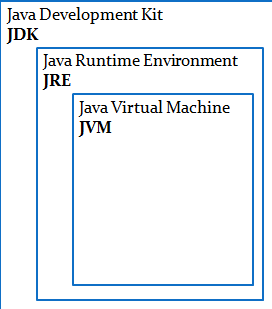
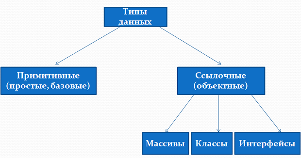
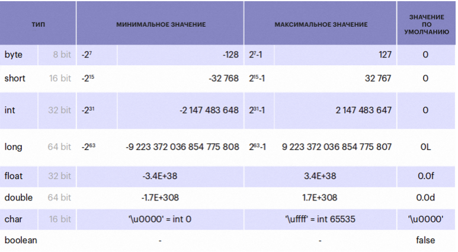
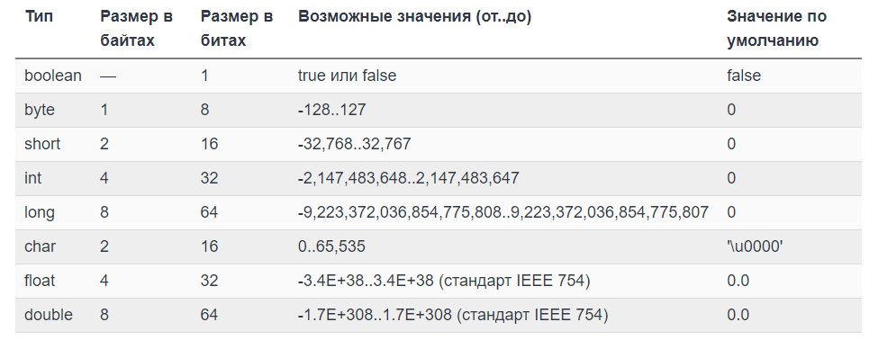

## base

1) [Что такое виртуальная машина?](#что-такое-виртуальная-машина)
2) [К какому типу языка программирования относится Java?](#к-какому-типу-языка-программирования-относится-java)
3) [Из каких компонентов состоит Java (JDK, JRE, JVM)?](#из-каких-компонентов-состоит-java-jdk-jre-jvm)
4) [Для чего используется JDK?](#для-чего-используется-jdk)
5) [Для чего используется JRE?](#для-чего-используется-jre)
6) [Для чего используется VM?](#для-чего-используется-vm)
7) [Что такое переменная?](#что-такое-переменная)
8) [Расскажите про примитивные типы.](#расскажите-про-примитивные-типы)
9) [Опишите шаги для компиляции и запуска приложения в консоли (javac java).](#опишите-шаги-для-компиляции-и-запуска-приложения-в-консоли-javac-java)
10) [Расскажите о конструкциях ветвления (if, else, switch, тернарное выражение)?](#расскажите-о-конструкциях-ветвления-if-else-switch-тернарное-выражение)
11) [Расскажите о таблице истинности?](#расскажите-о-таблице-истинности)
12) [Расскажите про отличия || &&.](#расскажите-про-отличия-or-and)
13) [Что такое тернарное условие?](#что-такое-тернарное-условие)
14) [Что такое циклы и для чего они используются?](#что-такое-циклы-и-для-чего-они-используются)
15) [Для чего используется цикл for?](#для-чего-используется-цикл-for)
16) [Для чего используется цикл foreach?](#для-чего-используется-цикл-foreach)
17) [Для чего используется цикл while?](#для-чего-используется-цикл-while)
18) [Для чего используется цикл do while?](#для-чего-используется-цикл-do-while)
19) [Что такое массив?](#что-такое-массив)
20) [Как создать массив?](#как-создать-массив)
21) [Как присвоить значение ячейке массива?](#как-присвоить-значение-ячейке-массива)
22) [Как можно пройти по всем элементам массива?](#как-можно-пройти-по-всем-элементам-массива)
23) [Как можно найти элемент в массиве?](#как-можно-найти-элемент-в-массиве)
24) [Что будет, если записывать элемент по индексу -1?](#что-будет-если-записывать-элемент-по-индексу-меньше-нуля)
25) [Как удалить ячейку в массиве?](#как-удалить-ячейку-в-массиве)
26) [Как отредактировать ячейку в массиве?](#как-отредактировать-ячейку-в-массиве)


## Что такое виртуальная машина
vm - ПО, эмулирующая аппаратное обеспечение.
jvm - основная часть исполняющей системы Java. Она исполняет бай-код java, предварительное созданный их исходного текста Java-программы компилятором javac. "Скомпилируй единожды, запускай везде". Jvm содержит интерпретатор байт-кода. Для повышения производительности во многих машинах также применяется JIT-компиляция(динамическая компиляция - компиляция байт-кода в машинный код во время работы программы)

[к оглавлению](#base)

## К какому типу языка программирования относится java
Java — строго типизированный объектно-ориентированный язык программирования общего назначения, разработанный компанией Sun Microsystems (в последующем приобретённой компанией Oracle). Разработка ведётся сообществом, организованным через Java Community Process; язык и основные реализующие его технологии распространяются по лицензии GPL. Права на торговую марку принадлежат корпорации Oracle.

[к оглавлению](#base)

## Из каких компонентов состоит java jdk jre jvm


JVM (Java Virtual Machine) - это виртуальная машина Java - основная часть исполняющей системы Java, так называемой Java Runtime Environment (JRE). Виртуальная машина Java исполняет байт-код Java, предварительно созданный из исходного текста Java-программы компилятором Java (javac). JVM обеспечивает платформо-независимый способ выполнения кода. Программисты могут писать код не задумываясь, как и где он будет выполняться.

JRE (Java Runtime Environment) - это минимальная реализация виртуальной машины, необходимая для исполнения Java приложений, без компилятора и других средств разработки. Состоит из виртуальной машины и библиотек Java классов.

JDK (Java Development Kit) - это комплект разработчика приложений на языке Java, включающий в себя компилятор, стандартные библиотеки классов Java, примеры, документацию, различные утилиты и исполнительную систему JRE.

[к оглавлению](#base)

## Для чего используется jdk
Java Development Kit является основным компонентом среды Java и предоставляет все инструменты, исполняемые и бинарные файлы, которые нужны для компиляции, отладки и выполнения программы на Java. JDK является платформо-зависимым программным обеспечением, поэтому есть отдельные инсталляторы для Windows, Mac и Unix-систем. Можно сказать, что JDK является надстройкой JRE, так как он содержит JRE с Java-компилятором, отладчиком и базовыми классами. Текущая версия JDK 1.8 также известна как Java 8.

[к оглавлению](#base)

## Для чего используется jre
JRE является реализацией JVM, которая предоставляет платформу для выполнения Java-программ. JRE состоит из виртуальной машины Java, бинарных файлов и других классов. JRE не содержит инструменты для разработки (компилятор Java, отладчик и т.д). Если вы хотите запустить любую Java программу, вы должны установить JRE.

[к оглавлению](#base)

## Для чего используется vm
JVM является сердцем языка программирования Java. Когда мы запускаем программу, JVM несет ответственность за преобразование байт-кода в машинный код. JVM также зависит от платформы и предоставляет основные функции, такие как управления памятью Java, сборкой мусора, и т.д. Мы также можем выделять определенный объем памяти для JVM. JVM является виртуальной машиной, потому что обеспечивает интерфейс, который не зависит от операционной системы и аппаратных средств. Эта независимость от аппаратного обеспечения и операционной системы дает Java-программам возможность выполняться на любом устройстве без необходимости внесения изменений — Write once, run anywhere (Напиши раз — запускай где угодно).

[к оглавлению](#base)

## Что такое переменная
поименованная, либо адресуемая иным способом область памяти, адрес которой можно использовать для осуществления доступа к данным. Данные, находящиеся в переменной, называются значением этой переменной.


[к оглавлению](#base)

## Расскажите про примитивные типы
В Java есть 8 примитивных типов, которые делят на 4 группы, вот они: Целые числа - byte, short, int, long. Числа с плавающей точкой (иначе вещественные) - float, double. Логический - boolean. 




[к оглавлению](#base)

## Опишите шаги для компиляции и запуска приложения в консоли javac java
* javac Main.java
* java Main

[к оглавлению](#base)

## Расскажите о конструкциях ветвления if else switch тернарное выражение
Оператор условия if проверяет равно ли выражение в скобках true если да, то действие выполняется, если нет выполняется код после блока if. Оператор else выполняется если if - false. Оператор if else так же проверяет условие, если true - заходим в тело. 

В отличие от операторов if и if-else, оператор switch применим к известному числу возможных ситуаций. Можно использовать простые типы byte, short, char, int. Также можно использовать Enum и String (начиная с JDK7), и специальные классы, которые являются обёрткой для примитивных типов: Character, Byte, Short, Integer.

Дублирование значений case не допускается. Тип каждого значения должен быть совместим с типом выражения.

Команду switch часто называют командой выбора. Выбор осуществляется в зависимости от целочисленного выражения. Форма команды выглядит так:
```java
switch(ВыражениеДляСравнения) {
    case Совпадение1: 
	    команда;
		break;
	case Совпадение2: 
	    команда;
		break;
	case Совпадение3: 
	    команда;
		break;
	default: 
	    оператор;
	    break;
}
```

“Тернарный” в переводе означает “тройной”. Это альтернатива условному оператору if-else
```java
String securityAnswer = (man.getAge() >= 18) ? "ok" : "not";
```

[к оглавлению](#base)

## Расскажите о таблице истинности
таблица истинности – таблица, в которой по действиям показано, какие значения принимает логическое выражение при всех возможных наборах его переменных.

При составлении таблицы истинности для логического выражения необходимо учитывать порядок выполнения логических операций, а именно:

* действия в скобках,
* инверсия (отрицание) !,
* & (конъюнкция) &,
* v (дизъюнкция) |,
* исключающее или ^, a ^ b = 00111100 ^ 00001101 = 00110001
* => (импликация),
* <=> (эквивалентность).

[к оглавлению](#base)

## Расскажите про отличия or and
Логические операторы.

|| - или -> заходим в тело, если хоть одно условие true
&& - и -> заходим в тело, если все условия true

[к оглавлению](#base)

## Что такое тернарное условие
принимает 3 операнда

условие ? выражение 1: выражение 2;

[к оглавлению](#base)

## Что такое циклы и для чего они используются
Циклы — это разновидность управляющих конструкций для организации многократного выполнения одного и того же участка кода. Код внутри такой управляющей конструкции выполняется циклично. Каждое выполнение кода — это итерация цикла. Количество итераций регулируется условием цикла

[к оглавлению](#base)

## Для чего используется цикл for
Для выполнения итераций по элементам массива или объектов. Условие проверяется перед каждой итерацией цикла.

[к оглавлению](#base)

## Для чего используется цикл foreach
Для выполнения итераций по элементам объектов, используем когда работает с элементами, а не с индексом элемента

[к оглавлению](#base)

## Для чего используется цикл while
Позволяет выполнить одну и ту же последовательность действий пока проверяемое условие истинно. Условие проверяется до выполнения тела.

[к оглавлению](#base)

## Для чего используется цикл do while
Условие проверяется после выполнения тела, значит гарантировано будет одна итерация. 

[к оглавлению](#base)

## Что такое массив
Массив - структура данных, хранящая набор значений, идентифицируемых по индексу. Набор однотипных данных.

[к оглавлению](#base)

## Как создать массив
```java
int[] arr = new int[5];
int[] arr = {1,2,3};
```

[к оглавлению](#base)

## Как присвоить значение ячейке массива
```java
int[] arr = new int[5];
arr[0] = 20;
```

[к оглавлению](#base)

## Как можно пройти по всем элементам массива
for, forEach, while, do-while, iterator

[к оглавлению](#base)

## Как можно найти элемент в массиве
Обратиться к индексу элемента

[к оглавлению](#base)

## Что будет если записывать элемент по индексу меньше нуля
Exception: ArrayIndexOutOfBounds

[к оглавлению](#base)

## Как удалить ячейку в массиве
Никак, можем только обнулить ячейку
```java
//1
int[] arr = {1,2,3};
int delete = 2;
int[] newArray = new int[arr.length - 1];
for(int i = 0; i < newArray.length; i++) {
    if (arr[i] == delete) {
        newArray[i] = arr[arr.lenght - 1];
    } else {
        newArray[i] = arr[i];
    }
}

//2
System.arraycopy(arr, index + 1, arr, index, arr.length - index - 1);
```

[к оглавлению](#base)

## Как отредактировать ячейку в массиве
Найти индекс и по индексу изменить значение
```java
int[] arr = new int[5];
arr[0] = 20;
```

[к оглавлению](#base)

