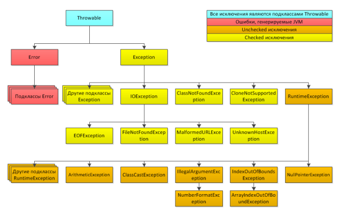

## oop

1) [Что такое ООП?](#что-такое-ооп)
2) [Базовые концепции ООП?](#базовые-концепции-ооп)
3) [Укажите из каких элементов состоит класс.](#укажите-из-каких-элементов-состоит-класс)
4) [Что такое конструктор?](#что-такое-конструктор)
5) [Можно ли наследовать конструктор?](#можно-ли-наследовать-конструктор)
6) [Что такое перегрузка конструктора?](#что-такое-перегрузка-конструктора)
7) [Что такое статический метод?](#что-такое-статический-метод)
8) [Что такое не статический метод?](#что-такое-не-статический-метод)
9) [Для чего используется ключевое слово this?](#для-чего-используется-ключевое-слово-this)
10) [Какой класс является базовый родительным классов для всех классов?](#какой-класс-является-базовый-родительным-классов-для-всех-классов)
11) [Что такое наследование? Приведите примеры из реальной жизни.](#что-такое-наследование-приведите-примеры-из-реальной-жизни)
12) [Опишите процесс создания нового объекта.](#опишите-процесс-создания-нового-объекта)
13) [Как вызвать метод из родительского класса?](#как-вызвать-метод-из-родительского-класса)
14) [Что такое переопределение метода?](#что-такое-переопределение-метода)
15) [Можно ли переопределить статический метод?](#можно-ли-переопределить-статический-метод)
16) [Что такое виртуальная функция и используются ли они в Java?](#что-такое-виртуальная-функция-и-используются-ли-они-в-java)
17) [Что такое перегрузка метода?](#что-такое-перегрузка-метода)
18) [Можно ли изменить тип возвращаемых данных при перегрузке метода?](#можно-ли-изменить-тип-возвращаемых-данных-при-перегрузке-метода)
19) [Что такое множественное наследование? Как его можно реализовать в Java.](#что-такое-множественное-наследование-как-его-можно-реализовать-в-java)
20) [Что такое полиморфизм? Приведите примеры из реальной жизни.](#что-такое-полиморфизм-приведите-примеры-из-реальной-жизни)
21) [Что такое инкапсуляция?](#что-такое-инкапсуляция)
22) [Как реализована инкапсуляция в Java?](#как-реализована-инкапсуляция-в-java)
23) [Можно ли применить модификаторы доступа к конструкторам?](#можно-ли-применить-модификаторы-доступа-к-конструкторам)
24) [Что такое интерфейс?](#что-такое-интерфейс)
25) [Какие типы исключительных ситуаций бывают?](#какие-типы-исключительных-ситуаций-бывают)
26) [Назовите основные методы класса Object?](#назовите-основные-методы-класса-object)
27) [Что такое шаблоны проектирования?](#что-такое-шаблоны-проектирования)
28) [Объясните шаблон - декоратор. Придумайте пример не относящийся к технике.](#объясните-шаблон-декоратор-придумайте-пример-не-относящийся-к-технике)
29) [Объясните шаблон - стратегия. Придумайте пример не относящийся к технике.](#объясните-шаблон-стратегия-придумайте-пример-не-относящийся-к-технике)
30) [Объясните шаблон - синглетон. Придумайте пример не относящийся к технике.](#объясните-шаблон-синглетон-придумайте-пример-не-относящийся-к-технике)
31) [Объясните шаблон - фабричный метод. Придумайте пример не относящийся к технике.](#объясните-шаблон-фабричный-метод-придумайте-пример-не-относящийся-к-технике)


## Что такое ооп

Объектно-ориентированное программирование (ООП) - методология программирования, основанная на представлении программы в виде совокупности объектов, каждый из которых является экземпляром определённого класса, а классы образуют иерархию наследования.
Каждый объект является экземпляром определенного класса. Классы образуют иерархию.

[к оглавлению](#oop)

## Базовые концепции ооп
* Инкапсуляция - сокрытие реализации;
* Наследование - создание новой сущности на базе уже существующей;
* Полиморфизм - возможность иметь разные форма для одной и той же сущности;
* Абстракция - набор общих характеристик.

[к оглавлению](#oop)

## Укажите из каких элементов состоит класс
* Поле - переменные (состояние)
* Поведение - методы

[к оглавлению](#oop)

## Что такое конструктор
Блок кода, предназначенный для инициализации полей объекта при его создании. Он вызывается всегда, когда создается новый экземпляр класса.

[к оглавлению](#oop)

## Можно ли наследовать конструктор
Нет, не наследуется подклассом, но конструктор суперкласса может быть вызван из подкласса.

[к оглавлению](#oop)

## Что такое перегрузка конструктора
Класс может иметь любое кол-во конструкторов, кот-ые различаются в списке параметров. Компилятор различает эти конструкторы, учитывая кол-во параметров в списке и их тип.

[к оглавлению](#oop)

## Что такое статический метод
Метод, который относится не к объекту, а к классу, его можно вызвать не используя ссылку на объект.

ограничения:
* могут вызывать только другие статические методы;
* им доступны только статические переменные;
* ни не могут делать ссылки по типу this, super.

[к оглавлению](#oop)

## Что такое не статический метод
Метод, который относится к объекту класса, обратиться к нему можно только черех ссылку на объект.

* Может быть вызван как статическим и не статическим методом;
* так же переменные;
* могут делать ссылки this, super.

[к оглавлению](#oop)

## Для чего используется ключевое слово this
Требуется для того, чтобы метод мог сослаться на вызвавший его объект.

Применяется:
* когда у переменной экземпляра класса и переменной метода/конструктора одинаковые имена;
* когда нужно вызывать конструктор одного типа из другого (явный вызов конструктора)

[к оглавлению](#oop)

## Какой класс является базовый родительным классов для всех классов
Object

[к оглавлению](#oop)

## Что такое наследование приведите примеры из реальной жизни
Предназначено для создания и описания нового класса на основе уже существующего с частично или полностью заимствующейся функциональностью. Класс, от которого производится наследование, назыв-ся базовым(родительским). Новый класс - производный класс.

Животное -> собака

[к оглавлению](#oop)

## Опишите процесс создания нового объекта
Необходимо использовать ключевое слово new и конструктор этого объекта. В момент выполнения этой конструкции выделяется память, необходимая для объекта, вызывается конструктор, а переменной присваивается адрес нового объекта в памяти.

[к оглавлению](#oop)

## Как вызвать метод из родительского класса
```java
super.method();
```

[к оглавлению](#oop)

## Что такое переопределение метода
Позволяется определять поведение характерное для типа подкласса, значит подкласс может реализовать метод родительского класса на основе его требования.

[к оглавлению](#oop)

## Можно ли переопределить статический метод
Перегружать можно, переопределять нет. В случае со статическими методами это не переопределение (overriding), а сокрытие (hiding).
[к оглавлению](#oop)

## Что такое виртуальная функция и используются ли они в java
[смотри тут](https://job4j.ru/profile/exercise/21/task-view/150)

[к оглавлению](#oop)

## Что такое перегрузка метода
В программе мы можем использовать методы с одним и тем же именем, но с разными типами и/или количеством параметров. Такой механизм называется перегрузкой методов (method overloading).

```java
public class Program{
      
    public static void main(String[] args) {
         
        System.out.println(sum(2, 3));          // 5
        System.out.println(sum(4.5, 3.2));      // 7.7
        System.out.println(sum(4, 3, 7));       // 14
    }
    static int sum(int x, int y){
             
        return x + y;
    }
    static double sum(double x, double y){
             
        return x + y;
    }
    static int sum(int x, int y, int z){
             
        return x + y + z;
    }
}
```


[к оглавлению](#oop)

## Можно ли изменить тип возвращаемых данных при перегрузке метода
Изменение типа возвращаемого значения не является достаточным условием перегрузки методов, поскольку возвращаемое не входит в сигнатуру метода. Изменения должны происходить именно в сигнатуре, а если быть точнее - то в его параметрах.

Подведем итоги и опишем ситуации, при каких условиях возможна перегрузка:

- изменение типа одного или нескольких параметров;

- изменение порядка параметров, при условии что они имеют разные типы;

- изменение количества параметров.

[к оглавлению](#oop)

## Что такое множественное наследование как его можно реализовать в java
Когда класс может иметь более одного суперкласса.

Можно только с помощью интерфейсов, реализовать данную идею, но именно множественное наследование Java не поддерживает.

[к оглавлению](#oop)

## Что такое полиморфизм приведите примеры из реальной жизни
Предназначен для использования объектов с одинаковым интерфейсом без информации о типе и внутренней структуре объекта. Снижает сложность программ, разрешая использование одного и того же интерфейса для задания единого набора действиям.

автолюбитель -> машина (знает как ездить на любой легковой машине)

Способность метода обрабатывать данные разных типов

[к оглавлению](#oop)

## Что такое инкапсуляция
Это скрытие полей объектов.
Это ограничение доступа к определенным методами и полям.
Цель инкапсуляции - уйти от зависимости внешнего интерфейса класса(то, что могут использовать другие классы) от реализации, чтобы малейшее изменение в классе не влекло за собой изменение внешнего поведения класса

[к оглавлению](#oop)

## Как реализована инкапсуляция в java
Модификаторами доступа private скрываются поля объекта, и при необходимости разрешается к ним
подкотрольный доступ через геттеры и сеттеры.

[к оглавлению](#oop)

## Можно ли применить модификаторы доступа к конструкторам
Да, но тогда будут ограничения для создания вне класса объекта этого класса.

[к оглавлению](#oop)

## Что такое интерфейс
Это тип данных, который может содержать лишь константы, абстрактные методы (так же неабстрактные
методы default и static). У них нету конструкторов.
Инерфейс позволяет создавать общей тип данных для разных объектов (т.е. использование интерфейса
гарантирует наличие определенного метода у объекта).

[к оглавлению](#oop)

## Какие типы исключительных ситуаций бывают
При работе Java приложений возможно появление различного рода ошибок и ситуаций, нарушающих
нормальный порядок выполнения программы. При их возникновении Java генерирует объекты одного
из подклассов класса Throwable.
Возникновение объектов типа Error или одного из его подклассов, означает что в процессе
выполнения программы возникли серьезные проблемы, которые не получится перехватить,
обработать и каким-то образом поправить. Они используются для обозначения ошибок, происходящих
в самой исполняющей среде (например, при переполнении стека (StackOverflowError)).
Исключения (Exceptions) также представляют собой объекты, генерируемые во время появления
ошибочных ситуаций и содержащие информацию о них, но в отличие от Error, исключения могут быть
перехвачены программой, обработаны, что предотвратит завершение работы приложения. Все
исключения можно разделить на две группы:
● Класс Exception и его подклассы: исключения, которые обязательно должны быть
перехвачены программой (Checked).
● Класс RuntimeException и его подклассы: исключения, охватывающие такие ситуации, как
деление на ноль или ошибочная индексация массивов (Unchecked).
Иерархия исключений представлена на схеме ниже.


* ArithmeticException Арифметическая ошибка
* ArrayIndexOutOfВoundsException Выход индекса за пределы массива
* ArrayStoreException Присваивание элементу массива объекта несовместимого типа
* ClassCastException Неверное приведение типов
* IllegalArgumentException Употребление недопустимого аргумента при вызове метода
* IndexOutOfВoundsException Выход индекса некоторого типа за допустимые пределы
* NegativeArraySizeException Создание массива отрицательного размера
* NullPointerException Неверное использование пустой ссылки
* NumberFormatException Неверное преобразование символьной строки в числовой формат

[к оглавлению](#oop)

## Назовите основные методы класса object
* protected Object clone() - создает новый объект, не отличающийся от клонируемого.
* public boolean equals(Object obj) - определяет, равен ли один объект другому.
* protected void finalize() - вызывается перед удалением неиспользуемого объекта.
* public final Class<?> getClass() - получает класс объекта во время выполнения.
* public int hashCode() - возвращает хэш-код, связанный с вызывающим объектом.
* public final void notify() - возобновляет исполнение потока, ожидающего вызывающего объекта.
* public final void notifyAll() - возобновляет исполнение всех потоков, ожидающих вызывающего объекта.
* public String toString() - возвращает символьную строку, описывающую объект.
* public final void wait() - ожидает другого потока исполнения.
* public final void wait(long timeout) - ожидает другого потока исполнения.
* public final void wait(long timeout, int nanos) - ожидает другого потока исполнения.

[к оглавлению](#oop)

## Что такое шаблоны проектирования
Схема решения часто возникающей задачи. Шаблоны разбиты на группы. Группы определяют общую задачу, которую решает этот шаблон.

Шаблон проектирования или паттерн в разработке программного обеспечения — повторяемая архитектурная конструкция, представляющая собой решение проблемы проектирования в рамках некоторого часто возникающего контекста

[к оглавлению](#oop)

## Объясните шаблон декоратор придумайте пример не относящийся к технике
Декоратор (англ. Decorator) — структурный шаблон проектирования, предназначенный для динамического подключения дополнительного поведения к объекту.

Добавление нового поведения в уже существующее поведение.

Base интерфейс описывающий поведение.

Class класс реализующий поведение.

Decor класс реализующий поведение и зависимый от другой реализации Base.

[к оглавлению](#oop)

## Объясните шаблон стратегия придумайте пример не относящийся к технике
Стратегия (англ. Strategy) — поведенческий шаблон проектирования, предназначенный для определения семейства алгоритмов, инкапсуляции каждого из них и обеспечения их взаимозаменяемости. Это позволяет выбирать алгоритм путём определения соответствующего класса.
Относится к поведенческим шаблонам. Он позволяет изменять алгоритм работы программы в запущенной программе. Пример: работает телевизор и мы можем включить 1 или 2-ой каналы при этом будет меняться картинка, но устройство одно


[к оглавлению](#oop)

## Объясните шаблон синглетон придумайте пример не относящийся к технике
Одиночка, для создания класса, который может содержать только один экземпляр объекта в VM. Используется с внешними ресурсами: файловая система, БД, связь с другими приложениями.


1. Создать явно конструктор и указать у него модификатор private. Таким образом, никто не сможет создать объект этого класса.

2. Так же нужно запретить наследование этого класса. Для этого используем ключевое слово final.
```java
public final class Log4File {
    private String[] messages = new String[1000];
    private int index = 0;

    private Log4File() {
    }

    public void add(String message) {
        messages[index++] = message;
    }

    public void save() {
        //TODO Сохраняем записи из массива messages в файл.
    }
}
```
3. Вы спросите, а какой же тогда смысл в этом классе, если никто не может использовать его методы?

На самом деле мы можем создать объект этого класса внутри самого класса.

Остается один момент, а как дать ссылку на этот объект? У нас есть ключевое слово static, его можно использовать для полей класса.

Если поле обозначено static, то оно привязано к классу, а не к объекту. Это позволяет сохранить ссылку на объект класса Log4File.

Так же добавим public static метод, чтобы другие классы могли получить ссылку на объект Log4File.

```java
private static Log4File instance = null;

    private String[] messages = new String[1000];
    private int index = 0;

    private Log4File() {
    }

    public static Log4File getInstance() {
        if (instance == null) {
            instance = new Log4File();
        }
        return instance;
    }

    public void add(String message) {
        messages[index++] = message;
    }

    public void save() {
        //TODO Сохраняем записи из массива messages в файл.
    }
```

Теперь объект класс Log4File может быть только один на всю программу.

Чтобы получить объект класса Log4File мы используем метод Log4File.getInstance().

```java
public static void main(String[] args) {
        Log4File log = Log4File.getInstance();
        log.add("add new Item");
        log.save();
    }
```

При первом вызове метод getInstance() программа проверяет заполнено ли поле instance.

Если оно не заполнено, то мы создаем объект класса Log4File и записываем его в статическое поле.

Каркас шаблона синлетон.

```java
public final class Singleton {

    private static Singleton instance = null; <- ссылка на единственный объект класса Singleton

    private Singleton() { <- явно создаем закрытый конструктор.
    }

    public static Singleton getInstance() { <- статический метод. Он используется для публикации ссылки. 
        if (instance == null) {
            instance = new Singleton();
        }
        return instance;
    }
}
```

[к оглавлению](#oop)

## Объясните шаблон фабричный метод придумайте пример не относящийся к технике
Это порождающий паттерн проектирования, который определяет общий интерфейс для создания объектов в суперклассе, позволяя подклассам изменять тип создаваемых объектов

Паттерн Фабричный метод предлагает создавать объекты не напрямую, используя оператор new, а через вызов особого фабричного метода. В реальности объекты всё равно будут создаваться при помощи new, но делать это будет фабричный метод.

Несмотря на название, важно понимать, что создание продуктов не является единственной функцией базового класса фабрики. Обычно "фабрика" – это всего лишь дополнительная роль для класса. Скорее всего, он уже имеет какую-то бизнес-логику, в которой требуется создание разнообразных продуктов. Зачастую фабричный метод объявляют абстрактным, чтобы заставить все подклассы реализовать его по-своему. Но он может возвращать и некий стандартный продукт.

При этом чтобы эта система заработала, все возвращаемые фабрикой объекты должны иметь общий интерфейс. В нашем случае мы можем определить этот интерфейс следующим образом:
```java
public interface Shape {
    String draw();
    double square();
}
```

```java
public class Triangle implements Shape {
    int a;
    int h;

    public Triangle(int a, int h) {
        this.a = a;
        this.h = h;
    }

    @Override
    public String draw() {
        String ln = System.lineSeparator();
        return "   *" + ln
              + "  * *"+ ln
              + " *   *" + ln
              + "*******";
    }

    @Override
    public double square() {
        return 0.5 * a * h;
    }
}

public class Rectangle implements Shape {
    int a;
    int b;

    public Rectangle(int a, int b) {
        this.a = a;
        this.b = b;
    }

    @Override
    public String draw() {
        String ln = System.lineSeparator();
        return "******" + ln
                + "*    *" + ln
                + "*    *" + ln
                + "******";
    }

    @Override
    public double square() {
        return a * b;
    }
}
```

```java
public abstract class ShapeOperator {
    public void showInfo() {
        Shape shape = createShape();
        System.out.println(shape.draw());
        System.out.println("Площадь фигуры равна: " + shape.square());
    }
    public abstract Shape createShape();
}
```

Фабричным у нас является метод createShape().

```java
public class RectangleOperator extends ShapeOperator {
    
    private Scanner input = new Scanner(System.in);

    @Override
    public Shape createShape() {
        System.out.print("Введите ширину прямоугольника: ");
        int a = Integer.parseInt(input.nextLine());
        System.out.print("Введите длину прямоугольника: ");
        int b = Integer.parseInt(input.nextLine());
        return new Rectangle(a, b);
    }
}
public class TriangleOperator extends ShapeOperator {

    private Scanner input = new Scanner(System.in);

    @Override
    public Shape createShape() {
        System.out.print("Введите длину основания треугольника: ");
        int a = Integer.parseInt(input.nextLine());
        System.out.print("Введите высоту треугольника: ");
        int b = Integer.parseInt(input.nextLine());
        return new Triangle(a, b);
    }
}
```

При этом его применением мы получили следующий ряд преимуществ:

* Избавление клиентского кода от привязки к конкретным классам продуктов. Действительно, класс Canvas оперирует абстрактными понятиями ShapeOperator и Shape. То, что в конечном счёте будет построено определяется выбором пользователя в блоке if-else, но можно это сделать и через конфигурационный файл или переменную среды.
* Выделяет код производства продуктов в одно место, упрощая поддержку кода. В нашем случае это осуществлено через реализацию фабричного метода createShape() в подклассах TriangleOperator и RectangleOperator.
* Упрощает добавление новых продуктов в программу. Допустим что мы захотим добавить поддержку фигуры Круг. Для этого достаточно создать продукт Round, реализующий интерфейс Shape и реализовать для него фабричный метод, например, в классе RoundOperator. Далее можно спокойно передавать в действующий пользовательский код экземпляр этого класса-фабрики, так как он производит продукт типа Shape, который имеет методы draw() и square(), а также реализует общую бизнес-логику: выводит общую информацию о заданной построенной фигуре с помощью метода showInfo().
* Реализует принцип открытости/закрытости. В нашем случае, мы можем сколько угодно модифицировать код создания существующих фигур и их методов, а также добавлять сколь угодно много новых фигур, реализующих интерфейс Shape. При этом это никак не отразится на пользовательском коде, оперирующем этими классами. Для него важно, что имеется фигура Shape, которую можно нарисовать и для которой можно найти площадь.
* Преимуществом фабричного метода по сравнению с использованием обычного конструктора является возможность ограничения создания новых объектов и их повторного использования. Такая проблема обычно возникает при работе с тяжёлыми ресурсоёмкими объектами, такими, как подключение к базе данных, файловой системе и т. д. В фабричном методе можно ограничить создание более чем одного экземпляра или дать возможность создавать новый экземпляр только при условии отсутствия уже созданных и неиспользуемых.

[к оглавлению](#oop)

