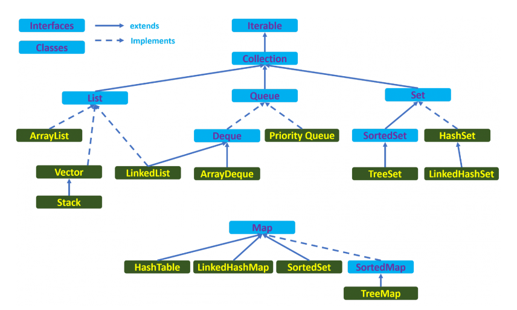
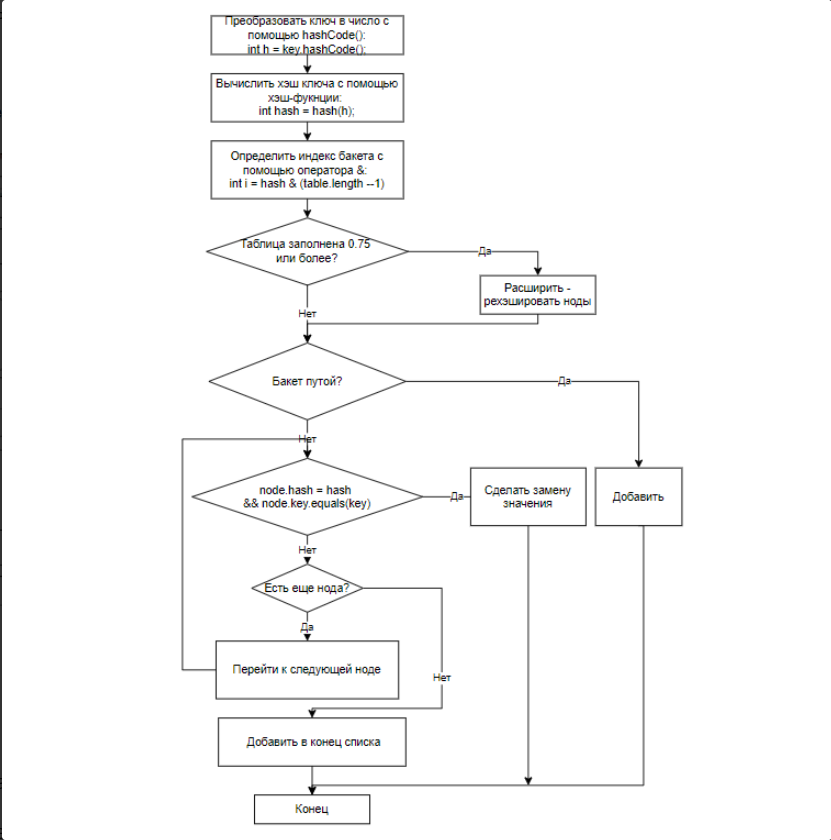
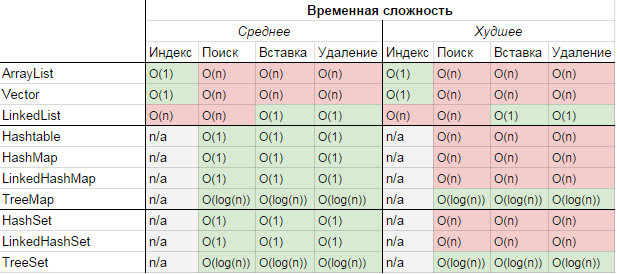
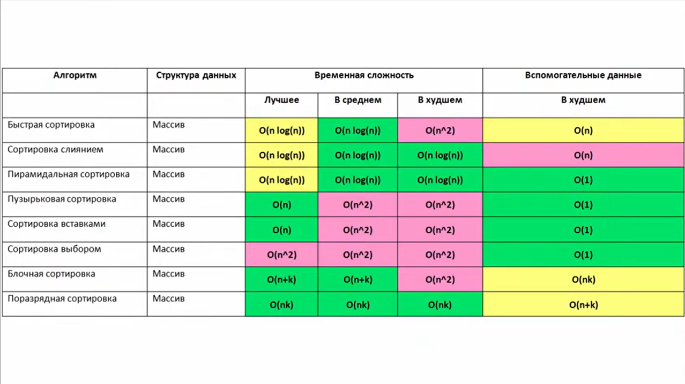

## Collections Pro

1) [Что такое generic?](#Что-такое-generic)
2) [Что такое wild cards?](#Что-такое-wild-cards)
3) [Что такое bound wild cards?](#Что-такое-bound-wild-cards)
4) [Что такое unbounded wild cards?](#Что-такое-unbounded-wild-cards)
5) [Где хранится информация про Generics?](#Где-хранится-информация-про-Generics)
6) [Как можно получить тип Generics?](#Как-можно-получить-тип-Generics)
7) [Что такое итератор?](#Что-такое-итератор)
8) [Что такое коллекции?](#Что-такое-коллекции)
9) [Назовите базовые интерфейсы коллекций?](#Назовите-базовые-интерфейсы-коллекций)
10) [Расскажите реализации интерфейса List?](#Расскажите-реализации-интерфейса-List)
11) [Расскажите реализации интерфейса Set?](#Расскажите-реализации-интерфейса-Set)
12) [Расскажите реализации интерфейса Map?](#Расскажите-реализации-интерфейса-Map)
13) [Отличие ArrayList от LinkedList?](#Отличие-ArrayList-от-LinkedList)
14) [Отличие Set от List?](#Отличие-Set-от-List)
15) [Расскажите про методы Object hashCode и equals?](#Расскажите-про-методы-Object-hashCode-и-equals)
16) [Расскажите про реализации Map?](#Расскажите-про-реализации-Map)
17) [Расскажите, что такое коллизии в Map Как с ними бороться](#Расскажите-что-такое-коллизии-в-Map-Как-с-ними-бороться)
18) [Расскажите, что такое анализ алгоритма?](#Расскажите-что-такое-анализ-алгоритма)
19) [Какая временная сложность алгоритмов(O-нотация) добавления, замены и удаления в каждой из коллекций? С чем связаны отличия](#%D0%BA%D0%B0%D0%BA%D0%B0%D1%8F-%D0%B2%D1%80%D0%B5%D0%BC%D0%B5%D0%BD%D0%BD%D0%B0%D1%8F-%D1%81%D0%BB%D0%BE%D0%B6%D0%BD%D0%BE%D1%81%D1%82%D1%8C-%D0%B0%D0%BB%D0%B3%D0%BE%D1%80%D0%B8%D1%82%D0%BC%D0%BE%D0%B2o-%D0%BD%D0%BE%D1%82%D0%B0%D1%86%D0%B8%D1%8F-%D0%B4%D0%BE%D0%B1%D0%B0%D0%B2%D0%BB%D0%B5%D0%BD%D0%B8%D1%8F-%D0%B7%D0%B0%D0%BC%D0%B5%D0%BD%D1%8B-%D0%B8-%D1%83%D0%B4%D0%B0%D0%BB%D0%B5%D0%BD%D0%B8%D1%8F-%D0%B2-%D0%BA%D0%B0%D0%B6%D0%B4%D0%BE%D0%B9-%D0%B8%D0%B7-%D0%BA%D0%BE%D0%BB%D0%BB%D0%B5%D0%BA%D1%86%D0%B8%D0%B9-%D1%81-%D1%87%D0%B5%D0%BC-%D1%81%D0%B2%D1%8F%D0%B7%D0%B0%D0%BD%D1%8B-%D0%BE%D1%82%D0%BB%D0%B8%D1%87%D0%B8%D1%8F)
20) [Расскажите реализации данных очередей и стеков](#Расскажите-реализации-данных-очередей-и-стеков)
21) [Расскажите про реализации деревьев](#Расскажите-про-реализации-деревьев)
22) [Что такое loadFactor?](#Что-такое-loadFactor)

Доп. вопросы:

[Что такое хеш таблицы](#Что-такое-хеш-таблицы)

[Какие существуют алгоритмы обхода дерева](#Какие-существуют-алгоритмы-обхода-дерева)

[Удаление элемента из дерева](#Удаление-элемента-из-дерева)

[Что такое красно-черное дерево](#Что-такое-красно-черное-дерево)

[Дополнительные материалы по generics](#Дополнительные-материалы-по-generics)


## Что такое generic

Generics - это технический термин, обозначающий набор свойств языка позволяющих определять и использовать обобщенные типы и методы. Обобщенные типы или методы отличаются от обычных тем, что имеют типизированные параметры.

Примером использования обобщенных типов может служить Java Collection Framework. Так, класс LinkedList<E> - типичный обобщенный тип. Он содержит параметр E, который представляет тип элементов, которые будут храниться в коллекции. Создание объектов обобщенных типов происходит посредством замены параметризированных типов реальными типами данных. Вместо того, чтобы просто использовать LinkedList, ничего не говоря о типе элемента в списке, предлагается использовать точное указание типа LinkedList<String>, LinkedList<Integer> и т.п.

Обобщения - это параметризованные типы.
С их помощью можно объявлять классы, интерфейсы и методы, где тип данных указан в виде параметра.
Сделаны для предохранения программиста от путаницы в типах данных.
После компиляции какая-либо информация о дженериках стирается. Это называется "Стирание типов"

Существует 2 типа дженериков:
+ **Параметризированый тип.**
  Представляет из себя возможность указать неопределенный тип, или несколько(в классе или методе),
  дать ему имя которое в дальнейшем можно использоваться в рамках класса, или метода, как эквивалентное оригинальному типу.
  Может быть использован с ключевым словом extends, ограничен этим классом и его наследниками.
  Так же можно использовать & или/и | указать несколько классов и/или интерфейсов.

```java
public static class NumberContainer<T extends Number & Comparable> {
```
+ **Wildcard**

  Используется в сигнатуре методов и в объявлении экземпляров переменных. Для параметризации класса - невозможно.
  Может быть использован в сочетании ключевыми словами extends и/или super.
  Делятся на три типа:

1) *Upper Bounded Wildcards* - <? extends Number>
2) *Unbounded Wildcards* - <?>
3) *Lower Bounded Wildcards* - <? super Integer>

Для выбора типа используют принцип PECS (Producer Extends Consumer Super)

Если метод имеет аргументы с параметризованным типом (например, Collection<T> или Predicate<T>), то в случае, если аргумент — производитель (producer), нужно использовать ? extends T, а если аргумент — потребитель (consumer), нужно использовать ? super T.

Производитель и потребитель, кто это такие? Очень просто: если метод читает данные из аргумента, то этот аргумент — производитель, а если метод передаёт данные в аргумент, то аргумент является потребителем. Важно заметить, что определяя производителя или потребителя, мы рассматриваем только данные типа T.

не использовать wildcard когда надо и получать и вставлять данные в структуру

[Использование generic wildcards для повышения удобства Java API](https://habr.com/ru/post/207360/)

[к оглавлению](#collections-pro)

## Что такое wild cards

 это особый тип аргумента типа, который управляет безопасностью типов при использовании универсальных типов. Его можно использовать в объявлениях и экземплярах переменных, а также в определениях методов, но не в определении универсального типа.

[к оглавлению](#collections-pro)

## Что такое bound wild cards

Подход, когда необходимо реализовать определенный тип и все его подтипы, используется "Ограничение сверху" <? extends Object>

[к оглавлению](#collections-pro)

## Что такое unbounded wild cards
Аналогичным образом ограниченный снизу wildcard ограничивает неизвестный тип определенным типом или супертипом этого типа.
Ограниченный снизу wildcard выражается с помощью wildcard символа ("?"), за которым следует ключевое слово super после которого указывается нижняя граница - <? super A>.

[к оглавлению](#collections-pro)

## Где хранится информация про Generics
Только в исходном коде до момента компиляции.

[к оглавлению](#collections-pro)

## Как можно получить тип Generics
Дженерики существуют только на момент компиляции, runtime, когда приложение выполняется информации о дженериках стирается. Тип дженерика нельзя определить ни через мета информацию о полях класса, ни через метаинформацию о методах класса(принимаемые параметры, возвращаемый тип). Так же в java нельзя создать инстанс дженеричной переменной. Следовательно получить тип дженеричной переменной класса, не имея ее инстанса невозможно.

Если у вас есть возможность получить инстанс переменной-дженерика(через рефлексию), то его тип можно определить не передавая его в конструктор, иначе ответ нет, нельзя.
```java

Class<T> t = (Class<T>) ((ParameterizedType) getClass().getGenericSuperclass()).getActualTypeArguments()[0];

public class TestClass {
    class MyClass extends OtherClass<GenericClass>{

        String myName;
        //Whatever

    }

    class OtherClass<T> {

        T myfield;

    }

    class GenericClass {
        String field;
    }

    public static void main(String[] args){
        OtherClass<GenericClass> ttt = new MyClass();
        ParameterizedType t = (ParameterizedType) ttt.getClass().getGenericSuperclass();
        Class<?> cls = (Class<?>) t.getActualTypeArguments()[0]; //
        System.out.println(cls);  // напечатает TestClass#GenericClass
    }
}
```

[к оглавлению](#collections-pro)

## Что такое итератор
Это шаблон проектирования для прохода по всем элементам множества.
Шаблон итератор используется в коллекциях, базах данных, чтении файлов.
Основные методы:
+ ```hasNext()``` - существует ли следующий элемент
+ ```next()``` - возвращает сам элемент и переводить указатель на следующий элемент
  
В стандартной библиотеке java существует 2 интерфейса это ```Iterable``` и ```Iterator```.
+ ```Iterable``` - Интерфейс Iterable имеет только один метод - iterator(), который возвращает Iterator.
+ ```Iterator``` - вернуть объект итератора.

Классы, реализующие интерфейс Iterable, могут применяться в конструкции for-each, которая использует Iterator.

+ `ListIterator` расширяет интерфейс `Iterator`
+ `ListIterator` может быть использован только для перебора элементов коллекции `List`;
+ `Iterator` позволяет перебирать элементы только в одном направлении, при помощи метода `next()`. Тогда как `ListIterator` позволяет перебирать список в обоих направлениях, при помощи методов `next()` и `previous()`;
+ `ListIterator` не указывает на конкретный элемент: его текущая позиция располагается между элементами, которые возвращают методы `previous()` и `next()`.
+ При помощи `ListIterator` вы можете модифицировать список, добавляя/удаляя элементы с помощью методов `add()` и `remove()`. `Iterator` не поддерживает данного функционала.

[к оглавлению](#collections-pro)

## Что такое коллекции
Хранилище объектов с динамическим размером, и разным временем на разные операции: поиск, вставка, удаление.

[к оглавлению](#collections-pro)

## Назовите базовые интерфейсы коллекций
+ **Collection** - коллекция содержит набор объектов (элементов).
  Здесь определены основные методы для манипуляции с данными,
  такие как вставка (add, addAll), удаление (remove, removeAll, clear), поиск (contains)
+ **Map** -  описывает коллекцию, состоящую из пар "ключ — значение". У каждого ключа только одно значение



На вершине иерархии в Java Collection Framework располагаются 2 интерфейса: `Collection` и `Map`. Эти интерфейсы разделяют все коллекции, входящие во фреймворк на две части по типу хранения данных: простые последовательные наборы элементов и наборы пар «ключ — значение» соответственно.

Интерфейс `Collection` расширяют интерфейсы:

+ `List` (список) представляет собой коллекцию, в которой допустимы дублирующие значения. Реализации:
  + `ArrayList` - инкапсулирует в себе обычный массив, длина которого автоматически увеличивается при добавлении новых элементов. Элементы такой коллекции пронумерованы, начиная от нуля, к ним можно обратиться по индексу.
  + `LinkedList` (двунаправленный связный список) - состоит из узлов, каждый из которых содержит как собственно данные, так и две ссылки на следующий и предыдущий узел.
  + `Vector` — реализация динамического массива объектов, методы которой синхронизированы.
  + `Stack` — реализация стека LIFO (last-in-first-out).
+ `Set` (сет) описывает неупорядоченную коллекцию, не содержащую повторяющихся элементов. Реализации:
  + `HashSet` - использует HashMap для хранения данных. В качестве ключа и значения используется добавляемый элемент. Из-за особенностей реализации порядок элементов не гарантируется при добавлении.
  + `LinkedHashSet` — гарантирует, что порядок элементов при обходе коллекции будет идентичен порядку добавления элементов.
  + `TreeSet` — предоставляет возможность управлять порядком элементов в коллекции при помощи объекта `Comparator`, либо сохраняет элементы с использованием «natural ordering».
+ `Queue` (очередь) предназначена для хранения элементов с предопределённым способом вставки и извлечения FIFO (first-in-first-out):
  + `PriorityQueue` — предоставляет возможность управлять порядком элементов в коллекции при помощи объекта `Comparator`, либо сохраняет элементы с использованием «natural ordering».
  + `ArrayDeque` — реализация интерфейса `Deque`, который расширяет интерфейс `Queue` методами, позволяющими реализовать конструкцию вида LIFO (last-in-first-out).

Интерфейс `Map` реализован классами:

+ `Hashtable` — хэш-таблица, методы которой синхронизированы. Не позволяет использовать `null` в качестве значения или ключа и не является упорядоченной.
+ `HashMap` — хэш-таблица. Позволяет использовать `null` в качестве значения или ключа и не является упорядоченной.
+ `LinkedHashMap` — упорядоченная реализация хэш-таблицы.
+ `TreeMap` — реализация, основанная на красно-чёрных деревьях. Является упорядоченной и предоставляет возможность управлять порядком элементов в коллекции при помощи объекта `Comparator`, либо сохраняет элементы с использованием «natural ordering».
+ `WeakHashMap` — реализация хэш-таблицы, которая организована с использованием _weak references_ для ключей (сборщик мусора автоматически удалит элемент из коллекции при следующей сборке мусора, если на ключ этого элемента нет жёстких ссылок).

[Справочник по Java Collections Framework](https://habr.com/ru/post/237043/)

[к оглавлению](#collections-pro)

## Расскажите реализации интерфейса List
+ **ArrayList** - на массиве с несинхронизированными методами.
+ **Vector** - на массиве с синхронизированными методами.
+ **Stack** - на массиве есть синхронизированные методы, но не все.
+ **LinkedList** - двусвязный список.

[простая реализация ArrayList](https://github.com/nikisha-script/job4j_design/blob/master/src/main/java/ru/job4j/collections/list/mytest/MySimpleArrayList.java)

[простая реализация LinkedList](https://github.com/nikisha-script/job4j_design/blob/master/src/main/java/ru/job4j/collections/list/mytest/MySimpleLinkedList.java)

[простая реализация Stack](https://github.com/nikisha-script/job4j_design/blob/master/src/main/java/ru/job4j/collections/list/SimpleStack.java)

[к оглавлению](#collections-pro)

## Расскажите реализации интерфейса Set
**Set** не может содержать дубликаты.
+ **HashSet** - основан на HashMap.
+ **LinkedHashSet** - расширяет HashSet, позволяет получать элементы в порядке их добавления, но требует больше памяти.
+ **TreeSet** - основан на сбалансированном двоичном дереве, в результате элементы упорядочены по возрастанию hashCode()'ов.
  Можно управлять порядком при помощи компаратора.

[к оглавлению](#collections-pro)

## Расскажите реализации интерфейса Map
+ **HashMap** - не синхронизированная хэш-таблица (быстрая).
+ **LinkedHashMap** - упорядоченная хэш-таблица с порядом итерирования в порядке добавления.
+ **TreeMap** - Упорядоченная по ключам. Основана на красно-черных деревьях. Может использовать компаратов в конструкторе.

[к оглавлению](#collections-pro)

## Отличие ArrayList от LinkedList
**ArrayList** реализован на массивах. (используют если чаще читаются элементы, чем добавляются)
Хранит свои элементы в массиве.
+ \+ осуществляется быстрый поиск элементов.
+ \+ меньше расходует памяти на хранение элементов
+ \- увеличение ArrayList'a происходит медленно.
+ \- при вставке элемента (или удалении) в середину или в начало, приходится переписывать все элементы.

**LinkedList** является представителем двунаправленного списка. (цепочка)
(используется если элементы чаще добавляются чем читаются)
Хранит свои элементы в объектах у которых есть ссылки на предыдущий и следующий элементы.
+ \+ быстрая вставка и удаление в середину списка (переписать next и prev и всё)
+ \- долгий поиск в середине (нужно перебрать все элементы)

в среднем, сложности одинаковые. Но я бы не стал рекомендовать использовать LinkedList,
за исключением ситуации когда, преобладает удаление или вставка в начало или конец списка.

[к оглавлению](#collections-pro)

## Отличие Set от List
+ **Set** - не хранит дубликаты.
+ **List** - может содержать дубли.

[к оглавлению](#collections-pro)

## Расскажите про методы Object hashCode и equals
По умолчанию, метод hashCode() для объекта возвращает номер ячейки памяти, где объект сохраняется. Метод equals() , как и следует из его названия, используется для простой проверки равенства двух объектов. Реализация этого метода по умолчанию просто проверяет по ссылкам два объекта на предмет их эквивалентности.

Метод hashCode используется для числового представления объекта, метод equals для сравнения двух объектов.
При переопределении метода equals всегда переопределяют hashCode.
Если метод equals true то hashCode всегда равны, но не наоборот, потому что возможны
коллизии и для разных элементов будет одинаковый hashCode.

**Метод equals переопределяется так:**
1. Не равны ли ссылки
2. Не равен null
3. Проверяем что объекты от одного класса.
4. Не равны ли hashCode
5. Не равны состояния полей.

**Метод HashCode переопределяется так:**
1. Простое нечетное число (31 популярно)
2. Умножаем результат на другое простое нечетное число (популярно 17)
   прибавляем hashCode поля которое относится к бизнес логике.
3. Повторяем пункт 2 пока не кончатся поля которые относятся к бизнес логике

[к оглавлению](#collections-pro)

## Расскажите про реализации Map
+ **HashMap** - основан на хэш-таблицах. Ключи и значения могут быть любых типов, в том числе и null.
  Данная реализация не дает гарантий относительно порядка элементов
+ **LinkedHashMap** -расширяет класс **HashMap**.
  Он создает связный список элементов в карте, расположенных в том порядке, в котором они вставлялись.
+ **TreeMap** - Он создает коллекцию, которая для хранения элементов применяет дерево.
  Объекты сохраняются в отсортированном порядке по возрастанию.
  Время доступа и извлечения элементов достаточно мало, что делает класс TreeMap блестящим выбором для хранения больших
  объемов отсортированной информации


hk = 31 * 17 * Object.field;

hf = hk ^ (hk >>> 16)

i = hf & (map.length - 1)

[к оглавлению](#collections-pro)

## Расскажите, что такое коллизии в Map. Как с ними бороться.
Коллизия это когда для двух объектов вычисляется одинаковый хеш код.
Решение это проверить методом equals что ссылки на объекты не равны, и в случае с хэш-таблицей добавить
в ту же ячейку еще один объект, за счет того что в каждая ячейка это связанный список.

[к оглавлению](#collections-pro)

## Расскажите, что такое анализ алгоритма.
Это то как соотносится количество данных и количества операций над ними со скоростью работы алгоритма (асимптотическая сложность).
n - количество входных данных

+ 1 = O(1) const
+ f(n) = O(log(n)) **логарифмический** рост (бинарный поиск, red black tree)
+ f(n) = O(n) **линейный** рост (линейный поиск)
+ f(n) = O(n * log(n)) **квазилинейный** рост (очень быстрый - быстрая сортировка)
+ f(n) = O(n ^ m) **полиномиальный** рост (n^2 - квадратичная сложность (чаще всего, двумерный массив, медленный алгоритм сортировки (пузырьковая)) - необходимо для улучшения производительности приводить к квазилинейному росту)
+ f(n) = O(2 ^ n) **экспоненциальный** рост (не должен быть в проекте - поиск чисел Фибоначчи) Последовательность чисел Фибоначчи определяется формулой Fn = Fn-1 + Fn-2 . То есть, следующее число получается как сумма двух предыдущих. Первые два числа равны 1, затем 2(1+1) , затем 3(1+2) , 5(2+3) и так далее: 1, 1, 2, 3, 5, 8, 13, 21... . Данный код будет быстро возрастать по памяти и количеству действий необходимых для вычисления
+ f(n) = O(n!) **факториальный** рост (не должен быть в проекте) - задача коммивояжёра. Задача коммивояжёра (или TSP от англ. travelling salesman problem) — одна из самых известных задач комбинаторной оптимизации, заключающаяся в поиске самого выгодного маршрута, проходящего через указанные города хотя бы по одному разу с последующим возвратом в исходный город.

[к оглавлению](#collections-pro)

## Какая временная сложность алгоритмов(O-нотация) добавления, замены и удаления в каждой из коллекций. С чем связаны отличия.
+ **ArrayList:** индекс - 0(1), поиск 0(n). вставка 0(n), удаление O(n).
+ **LinkedList:** индекс - 0(n), поиск 0(n). вставка 0(1), удаление O(1).
+ **Деревья** для всех операций - O(log(n)).
  Хэш таблицы - O(1) для всех операций, если не считать коллизии





[к оглавлению](#collections-pro)

## Расскажите реализации данных очередей и стеков.
+ **Queue** (одностороняя очередь) - когда элементы можно получить в том порядке в котором добавляли. **FIFO**
+ **Deque** (двусторонняя очередь) - можно вставлять/получать элементы из начали и конца.
+ **Stack** - можно получить только последний элемент **LIFO**

```java
 Queue<Integer> myQ = new LinkedList<Integer>();
```

[к оглавлению](#collections-pro)

## Расскажите про реализации деревьев.
+ **TreeMap** - Упорядоченная по ключам. Основана на красно-черных деревьях. Может использовать comparator в конструкторе.
  Красно-черные деревья это самобалансирующееся дерево которое гарантирует логарифмический рост высоты дерева от числа узлов.
+ **TreeSet** - основан на сбалансированном двоичном дереве, в результате элементы упорядочены по возрастанию hashCode()'ов.
  Можно управлять порядком при помощи компаратора.

[к оглавлению](#collections-pro)

## Что такое loadFactor.
В хеш таблице поле которое показывает на сколько заполнен массив на котором эта таблица основана,
если на 3/4 то создается новый массив с большим размером и данные перераспределяются.
Вычисляется длинна массива / количество элементов.

Фактор загрузки ввели для того, чтобы понизить число коллизий.

[к оглавлению](#collections-pro)

## Какие существуют алгоритмы обхода дерева

В зависимости от траекторий выделяют два типа обхода:
+ горизонтальный (в ширину)
+ вертикальный (в глубину).

**Горизонтальный** обход подразумевает обход дерева по уровням (level-ordered) – вначале обрабатываются все узлы
текущего уровня, после чего осуществляется переход на нижний уровень.
```java
 static void contLevelOrder(Node top){
        Queue<Node> queue=new LinkedList<> ();
        do{
            top.treatment();
            if (top.left!=null) queue.add(top.left);
            if (top.right!=null) queue.add(top.right);
            if (!queue.isEmpty()) top=queue.poll();
        }while (!queue.isEmpty());
    }
```

**Вертикальный** бывает 3 видов:

+ прямой (preorder)
    1. Посещение узла.
    2. Вызов самого себя для обхода левого поддерева узла.
    3. Вызов самого себя для обхода правого поддерева узла

+ симметричный (inorder). При симметричном обходе двоичного дерева все узлы перебираются в порядке возрастания ключей.
  Простейший способ обхода основан на использовании рекурсии.
  Метод должен выполнить только три операции:
    1. Вызов самого себя для обхода левого поддерева узла.
    2. Посещение узла.
    3. Вызов самого себя для обхода правого поддерева узла.
```java
    private void inOrder(node localRoot)
        {
            if(localRoot != null)
            {
                inOrder(localRoot.leftChild);
                console.log(node.value);
                inOrder(localRoot.rightChild);
            }
        }  
      
```
+ обратный (postorder)
    1. Вызов самого себя для обхода левого поддерева узла.
    2. Вызов самого себя для обхода правого поддерева узла.
    3. Посещение узла.

[к оглавлению](#collections-pro)

## Удаление элемента из дерева

Если у удаляемого элемента нет потомков или один потомок, то просто удалить. Если у удаляемого элемента есть два потомка,
то удаляемый узел надо заменить на приемника. Т.к. используется сложный алгоритм для поиска приемника, то часто вместо удаления
используют флаг isDeleted. В остальных методах проверяют значение этого флага.

[к оглавлению](#collections-pro)

## Что такое красно-черное дерево

Красно-черные деревья относятся к сбалансированным бинарным деревьям поиска.
Как бинарное дерево, красно-черное обладает свойствами:
1) Оба поддерева являются бинарными деревьями поиска.
2) Для каждого узла с ключом K выполняется критерий упорядочения:
   ключи всех левых потомков <= K < ключи всех правых потомков

(в других определениях дубликаты должны располагаться с правой стороны либо вообще отсутствовать).
Это неравенство должно быть истинным для всех потомков узла, а не только его дочерних узлов.

Свойства красно-черных деревьев:
1) Каждый узел окрашен либо в красный, либо в черный цвет (в структуре данных узла появляется дополнительное поле – бит цвета).
2) Корень окрашен в черный цвет.
3) Листья(так называемые NULL-узлы) окрашены в черный цвет.
4) Каждый красный узел должен иметь два черных дочерних узла. Нужно отметить, что у черного узла могут быть черные дочерние узлы. Красные узлы в качестве дочерних могут иметь только черные.
5) Пути от узла к его листьям должны содержать одинаковое количество черных узлов(это черная высота).

[Статья про красно черные деревья](https://habr.com/ru/post/330644/)

[к оглавлению](#collections-pro)


## Дополнительные материалы по generics
+ [Сырые типы - Generics #1 - Advanced Java](https://www.youtube.com/watch?v=MniNZsyjH9E&list=PL6jg6AGdCNaX1yIJpX4sgALBTmTVc_uOJ)
+ [Наследование и расширители обобщений - Generics #2 - Advanced Java](https://www.youtube.com/watch?v=pezRhckJbFE&index=2&list=PL6jg6AGdCNaX1yIJpX4sgALBTmTVc_uOJ)
+ [Рекурсивное расширение типа - Generics #3 - Advanced Java](https://www.youtube.com/watch?v=ns8T7-nI_Ec&index=3&list=PL6jg6AGdCNaX1yIJpX4sgALBTmTVc_uOJ)
+ [Александр Маторин — Неочевидные Дженерики](https://www.youtube.com/watch?v=_0c9Fd9FacU&t=4s)
+ [Введение в Java. Generics. Wildcards | Технострим](https://www.youtube.com/watch?v=FRmgcBxJvb4)
+ [O'Reilly : Java Generics and Collections](http://shop.oreilly.com/product/9780596527754.do)

[к оглавлению](#collections-pro)
