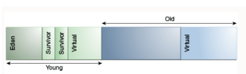
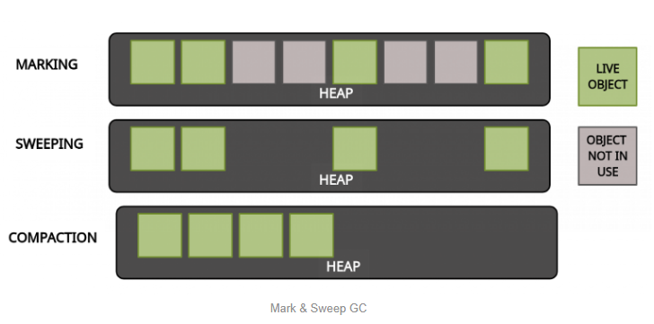
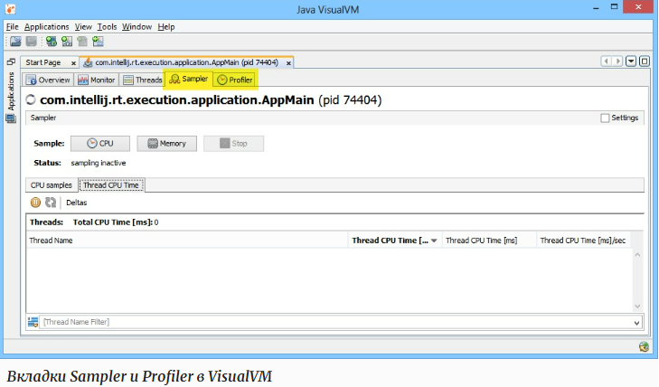

## gc

1) [Чем Java отличается от C++?](#чем-java-отличается-от-плюсов)
2) [Что такое менеджер памяти?](#что-такое-менеджер-памяти)
3) [Какой механизм используется в Java для управления памятью?](#какой-механизм-используется-в-java-для-управления-памятью)
4) [Опишите процесс работы сборщика мусора.](#опишите-процесс-работы-сборщика-мусора)
5) [Какие алгоритмы сборщика вы знаете?](#какие-алгоритмы-сборщика-вы-знаете)
6) [Чем отличаются сборщики мусора?](#чем-отличаются-сборщики-мусора)
7) [Расскажите про утилиты для анализа памяти?](#расскажите-про-утилиты-для-анализа-памяти)
8) [Что такое ссылки?](#что-такое-ссылки)
9) [Какие типы ссылок Вы знаете?](#какие-типы-ссылок-вы-знаете)
10) [Чем они отличаются?](#чем-они-отличаются)
11) [Расскажите про String pool и Int pool.](#расскажите-про-string-pool-и-int-pool)
12) [Расскажите о методе String.intern().](#расскажите-о-методе-stringintern)
13) [Расскажите, что такое профайлер.](#расскажите-что-такое-профайлер)
14) [Расскажите, как использовать VisualVM.](#расскажите-как-использовать-visualvm)
15) [Расскажите, чем отличается sampling от profiling? (Это типы аудита. Режим работы в профайлере)](#расскажите-чем-отличается-sampling-от-profiling-это-типы-аудита-режим-работы-в-профайлере)
16) [Расскажите о методе finalize().](#расскажите-о-методе-finalize)
17) [Расскажите о методе clone(). Что такое Deep clone and Shallow clone?](#расскажите-о-методе-clone-что-такое-deep-clone-and-shallow-clone)
18) [Расскажите о Stack и Heap.](#расскажите-о-stack-и-heap)


## Чем java отличается от плюсов

### ```Компилятор и интерпретатор```
Поскольку C ++ является компилируемым языком, исходный код C ++ сначала компилируется в объектный код, а затем выполняется для генерации вывода. Java - это компилируемый и интерпретируемый язык. Скомпилированный вывод исходного кода Java - это независимый от платформы байт-код.

###  ```Глобальные переменные```
В старые добрые времена Фортрана, когда "настоящие мужчины" писали на ассемблере, а программы хранились на перфокартах, главным инструментом в программировании были глобальные переменные. Си перенял эту особенность и несколько ее усовершенствовал - программисту приходилось по крайней мере объявлять тип глобальной переменной. Конечно же, при использовании глобальных переменных проблема состояла в том, что любая функция могла привести к широкомасштабным побочным эффектам, изменив глобальное состояние системы.

В Java единственным глобальным пространством имен является классовая иерархия. В этом языке просто невозможно создать глобальную переменную, не принадлежащую ни одному из классов.

### ```Goto```
Другая не слишком хорошая конструкция традиционных языков программирования - оператор goto, предназначенный для передачи управления. Всем нам на первых занятиях по программированию говорили, что можно обойтись без этого оператора, ухудшающего структуру программы и делающего ее неудобочитаемой. До того, как в C++ появился механизм работы с исключениями, goto активно использовался для выхода из циклов в исключительных ситуациях.

В Java оператора goto нет. В ней есть зарезервированное ключевое слово goto, но это сделано лишь во избежание возможной путаницы - для того, чтобы удержать программистов от его использования. Зато в Java есть операторы continue и break с меткой, восполняющие отсутствие goto в тех единственных случаях, когда использование последнего было бы оправдано. А мощный хорошо определенный встроенный в Java механизм исключений делает ненужным использование goto во всех остальных ситуациях.

### ```Указатели```
Указатели или адреса в памяти - наиболее мощная и наиболее опасная черта C++. Причиной большинства ошибок в сегодняшнем коде является именно неправильная работа с указателями. Например, одна из типичных ошибок - просчитаться на единицу в размере массива и испортить содержимое ячейки памяти, расположенной вслед за ним.

Хотя в Java дескрипторы объектов и реализованы в виде указателей, в ней отсутствуют возможности работать непосредственно с указателями. Вы не можете преобразовать целое число в указатель, а также обратиться к произвольному адресу памяти.

### ```Распределение памяти```
В строю опасных качеств C++ рука об руку с указателями идет распределение памяти. Распределение памяти в С, а значит и в C++, опирается на инь и янь ненадежного кода - на вызовы библиотечных функций malloc() и free().Если вы вызовете free() с указателем на блок памяти, который вы уже освободили ранее, или с указателем, память для которого никогда не выделялась - готовьтесь к худшему. Обратная проблема, когда вы просто забываете вызвать free(), чтобы освободить ненужный больше блок памяти, гораздо более коварна. "Утечка памяти" (memory leak) приводит к постепенному замедлению работы программы по мере того, как системе виртуальной памяти приходится сбрасывать на диск неиспользуемые страницы с мусором. И, наконец, когда все системные ресурсы исчерпаны, программа неожиданно аварийно завершается, а вы начинаете ломать голову над этой проблемой. В C++ добавлены два оператора - new и delete, которые используются во многом аналогично функциям malloc() и free(). Программист по-прежнему отвечает за то, чтобы каждый неиспользуемый объект, созданный с помощью оператора new, был уничтожен оператором delete.

в Java нет функций malloc() , free(). Поскольку в ней каждая сложная структура данных - это объект, память под такие структуры резервируется в куче (heap) с помощью оператора new. Реальные адреса памяти, выделенные этому объекту, могут изменяться во время работы программы, но вам не нужно об этом беспокоиться. Вам даже не придется вызывать free () или delete, поскольку Java - система с так называемым сборщиком мусора. Сборщик мусора запускается каждый раз, когда система простаивает, либо когда Java не может удовлетворить запрос на выделение памяти.

[к оглавлению](#gc)

## Что такое менеджер памяти
Менеджер памяти — часть системы (программы или ОС), обрабатывающая запросы на выделение и освобождения оперативной памяти.

[к оглавлению](#gc)

## Какой механизм используется в java для управления памятью

1) В Java используется автоматическое управление памятью, называемое "сборка мусора".
2) Все создаваемые программой объекты находятся в области памяти под названием "куча" (heap). JVM использует больше памяти, чем занимает куча. Для методов Java и стеков потоков выделяется память отдельно от кучи.
3) Когда объекты занимают в куче много места, происходит очистка ее от уже не используемых, "мертвых" объектов - сборка мусора.
4) Сборщик мусора - это отдельный поток, который действует автоматически и в общем случае не требует внимания программиста, позволяя тому сосредоточиться на бизнес-логике.

[к оглавлению](#gc)

## Опишите процесс работы сборщика мусора

Все объекты хранятся в куче (heap). Куча делится на поколения (generation). Есть всего два поколения: молодое (young) и старое (old). Young generation состоит из eden и survivor space.



Важное отступление, выбор «поколенческой» (generational) модели памяти сделан не спроста. Опытным путем было доказано, что большинство объектов не живут долго. Это заключение, позволяет сделать young generation небольшим, а в old generation хранить объекты действительно «живущие» дольше обычного, тем самым эффективно использовать память.

Сборка мусора происходит, когда заполнена вся область памяти. Раз память делится на два поколения соответственно бывает два типа сборки мусора: minor GC и major GC. Первый происходит, когда переполняется young generation, второй, когда переполняется область из old generation.

1. Объект рождается. Во время исполнения JVM видит, что стоит оператор new. Происходит выделение памяти под объект и возврат ссылки, которая будет ссылаться на занятый участок памяти. Все объекты рождаются в eden
2. Этап 1 выполняет до тех пор, пока не будет заполнен eden.Когда eden заполнен происходит minor GC:
3. Объекты, у которых уже нет ссылки удаляются
4. Объекты, у которых есть ссылки попадают в survivor space из eden. Причем survivor space делиться на две части. Между этими частями происходит перемещения объектов. В один момент времени одна из частей пуста, чтоб мочь вместить объекты пришедшие из eden.
5. Объекты, которые уже были в одной части survivor space, перемещаются в другую, при этом растет их «возраст» (age). Сам процесс, перемещения объектов из различных частей survivor space и увеличения их возраста называется «взрослением» (aging).
6. Объекты, которые достигли определенного возраста попадают в old generation. Этот процесс называется «продвижением» promotion. Этапы 1-6 происходят до тех пока не будет заполнен old generation, причем по ходу будут происходить minor GC, для очищения young generation.
7. Когда old generation заполняется производиться major GC
8. Этапы 1-7 происходят на протяжении работы программы

[к оглавлению](#gc)

## Какие алгоритмы сборщика вы знаете

### ```алгоритм пометок (Mark & Sweep)```

Этот алгоритм состоит из трех этапов:
1. Mark (маркировка). На первом этапе GC сканирует все объекты и помечает живые (объекты, которые все еще используются). На этом шаге выполнение программы приостанавливается. Поэтому этот шаг также называется "Stop the World" .

2. Sweep (очистка). На этом шаге освобождается память, занятая объектами, не отмеченными на предыдущем шаге.

3. Compact (уплотнение). Объекты, пережившие очистку, перемещаются в единый  непрерывный блок памяти. Это уменьшает фрагментацию кучи и позволяет проще и быстрее размещать новые объекты.



[habr](https://habr.com/ru/company/otus/blog/553996/)

[к оглавлению](#gc)

## Чем отличаются сборщики мусора

| Сборщик мусора| Описание | Преимущества | Когда использовать                                                                                                                                                                                             | Флаги для включения |
| ------------- | -------- | ------------ |----------------------------------------------------------------------------------------------------------------------------------------------------------------------------------------------------------------|---------------------|
| Serial| Использует один поток| Эффективный, т.к. нет накладных расходов на взаимодействие потоков. | Однопроцессорные машины.Работа с небольшими наборами данных. | -XX:+UseSerialGC |
| Parallel | Использует несколько потоков. | Многопоточность ускоряет сборку мусора. | В приоритете пиковая производительность.Допустимы паузы при GC в одну секунду и более. Работа со средними и большими наборами данных. Для приложений, работающих на многопроцессорном или многопоточном оборудовании. | XX:+UseParallelGC |
| G1 | Выполняет некоторую тяжелую работу параллельно с работой приложения | Может использоваться как на небольших системах, так и на больших с большим количеством процессоров и большим количеством памяти. | Когда время отклика важнее пропускной способности. Паузы GC должны быть меньше одной секунды. | -XX:+UseG1GC |
| Z1 | Выполняет всю тяжелую работу параллельно с работой приложения. | Низкая задержка. | В приоритете время отклика. | +UseZGC |

[к оглавлению](#gc)

## Расскажите про утилиты для анализа памяти

Для мониторинга можно использовать следующие инструменты:

1. [Visual VM](https://visualvm.github.io/)

Для включения логирования событий сборщика мусора добавьте следующие параметры JVM:
```java
-XX:+PrintGCDateStamps -verbose:gc -XX:+PrintGCDetails -
Xloggc:/tmp/[Application-Name]-[Application-port]-%t-gc.log -
XX:+UseGCLogFileRotation -XX:NumberOfGCLogFiles=20 -
XX:GCLogFileSize=100M
```

2. ```jps``` (узнать process id)
 ```jmap -histo <pid>``` (Эта утилита позволяет увидеть как объекты создаются, какие ожидают удаления, т.е. объекты имеющие непосредственное отношение к памяти.)

```jstat -gc pid 1s 10```  - В отличие от предыдущих утилит, утилита jstat предоставляет сводную информацию о состоянии памяти программы

```jconsole```

[к оглавлению](#gc)

## Что такое ссылки

Ссылки в Java — указатели на объекты. Другими словами, ссылка — это переменная, содержащая адрес ячейки памяти, в которой хранится объект. Кроме того, ссылка может быть инициализирована как null — нулевая ссылка, не указывающая ни на какой объект в памяти (именно это значение является значением по умолчанию)

[к оглавлению](#gc)

## Какие типы ссылок вы знаете

1. Strong Reference
2. Soft Reference
3. Weak Reference
4. PhantomReference

[https://habr.com/ru/post/549176/](https://habr.com/ru/post/549176/)

[к оглавлению](#gc)

## Чем они отличаются
Все типы ссылок, за исключением сильных, в Java являются наследниками класса Reference. Все его наследники всегда попадают в ReferenceQueue, это может происходить как явно (мы можем задать свою очередь) или неявно (когда мы не задаем). В нее попадают ссылки тех объектов, которые уже помечены на удаление.

### ```Strong Reference```
Сильная ссылка является "обычной" ссылкой, которую мы с вами привыкли создавать. При данном типе ссылок объекты удаляются только если на них нет сильной ссылки или они находятся в составе объекта на который нет ссылки. Объект в куче не удаляется сборщиком мусора, пока на него указывает сильная ссылка или если он явно доступен через цепочку сильных ссылок.

### ```Soft Reference```
Эти типы ссылок используются для более чувствительных к памяти сценариев, поскольку они будут собираться сборщиком мусора только тогда, когда вашему приложению не хватает памяти. Следовательно, пока нет критической необходимости в освобождении некоторого места, сборщик мусора не будет касаться легко доступных объектов. Java гарантирует, что все объекты, на которые имеются мягкие ссылки, будут очищены до того, как будет выдано исключение OutOfMemoryError. В документации Javadocs говорится, что «все мягкие ссылки на мягко достижимые объекты гарантированно очищены до того, как виртуальная машина выдаст OutOfMemoryError».

Подобно слабым ссылкам, мягкая ссылка создается следующим образом:
```java
 SoftReference<StringBuilder> reference = new SoftReference<>(new StringBuilder());
```


### ```Weak Reference```
Попросту говоря, слабая ссылка на объект из кучи, скорее всего, не сохранится после следующего процесса сборки мусора. Слабая ссылка создается следующим образом:
```java
WeakReference<StringBuilder> reference = new WeakReference<>(new StringBuilder());
```

Хорошим вариантом использования слабых ссылок являются сценарии кеширования. Представьте, что вы извлекаете некоторые данные и хотите, чтобы они также были сохранены в памяти - те же данные могут быть запрошены снова. С другой стороны, вы не уверены, когда и будут ли эти данные запрашиваться снова. Таким образом, вы можете сохранить слабую ссылку на него, и в случае запуска сборщика мусора, возможно, он уничтожит ваш объект в куче. Следовательно, через некоторое время, если вы захотите получить объект, на который вы ссылаетесь, вы можете внезапно получить null значение. Хорошей реализацией сценариев кеширования является коллекция WeakHashMap <K, V>. Если мы откроем WeakHashMap класс в Java API, мы увидим, что его записи фактически расширяют WeakReferenceкласс и используют его поле ref в качестве ключа отображения (Map):

```java
/**
    * The entries in this hash table extend WeakReference, using its main ref
    * field as the key.
*/

private static class Entry<K,V> extends WeakReference<Object> implements Map.Entry<K,V> {

    V value;
```

После сбора мусора ключа из WeakHashMap вся запись удаляется из карты.

### ```PhantomReference```
фантомными ссылками, — объект не удаляется из памяти до тех пор, пока его фантомная ссылка находится в этой очереди.

Он будет удален только после того, как у фантомной ссылки будет вызван метод clear()

Используется для планирования посмертных действий по очистке, поскольку мы точно знаем, что объекты больше не живы. Используется только с очередью ссылок, поскольку .get()метод таких ссылок всегда будет возвращаться null. Эти типы ссылок считаются предпочтительными для финализаторов.

Фантомный тип ссылок имеет две особенности:

1) Метод get() всегда возвращает null, поэтому доступ можно осуществить только через ReferenceQueue

2) PhantomReference попадает в ReferenceQueue только после выполнения finalize(), что значит мы еще имеем доступ к объекту некоторое время.

Данный тип ссылки используется для более гибкого управления удалением объектов, минуя минусы finalize() (будут описаны в статье по первой ссылки)


[к оглавлению](#gc)

## Расскажите про string pool и int pool

Ссылки на тип String в Java обрабатываются немного по- другому. Строки неизменяемы, что означает, что каждый раз, когда вы делаете что-то со строкой, в куче фактически создается другой объект. Для строк Java управляет пулом строк в памяти. Это означает, что Java сохраняет и повторно использует строки, когда это возможно. В основном это верно для строковых литералов. Например:
```java
String localPrefix = "297"; //1
String prefix = "297";      //2

if (prefix == localPrefix)
{
    System.out.println("Strings are equal" );
}
else
{
    System.out.println("Strings are different");
}Строка  localPrefix  =  «297» ; // 1
```
При запуске этот код распечатывает следующее:

Strings are equal

Следовательно, оказывается, что две ссылки типа String на одинаковые строковые литералы фактически указывают на одни и те же объекты в куче. Однако это не действует для вычисляемых строк. Предположим, что у нас есть следующее изменение в строке // 1 приведенного выше кода.
```java
String localPrefix = new Integer(297).toString(); //1
```

Вывод:

Strings are different

В этом случае мы фактически видим, что у нас есть два разных объекта в куче. Если учесть, что вычисляемая строка будет использоваться довольно часто, мы можем заставить JVM добавить ее в пул строк, добавив .intern()метод в конец вычисляемой строки:

```java
String localPrefix = new Integer(297).toString().intern(); //1
```

При добавлении вышеуказанного изменения создается следующий результат:

Строки равны

### ```pool int```

1) В Java существует пул объектов-оберток примитивов. Он создается статически, при инициализации соответствующего класса.
2) По спецификации пул используется для переменных: 1) byte и boolean; 2) int и long в интервале [-128...127] и 3) char в интервале [0...127].
3) Для таких объектов при автобоксинге (а также при вызове метода valueOf()) не будет создаваться новый объект, а будет возвращаться объект из пула.
4) Например, Integer.valueOf(127) == Integer.valueOf(127), а вот Integer.valueOf(128) != Integer.valueOf(128).
5) Ссылка на кэш (массив со ссылками на объекты пула) - статическая переменная внутреннего статического класса (например, Integer.IntegerCache) или статический член класса (Boolean.TRUE).

```java
public class Temp {
    public static void main(String []args){
        Integer i1 = 10;
        Integer i2 = 10;
        System.out.println(i1 == i2);
    }
}
```
Вывод: true
```java
public class Temp {
    public static void main(String []args){
        Integer i1 = 130;
        Integer i2 = 130;
        System.out.println(i1 == i2);
    }
}
```
Вывод: false

В Java есть пул(pool) целых чисел в промежутке [-128;127]. Т.е. если мы создаем Integer в этом промежутке, то вместо того, чтобы каждый раз создавать новый объект, JVM берет их из пула. Таким образом, в первом примере i1 и i2 указывают на один и тот же объект из пула, а во втором - создаются два разных объекта. Отсюда и результат. Стоит заметить, что в приведенных выше примерах не использовалось ключевое слово new.

```java
public class Temp {
    public static void main(String []args){
        Integer i1 = new Integer(10);
        Integer i2 = new Integer(10);
        System.out.println(i1 == i2);
    }
}
```
Вывод: false

Кэширование касается не только класса-оболочки Integer. Имеются аналогичные реализации кеширования для других классов-оболочек целочисленных типов:
ByteCache, ShortCache, LongCache, CharacterCache.

```java
        Integer n1 = 1234;
        Integer n2 = 1234;
        System.out.println(n1 == n2);
        System.out.println(n1.equals(n2));

        Integer n3 = 123;
        Integer n4 = 123;
        System.out.println(n3 == n4);
        System.out.println(n3.equals(n4));

        Integer n5 = 123;
        Integer n6 = new Integer(123);
        System.out.println(n5 == n6);
        System.out.println(n5.equals(n6));
```
false
true

true
true

false
true


 
[к оглавлению](#gc)

## Расскажите о методе stringintern
public String intern()
Returns a canonical representation for the string object.
A pool of strings, initially empty, is maintained privately by the class String.

When the intern method is invoked, if the pool already contains a string equal to this String object as determined by the equals(Object) method, then the string from the pool is returned. Otherwise, this String object is added to the pool and a reference to this String object is returned.

It follows that for any two strings s and t, s.intern() == t.intern() is true if and only if s.equals(t) is true.

All literal strings and string-valued constant expressions are interned. String literals are defined in section 3.10.5 of the The Java™ Language Specification.

Returns:
a string that has the same contents as this string, but is guaranteed to be from a pool of unique strings.

Основной алгоритм:
1) Создать множество (hash set) строк
2) Проверить, что строка (как последовательность символов), с которой вы имеете дело, уже в множестве
3) Если да, то использовать строку из множества
4) В противном случае, добавить эту строку в множество и затем использовать ее

При использовании этого алгоритма гарантируется, что если две строки являются идентичными последовательностями символов, они являются одним экземпляром класса. Это означает, что вы можете спокойно сравнивать строки, используя == вместо equals(), получая при этом значительные преимущества производительности при многократно повторяющихся сравнениях.

К счастью Java уже включает в себя реализацию этого алгоритма. Это метод intern() в классе java.lang.String. Выражение new String("Hello").intern() == new String("Hello").intern() возвращает true, в то время как без использования intern() возвращается false.

1) Метод string.intern() вызывается на объекте String и возвращает объект из String pool.
2) Если в String pool объекта, который equals (string) нет, то туда добавляется объект string.
3) Таким образом, если str1.equals(str2), то str1.intern() == str2.intern().

[Все о String.intern()](https://habr.com/ru/post/79913/)

[к оглавлению](#gc)

## Расскажите что такое профайлер
Профилирование - это сбор и анализ характеристик работы приложения.

jps, jmap, jstat, jconsole

[к оглавлению](#gc)

## Расскажите как использовать visualvm
Для выполнения данного задания, нужно установить VisualVM (инструмент, который предоставляет визуальный интерфейс для просмотра приложений на основе технологии Java (приложений Java), работающих на виртуальной машине Java (JVM)).

Если на данный момент у Вас еще нет VisualVM, переходите по [ссылке](https://visualvm.github.io/download.html).

[к оглавлению](#gc)

## Расскажите чем отличается sampling от profiling это типы аудита режим работы в профайлере

### ```Sampling```
```Sampling``` — собирает статистические данные о работе приложения (во время профилирования). Этот метод легковесный и поэтому, в результате его работы очень маленькая погрешность в полученных данных

Каждый определенный интервал времени собирается информация о стеке вызовов (call stack). На основе этих данные производится подсчет производительности. Используется для первоначального профилирования и для определения проблем связанных с использование процессора.



```Sampling``` означает получение большого количества дампов потоков и анализ трассировки стека. Обычно это быстрее, не требует изменений в вашем байт-коде во время выполнения (что может привести к его поломке), но также менее точно.

```Profiling``` означает [инструментирование](https://docs.oracle.com/en/java/javase/16/docs/api/java.instrument/java/lang/instrument/Instrumentation.html) ваших классов и методов, поэтому они «отчитываются» всякий раз, когда они запускаются. Это более точно, так как учитывается каждый вызов инструментированного метода, а не только те, которые перехвачены при создании дампа. Однако инструментирование означает, что байт-код ваших классов изменен, и это может привести к поломке вашей программы. Фактически, по этой причине использование профилирования на больших серверах приложений (таких как JBoss или WebLogic) часто приводит к тому, что все умирает или зависает.

[к оглавлению](#gc)

## Расскажите о методе finalize
Этот метод вызывается Java-машиной у объекта перед тем, как объект будет уничтожен. Фактически этот метод – противоположность конструктору. В нем можно освобождать ресурсы, используемые объектом.

Предназначен этот метод для автоматического освобождения системных ресурсов, занимаемых объектом, на котором будет данный метод вызван. Это кажется удобным, чтобы не помнить постоянно, например, что мы должны закрыть соединение с каким-то ресурсом, когда оно больше не требуется.

Не стоит полагаться на finalize для чистки данных. Во-первых, нет гарантии, что он будет вызван, т.к. где-то может остаться ссылка на объект. Во-вторых, нет гарантии на то, в какое время будет вызван метод. Это связано с тем, что после того, как объект становится доступным для сборки и, если в нем переопределен метод finalize, то он не вызывается сразу, а помещается в очередь, которая обрабатывается специально созданным для этого потоком. Стоит отметить, что в очередь на финализацию попадают только те объекты, в которых переопределен метод finalize.

Есть вероятность, что этот метод не будет вызван совсем. Это может произойти в момент, когда объект уже станет доступным для сборщика мусора и программа завершит свою работу.

Интересной особенностью метода является то, что он может снова сделать объект доступным, присвоив this какой-нибудь переменной, хотя так делать не рекомендуется, т.к. при восстановлении объекта, повторно finalize вызван не будет

Еще одним недостатком является то, что надо помнить про вызов finalize-метода супер-класса, если мы переопределяем его. Разработчик не вызовет — никто не вызовет.


Есть один способ быть уверенным, что finalize-методы были запущены для объектов, доступных для сборки: вызвать System.runFinalization() или Runtime.getRuntime().runFinalization(). Выход из метода осуществляется только тогда, когда все доступные методы объектов для финализации будут выполнены

[https://habr.com/ru/post/183344/](https://habr.com/ru/post/183344/)

[к оглавлению](#gc)

## Расскажите о методе clone что такое deep clone and shallow clone

clone() является Object, приведение типов необходимо для присвоения возвращаемой ссылки Object ссылке на объект. Все задействованные классы должны реализовывать Cloneable интерфейс для указания Object. clone() метод о том, что для этого метода разрешено создавать полевые копии экземпляров этого класса.

Для клонирования объекта в Java можно пользоваться тремя способами:
* Переопределение метода clone() и реализация интерфейса Cloneable();
* Использование конструктора копирования;
* Использовать для клонирования механизм сериализации

```Deep clone``` - независимая копия объекта. Если оригинальный объект изменится, deep clone не изменится. Если deep clone изменится - оригинальный не изменится.

```Shallow clone``` - зависимая копия объекта. Если оригинальный объект изменится, Shallow clone изменится. Если Shallow clone изменится - оригинальный изменится.

[https://habr.com/ru/post/246993/](https://habr.com/ru/post/246993/)

[deep clone and shallow clone](https://www.youtube.com/watch?v=iM9R0Pj-wCs)

[https://www.techiedelight.com/ru/shallow-copy-vs-deep-copy-java/](https://www.techiedelight.com/ru/shallow-copy-vs-deep-copy-java/)

[https://www.examclouds.com/ru/java/java-core-russian/cloning](https://www.examclouds.com/ru/java/java-core-russian/cloning)

[к оглавлению](#gc)

## Расскажите о stack и heap
### ```heap```
1) Heap ("куча") - область памяти, выделенная JVM для размещения объектов.
2) Абсолютно все объекты, созданные в ходе работы приложения, размещаются в heap.
3) Мертвые объекты собираются сборщиком мусора.
4) Обычно делится на Young и Old Generation.
5) Работает медленнее, чем Stack память.
6) Если нет места под объект после сборки мусора, выкидывается OutOfMemoryException.
### ```stack```
1) Stack (стек) - область памяти для хранения ЛОКАЛЬНЫХ переменных, создаваемых в методе.
2) Если локально создается объект, то сам объект помещается в Heap, а ссылка на него - в Stack.
3) Stack значительно меньше, чем Heap, скорость доступа - значительно быстрее.
4) Если память стека полностью занята (н-р бесконечная рекурсия), выбрасывается StackOverflowException.
5) Память Stack не требует сборщика мусора - блок полностью очищается при выходе из метода.
   6.1) Устройство: по принципу LIFO. Вызван метод - ему выделяется блок стек-памяти и кладется "сверху".
   6.2) Внутри вызван подметод - выделяется еще блок памяти и кладется "сверху".
   6.3) Всегда доступен только последний, самый "верхний" блок памяти.
   6.4) Метод отработал - его верхний блок памяти очищается, становится доступен более нижний блок - обрамляющего метода

[к оглавлению](#gc)

