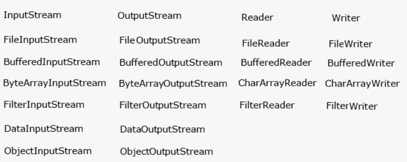
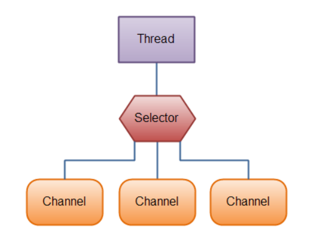
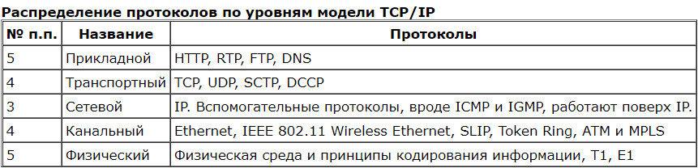

## input output

1) [Что такое поток ввода-вывода?](#что-такое-поток-ввода-вывода)
2) [Что такое Java IO?](#io)
3) [Что такое Java NIO?](#nio)
4) [Что такое Scanner?](#scanner)
5) [Как работает Scanner внутри?](#scanner)
6) [Какие базовые методы существуют в Scanner?](#методы-в-scanner)
7) [Что такое байтовый поток? Как он реализован внутри?](#байтовый-поток)
8) [Что такое символьный поток? Как он реализован внутри?](#символьный-поток)
9) [Что такое буферизированный поток?](#буферизированный-поток)
10) [Что такое форматированный вывод? Какие механизмы позволяют осуществить форматированный вызов?](#форматированный-вывод)
11) [Как осуществляется ввод и вывод из командной строки?](#ввод-вывод-из-командной-строки)
12) [Что такое класс Console? Расскажите его АПИ](#класс-Console)
13) [Что такое поток данных? Data stream](#поток-данных)
14) [Что такое поток объектов, Object stream](#поток-объектов)
15) [Что такое Path? Как он реализуется на разных ОС?](#что-такое-Path)
16) [Как получить список файлов?](#как-получить-список-файлов)
17) [Как проверить что файловая сущность является файлом или папкой?](#как-проверить-что-файловая-сущность-является-файлом-или-папкой)
18) [Как удалить файл?](#как-удалить-файл)
19) [Как переместить файл?](#как-переместить-файл)
20) [Как управлять аттрибутами файла?](#как-управлять-аттрибутами-файла)
21) [Как создать файл?](#как-создать-файл)
22) [Как создать директорию?](#как-создать-директорию)
23) [Как записать в файл?](#как-записать-в-файл)
24) [Как прочитать данные из файла?](#как-прочитать-данные-из-файла)
25) [Что такое сокет?](#что-такое-сокет)
26) [Какие виды сокетов есть в Java? С каким протоколом они работают?](#какие-виды-сокетов-есть-в-Java)
27) [Как отправить через сокет сообщение?](#как-отправить-через-сокет-сообщение)
28) [Что такое логирование?](#что-такое-логирование)
29) [Какие уровни логирования вы знаете?](#какие-уровни-логирования-вы-знаете)
30) [Какая библиотека для логирования используется в курсе? Как ее настроить?](#какая-библиотека-для-логирования-используется-в-курсе)
31) [Опишите из каких элементов состоит формат JSON](#Опишите-из-каких-элементов-состоит-формат-JSON)
32) [Как преобразовать POJO в/из json?](#как-преобразовать-POJO-в-и-из-json)
33) [Опишите из каких элементов состоит формат XML](#опишите-из-каких-элементов-состоит-формат-XML)
34) [Как преобразовать POJO в/из xml?](#как-преобразовать-POJO-в-и-из-xml)

## Что такое поток ввода вывода
Отличительной чертой многих языков программирования является работа с файлами и потоками. В Java основной функционал работы с потоками сосредоточен в классах из пакета java.io.

Ключевым понятием здесь является понятие потока. Хотя понятие "поток" в программировании довольно перегружено и может обозначать множество различных концепций. В данном случае применительно к работе с файлами и вводом-выводом мы будем говорить о потоке (stream), как об абстракции, которая используется для чтения или записи информации (файлов, сокетов, текста консоли и т.д.).

Поток связан с реальным физическим устройством с помощью системы ввода-вывода Java. У нас может быть определен поток, который связан с файлом и через который мы можем вести чтение или запись файла. Это также может быть поток, связанный с сетевым сокетом, с помощью которого можно получить или отправить данные в сети. Все эти задачи: чтение и запись различных файлов, обмен информацией по сети, ввод-ввывод в консоли мы будем решать в Java с помощью потоков.

Объект, из которого можно считать данные, называется потоком ввода, а объект, в который можно записывать данные, - потоком вывода. Например, если надо считать содержание файла, то применяется поток ввода, а если надо записать в файл - то поток вывода.

В основе всех классов, управляющих потоками байтов, находятся два абстрактных класса: InputStream (представляющий потоки ввода) и OutputStream (представляющий потоки вывода)

Но поскольку работать с байтами не очень удобно, то для работы с потоками символов были добавлены абстрактные классы Reader (для чтения потоков символов) и Writer (для записи потоков символов).

Все остальные классы, работающие с потоками, являются наследниками этих абстрактных классов. Основные классы потоков:



[к оглавлению](#input-output)

## io
IO API – (Input & Output) в первую очередь это Java API, которые облегчают работу с потоками.
В java.io существуют так называемые потоки ввода и вывода (InputStream and OutputStream).

В основном java.io предназначен для чтения и записи данных в ресурс:

1) файл;
2) при работе с сетевым подключением;
3) System.err, System.in, System.out;
4) при работе с буфером.

**Классы Java IO API**

**Базовые**

+ InputStream / OutputStream - абстрактный класс, определяющий потоковый байтовый ввод/вывод
+ Reader / Writer - Символьные потоки имеют два основных абстрактных класса Reader и Writer, управляющие потоками символов Unicode.
+ InputStreamReader / OutputStreamWriter Входной/выдодной поток, транслирующий байты в символы

**Массивы**

+ ByteArrayInputStream / ByteArrayOutputStream - использует байтовый массив в потоке.
+ CharArrayReader / CharArrayWriter - читает/пишет из символьного массива.

**Files**

+ FileInputStream / FileOutputStream - Чтение/Отправка данных в файл на диске. Реализация класса OutputStream
+ RandomAccessFile / RandomAccessFile - Чтение/запись файлов с произвольным доступом. метод seek() позволяет переместиться к определенной позиции и изменить хранящееся там значение.
  При использовании RandomAccessFile необходимо знать структуру файла. Класс RandomAccessFile содержит методы для чтения и записи примитивов и строк UTF-8.
  RandomAccessFile может открываться в режиме чтения ("r") или чтения/записи ("rw"). Также есть режим "rws", когда файл открывается для операций чтения-записи и каждое изменение данных файла немедленно записывается на физическое устройство.
+ FileReader / FileWriter FileWriter записывает данные в файл. При вводе/выводе практически всегда применяется буферизация, поэтому используется BufferedWriter.                           
  Когда данные входного потока исчерпываются, метод readLine() возвращает null. Для потока явно вызывается метод close(); если не вызвать его для всех выходных файловых потоков, в буферах могут остаться данные, и файл получится неполным

**Буферизация**

+ BufferedInputStream / BufferedOutputStream  - буферизируемый поток. Буферы вывода нужно для повышения производительности
+ BufferedReader / BufferedWriter

[к оглавлению](#input-output)

## nio
В отличие от традиционных Java-реализаций для ввода-вывода, использующих блокирующую модель передачи данных, Java NIO использует неблокирующую передачу, а также службы уровня операционной системы для достижения максимальной скорости передачи данных.

Для работы Java NIO использует:

+ буферы — типы для хранения данных;
+ каналы — аналоги потоков для быстрой записи или чтения данных.

| IO| NIO |
| ---| --- |
| Потокоориентированный| Буфер-ориентированный |
| Блокирующий (синхронный) ввод/вывод| Неблокирующий (асинхронный) ввод/вывод |
***Потокоориентированный и буфер-ориентированный ввод/вывод***

Основное отличие между двумя подходами к организации ввода/вывода в том, что Java IO является потокоориентированным, а Java NIO – буфер-ориентированным.

Потокоориентированный ввод/вывод подразумевает чтение/запись из потока/в поток одного или нескольких байт в единицу времени поочередно. Данная информация нигде не кэшируются. Таким образом, невозможно произвольно двигаться по потоку данных вперед или назад. Если вы хотите произвести подобные манипуляции, вам придется сначала кэшировать данные в буфере.

Подход, на котором основан Java NIO немного отличается. Данные считываются в буфер для последующей обработки. Вы можете двигаться по буферу вперед и назад. Это дает немного больше гибкости при обработке данных. В то же время, вам необходимо проверять содержит ли буфер необходимый для корректной обработки объем данных. Также необходимо следить, чтобы при чтении данных в буфер вы не уничтожили ещё не обработанные данные, находящиеся в буфере.

***Блокирующий и неблокирующий ввод/вывод***

Потоки ввода/вывода (streams) в Java IO являются блокирующими. Это значит, что когда в потоке выполнения (tread) вызывается read() или write() метод любого класса из пакета java.io.*, происходит блокировка до тех пор, пока данные не будут считаны или записаны. Поток выполнения в данный момент не может делать ничего другого.

Неблокирующий режим Java NIO позволяет запрашивать считанные данные из канала (channel) и получать только то, что доступно на данный момент, или вообще ничего, если доступных данных пока нет. Вместо того, чтобы оставаться заблокированным пока данные не станут доступными для считывания, поток выполнения может заняться чем-то другим.

***Каналы(channels)***

Каналы – это логические (не физические) порталы, через которые осуществляется ввод/вывод данных, а буферы являются источниками или приёмниками этих переданных данных. При организации вывода, данные, которые вы хотите отправить, помещаются в буфер, а он передается в канал. При вводе, данные из канала помещаются в предоставленный вами буфер.

Каналы напоминают трубопроводы, по которым эффективно транспортируются данные между буферами байтов и сущностями по ту сторону каналов. Каналы – это шлюзы, которые позволяют получить доступ к сервисам ввода/вывода операционной системы с минимальными накладными расходами, а буферы – внутренние конечные точки этих шлюзов, используемые для передачи и приема данных.

Тоже самое справедливо и для неблокирующего вывода. Поток выполнения может запросить запись в канал некоторых данных, но не дожидаться при этом пока они не будут полностью записаны.

Таким образом неблокирующий режим Java NIO позволяет использовать один поток выполнения для решения нескольких задач вместо пустого прожигания времени на ожидание в заблокированном состояний. Наиболее частой практикой является использование сэкономленного времени работы потока выполнения на обслуживание операций ввода/вывода в другом или других каналах.

***Селекторы***

Селекторы в Java NIO позволяют одному потоку выполнения мониторить несколько каналов ввода. Вы можете зарегистрировать несколько каналов с селектором, а потом использовать один поток выполнения для обслуживания каналов, имеющих доступные для обработки данные, или для выбора каналов, готовых для записи.



Чтобы лучше понять концепцию и выгоду от применения селекторов, давайте абстрагируемся от программирования и представим себе железнодорожный вокзал. Вариант без селектора: есть три железнодорожных пути (каналы), на каждый из них в любой момент времени может прибыть поезд (данные из буфера), на каждом пути постоянно ожидает сотрудник вокзала (поток выполнения), задача которого – обслуживание прибывшего поезда. В результате трое сотрудников постоянно находятся на вокзале даже если там вообще нет поездов. Вариант с селектором: ситуация та же, но для каждой платформы есть индикатор, сигнализирующий сотруднику вокзала (поток выполнения) о прибытии поезда. Таким образом на вокзале достаточно присутствия одного сотрудника.

[Основные отличия Java IO и Java NIO](https://habr.com/ru/post/235585/)

[Внутренне устройство ByteBuffer и методы](https://www.baeldung.com/java-bytebuffer)

Example:
```java
RandomAccessFile aFile = new RandomAccessFile("data/nio-data.txt", "rw");
    FileChannel inChannel = aFile.getChannel();

    ByteBuffer buf = ByteBuffer.allocate(48);

    int bytesRead = inChannel.read(buf);
    while (bytesRead != -1) {

      System.out.println("Read " + bytesRead);
      buf.flip();

      while(buf.hasRemaining()){
          System.out.print((char) buf.get());
      }

      buf.clear();
      bytesRead = inChannel.read(buf);
    }
    aFile.close();
```

[к оглавлению](#input-output)

## scanner
Класс имеет смысл использовать для «сканирования» источника данных. Под сканированием подразумевается нахождение последовательности символов среди данных источника. Последовательность символов называется токеном
Токенами могут быть примитивы, строки (в значении с англ. line), символьные выражения, соответствующие регулярному выражению и т.п.. В общем все, что может быть представлено в виде последовательности символов.

Сам класс работает как Iterator, т.к. поддерживает данный интерфейс.

Причем большинство методов можно разделить на hasTYPE и nextTYPE, где TYPE - это тип по шаблону которого будет происходить отделение токенов друг от друга. Например, hasInt(), nextInt().

В качестве источника данных Scanner принимает любой вид данных, включая Reader, InputStream, File для java.io и Readable, Path для java.util.nio. Также можно задать источник в виде строки String.

Scanner класс в java.util для чтение данных примитивных типов int, double, string и т.д. Это самый простой способ для получения
входящих данных, но не самый эффективный если есть ограничения по времени.

Класс Scanner предоставляется с множеством конструкторов, например:
```java
Scanner scanner = new Scanner(System.in); // получаем InputStream
Scanner fileScanner = new Scanner(new FileReader("передаем сюда имя файла"));
Scanner stringScanner = new Scanner("здесь строка"); // получаем сканер со строки
```

[к оглавлению](#input-output)

## Методы в scanner
Класс Scanner имеет следующие основные методы:

+ next() считывает введенную строку
+ nextBoolean() считывает введенное логическое значение
+ nextInt() считывает введенное целое число типа int
+ nextFloat() считывает введенное вещественное число типа float
+ nextDouble() считывает введенное вещественное число типа double
+ nextLine() считывает введенную всю строку до символа перехода на новую строку.

Если считываемый тип данных не соответствует используемому типу метода сканера, то возникнет ошибка времени выполнения программы, например, читаем целое число, а пользователь вводит дробное. Для того чтобы избежать подобных ошибок используются методы проверки считываемых типов:

+ boolean hasNextLine(): вернет true если следующим значением является строка, иначе — false;
+ boolean hasNextInt(): вернет true если значением является значение типа int;
+ boolean hasNextFloat(): вернетtrue если следующим значением является значение типаfloat;

[к оглавлению](#input-output)

## Байтовый поток
Byte streams работает с данными побайтово (8 bits). Например, FileInputStream используется для чтения и FileOutputStream для записи.
Byte streams интерфейс, который внутри основан на байтовом массиве. В основе находится некий буфер который заполняется, вычитывается и заново заполняется.

1) Байтовый поток в Java - это объект InputStream/OutputStream. 2) В потоке можно прочитать или записать один или несколько байтов. 3) Внутри есть абстрактный метод read() / write(int b), для чтения/записи одного байта. Реализация этого метода и определяет фактическую реализацию потока.

Запись:
```java
 try (FileOutputStream out = new FileOutputStream("result.txt")) {
            out.write("Hello, world!".getBytes());
            out.write(System.lineSeparator().getBytes());
        } catch (Exception e) {
            e.printStackTrace();
        }
```

Чтение:
```java
try (FileInputStream in = new FileInputStream("input.txt")) {
            StringBuilder text = new StringBuilder();
            int read;
            while ((read = in.read()) != -1) {
                text.append((char) read);
            }
            System.out.println(text);
        } catch (Exception e) {
            e.printStackTrace();
        }
```

[к оглавлению](#input-output)

## Символьный поток
В Java, символы хранятся в кодировке Unicode (16 bit). Символный поток позволяет читать данные символ за символом. Для пример FileReader и FileWriter символьные потоки.
Можно задать свою кодировку

Как он реализован внутри? 1) Символьный поток в Java - это объект Reader/Writer. 2) В потоке можно прочитать или записать один или несколько символов (char, 2 байта). Реализация этого метода и определяет фактическую реализацию работы объекта.

Чтение:
```java
try (FileReader in = new FileReader("input.txt")) {
            in.lines().forEach(System.out::println);
        } catch (Exception e) {
            e.printStackTrace();
        }
```

Запись:
```java
String data = "This is the data in the output file";

    try {
      // Creates a FileWriter
      FileWriter output = new FileWriter("output.txt");

      // Writes the string to the file
      output.write(data);

      // Closes the writer
      output.close();
    }

    catch (Exception e) {
      e.getStackTrace();
    }
```

[к оглавлению](#input-output)

## Буферизированный поток
Для оптимизации операций ввода-вывода используются буферизуемые потоки. Эти потоки добавляют к стандартным специальный буфер в памяти, с помощью которого повышается производительность при чтении и записи потоков.
BufferedInputStream и BufferedOutputStream.
Это может сделать программу намного эффективней, так как каждый такой запрос часто инициировал доступ к диску, сетевое действие, или некоторую другую работу, которая относительно дорога.

BufferedReader in = new BufferedReader(new FileReader("input.txt"))

Это наглядный пример использование шаблона декоратор. Один поток оборачивается в другой.

Базовый поток - это поток байтов. Его можно обернуть в символьный поток, если мы знаем, что нам нужно читать текст.

Символьные потоки позволяют читать сразу символы, а не байты. Так же у буферизированного символьного потока есть методы чтения целой строки.

[к оглавлению](#input-output)

## Форматированный вывод

Базовой частью поддержки создания форматированного вывода в языке Java служит класс Formatter, включенный в пакет java.util. Он обеспечивает преобразования формата (format conversions) позволяющие выводить числа, строки и время и даты практически в любом понравившемся вам формате.
В классе Formatter объявлен метод format(), который преобразует переданные в него параметры в строку заданного формата и сохраняет в объекте типа Formatter.
Аналогичный метод format() объявлен у классов PrintStream и PrintWriter. System.out это статическая переменная типа PrintStream.
В Java 5 для классов PrintStream и PrintWriter добавлен метод printf(). Методы printf() и format() автоматически используют класс Formatter:

Форматированный вывод нужно использовать вместо конкатенации строк.
+ %a	Шестнадцатеричное число с плавающей точкой
+ %b	Булево значение
+ %c	Символ
+ %d	Десятичное целое
+ %e	Число в научной записи
+ %f	Десятичное число с плавающей точкой
+ %h	Хеш-код от аргумента
+ %o	Восьмеричное целое
+ %n	Символ переноса строки
+ %t	Время
+ %x	Шестнадцатеричное целое

String output = String.format("%s = %d", "joe", 35);
String.format(); Formatter

Можно создать Formatter и привязать его к StrungBuilder

```java
StringBuilder sbuf = new StringBuilder();
Formatter fmt = new Formatter(sbuf);
fmt.format("PI = %f%n", Math.PI);
System.out.print(sbuf.toString());
```
Также есть свое форматирование для вывода дат.

Можно задавать выравнивание, количество отступов.
```java
String.format("|%-20d|", 93); // prints: |93                  |

String.format("|%020d|", 93); // prints: |00000000000000000093|
```

[к оглавлению](#input-output)

## Ввод вывод из командной строки
По умолчанию ввод с клавиатуры, вывод на монитор.

Класс System содержит также три переменные предопределенных потоков ввода-вывода: in, out и err
+ Переменная System.out ссылается на стандартный поток вывода. По умолчанию это консоль.
+ Переменная System.in ссылается на стандартный поток ввода, которым по умолчанию является клавиатура.
+ System.err - для ошибок.

[к оглавлению](#input-output)

## Класс Console
Специально для работы с консолью в Java определен класс Console, который хранится в пакете java.io. Он не получает консольный ввод-вывод сам по себе, а использует уже имеющиеся потоки System.in и System.out. Но в то же время Console значительно упрощает ряд операций, связанных с консолью.
Для получения объекта консоли надо вызвать статический метод System.console():
```java
    Console console = System.console();
```

Основные методы класса Console:

+ flush(): выводит на консоль все данные из буфера

+ format(): выводит на консоль строку с использованием форматирования

+ printf(): выводит на консоль строку с использованием форматирования (фактически то же самое, что и предыдущий метод)

+ String readLine(): считывает с консоли введенную пользователем строку

+ char[] readPassword(): считывает с консоли введенную пользователем строку, при этом символы строки не отображаются на консоли
Альтернатива стандратным потокам ввода / вывода класс Console.

Для создание экземпляра используется System.console(). Метод может вернуть NULL если консоль недоступна.
Консоль позволяет вводить пароль используя метод readPassword (не видны символы при вводе, не сохраняется в памяти).


[к оглавлению](#input-output)

## Поток данных
Классы DataOutputStream и DataInputStream позволяют записывать и считывать данные примитивных типов (boolean, char, byte, short, int, long, float, and double).
+ DataOutputStream.writeDouble
+ DataInputStream.readDouble

[к оглавлению](#input-output)

## Поток объектов
*Сериализация* – процесс преобразования объектов в бинарный (т.е. последовательность битов) или текстовый формат.

*Десериализация* – процесс преобразования сериализованных данных в объекты, т.е. операция обратная сериализации.

ObjectOutputStream используется для конвертации объектов в поток. В java это называется сериализация. Объект преобразованный таким образом
может быть сохранен в базу данных, передан по сети и т.п. Для записи в файл можно использовать FileOutputStream.
Объект который передается в потоке должен реализовывать интерфейс java.io.Serializable.

```java
FileOutputStream fos = new FileOutputStream("EmployeeObject.ser");
ObjectOutputStream oos = new ObjectOutputStream(fos);
// write object to file
oos.writeObject(emp);
```
При сериализации используют переменную SerialVersionUID.
Во время сериализации, среда выполнения Java создает номер версии для класса, так что она может десереализировать его позже. В Java этот номер версии известен как SerialVersionUID. Если во время десериализации, SerialVersionUID не соответствует, то процесс завершится с исключением

SerialVersionUID используется для указании версии сериализованных данных.

+ Когда мы не объявляем SerialVersionUID в нашем классе, среда выполнения Java делает это за нас, но этот процесс чувствителен ко многим метаданным класса включая количество полей, тип полей, модификаторы доступа полей, интерфейсов, которые реализованы в классе и пр. Вы можете найти точную информацию в документации о сериализации от Oracle.
+ Рекомендуется объявлять SerialVersionUID как private static final long переменную во избежание механизма по умолчанию.

[к оглавлению](#input-output)

## Что такое Path
Java 7 представляет новую абстракцию для пути, а именно интерфейс Path. Он используется в новых функциях и API, по всему NIO.2.
Объект пути содержит имена каталогов и файлов, которые составляют полный путь до файла/каталога, представленного объектом Path;
Path содержит методы для извлечения элементов пути, манипуляций с ними и их добавления.

Путь к файлу, в разных системх может записываться по разному, \ или / поэтому лучше
использовать File.separator для построения пути

```java
// Cоздание объекта Path через вызов статического метода get() класса Paths 
Path testFilePath = Paths.get("/home/heorhi/testfile.txt"); 
         
//Пример строки создания объекта Path пути для запуска в Windows 
Path testFilePath = Paths.get("D:\\test\\testfile.txt");
```

[к оглавлению](#input-output)

## Как получить список файлов
+ Без учета подпапок
```java
File file = new File("dir");
File[] filesArr = file.listFiles();
String[] filesNames = file.list();
```

+ С учетом подпапок
```java
public void listFilesForFolder(final File folder) {
    for (final File fileEntry : folder.listFiles()) {
        if (fileEntry.isDirectory()) {
            listFilesForFolder(fileEntry);
        } else {
            System.out.println(fileEntry.getName());
        }
    }
}

final File folder = new File("/home/you/Desktop");
listFilesForFolder(folder);
```

**Java 8**

+ Java NIO без учета подпапок
```java
Stream<Path> stramFiles = Files.list(Paths.get("dir"));
```

+ С учетом подпапок. Files.walk API is available from Java 8.

```java
try (Stream<Path> paths = Files.walk(Paths.get("/home/you/Desktop"))) {
    paths
        .filter(Files::isRegularFile)
        .forEach(System.out::println);
}
```

+ Через walkFileTree

(The difference between walk and walkFileTree is that they supply different interfaces for walking the tree: walkFileTree takes FileVisitor, walk gives Stream<Path>)

```java
Files.walkFileTree(directory, Collections.emptySet(), 1, new SimpleFileVisitor<Path>() {
    @Override
    public FileVisitResult visitFile(Path file, BasicFileAttributes attrs) throws IOException {
        doSomething(file);
        return FileVisitResult.CONTINUE;
    }

    @Override
    public FileVisitResult visitFileFailed(Path file, IOException exc) {
        // log exc
        return FileVisitResult.CONTINUE;
    }
});
```

[к оглавлению](#input-output)

## Как проверить что файловая сущность является файлом или папкой
```java
File file = new File("/Users/pankaj/source.txt");
File dir = new File("/Users/pankaj");
File notExists = new File("/Users/pankaj/notafile");
        
System.out.println("/Users/pankaj/source.txt is file?"+file.isFile());
System.out.println("/Users/pankaj/source.txt is directory?"+file.isDirectory());
        
System.out.println("/Users/pankaj is file?"+dir.isFile());
System.out.println("/Users/pankaj is directory?"+dir.isDirectory());
        
System.out.println("/Users/pankaj/notafile is file?"+notExists.isFile());
System.out.println("/Users/pankaj/notafile is directory?"+notExists.isDirectory());
```

С использованием path

```java
Path file = new File(path).toPath();

boolean exists =      Files.exists(file);        // Check if the file exists
boolean isDirectory = Files.isDirectory(file);   // Check if it's a directory
boolean isFile =      Files.isRegularFile(file); // Check if it's a regular file
```

[к оглавлению](#input-output)

## Как удалить файл
**Using java.io.File.delete() function:**
```java
File file = new File("/Users/pankaj/file.txt");
if(file.delete()){
    System.out.println("/Users/pankaj/file.txt File deleted");
}else System.out.println("File /Users/pankaj/file.txt doesn't exist");
```
**Using java.nio.file.files.deleteifexists(Path p)**
```java
Files.deleteIfExists(Paths.get("C:\\Users\\Mayank\\Desktop\\445.txt")); 
```

[к оглавлению](#input-output)

## Как переместить файл
Java.io.File не содержит никакого готового метода перемещения файла, но вы можете обойти это с помощью следующих двух альтернатив:

+ File.renameTo() (может не сработать на разных файловых системах. Надо проверять результат)
+ Скопируйте в новый файл и удалите исходный файл.

Для Java 7:

+ Files.move(Paths.get("/foo.txt"), Paths.get("bar.txt"), StandardCopyOption.REPLACE_EXISTING);

[к оглавлению](#input-output)

## Как управлять аттрибутами файла
Базовые атрибуты (доступны во всех ОС):

+ File type
+ File size
+ Created time
+ Owner of the file
+ Last time modified
+ Last time accessed
+ Hidden
+ System file
+ Regular file
+ isDirectory

FileAttributeView - базовый интерфейс с подинтерфейсами

+ BasicFileAttributeView
+ DosFileAttributeView
+ PosixFileAttributeView
+ UserDefinedFileAttributeView
+ AclFileAttributeView
+ FileOwnerAttributeView

```java
Path path = FileSystems.getDefault().getPath("c:/test", "somefile.txt");
BasicFileAttributeView basicView = Files.getFileAttributeView(path, BasicFileAttributeView.class);
basicView.readAttributes().lastAccessTime().toMillis();;  // will return the last time the file was read.
basicView.readAttributes().lastModifiedTime().toMillis();  // will return the last time the file was changed.
basicView.readAttributes().creationTime().toMillis();  // will return the creation time.
```

```java
DosFileAttributeView dosView = Files.getFileAttributeView(path,DosFileAttributeView.class);
dosView.setHidden(true);
dosView.setReadOnly(true);
dosView.setSystem(true);
dosView.setArchive(true);
```

[к оглавлению](#input-output)

## Как создать файл
Три способа:
+ File file = new File(absoluteFilePath);
  file.createNewFile();

+ FileOutputStream fos = new FileOutputStream("name.txt");
  fos.write(fileData.getBytes());
  fos.flush();
  fos.close();

+ String fileData = "Pankaj Kumar";
  Files.write(Paths.get("name.txt"), fileData.getBytes());

+ Path path = Paths.get("name.txt");
  Files.createFile(path);


[к оглавлению](#input-output)

## Как создать директорию
+ new File("/path/directory").mkdirs();

+ Files.createDirectories(Paths.get("/path/to/directory"));

[к оглавлению](#input-output)

## Как записать в файл
+ **BufferedWritter**
```java
    BufferedWriter writer = new BufferedWriter(new FileWriter("c:/temp/samplefile1.txt"));
    writer.write(fileContent);
    writer.close();
```

+ **FileWriter/PrintWriter**

```java
    FileWriter fileWriter = new FileWriter("c:/temp/samplefile2.txt");
    fileWriter.write(fileContent);
    fileWriter.close();
```

+ **FileOutputStream**

```java
    FileOutputStream outputStream = new FileOutputStream("c:/temp/samplefile4.txt");
    byte[] strToBytes = fileContent.getBytes();
    outputStream.write(strToBytes);
     
    outputStream.close();
```

+ **DataOutputStream**

```java
    FileOutputStream outputStream = new FileOutputStream("c:/temp/samplefile5.txt");
    DataOutputStream dataOutStream = new DataOutputStream(new BufferedOutputStream(outputStream));
    dataOutStream.writeUTF(fileContent);
     
    dataOutStream.close();
```

+ **FileChannel**

```java
    RandomAccessFile stream = new RandomAccessFile("c:/temp/samplefile6.txt", "rw");
    FileChannel channel = stream.getChannel();
    byte[] strBytes = fileContent.getBytes();
    ByteBuffer buffer = ByteBuffer.allocate(strBytes.length);
    buffer.put(strBytes);
    buffer.flip();
    channel.write(buffer);
    stream.close();
    channel.close();
```

+ **Java 7 Path**

```java
    Path path = Paths.get("c:/temp/samplefile7.txt");     
    Files.write(path, fileContent.getBytes());
```

+ Если мы попытаемся записать в файл, который не существует, файл будет создан первым, и никаких исключений не будет выдано (кроме использования метода Path).
+ Всегда закрывайте поток вывода после записи содержимого файла, чтобы освободить все ресурсы. Это также поможет не повредить файл.
+ Use PrintWriter используется для записи форматированного текста.
+ Используйте FileOutputStream для записи двоичных данных.
+ Используйте DataOutputStream для записи примитивных типов данных.
+ Используйте FileChannel для записи больших файлов.

[к оглавлению](#input-output)

## Как прочитать данные из файла
+ **BufferedReader**
```java
    BufferedReader br = new BufferedReader(new FileReader(file)); 
         
    String st; 
    while ((st = br.readLine()) != null) 
        System.out.println(st); 
    }
```

+ **FileReader**
```java
    FileReader fr = 
          new FileReader("C:\\Users\\pankaj\\Desktop\\test.txt"); 
      
    int i; 
    while ((i=fr.read()) != -1) 
    System.out.print((char) i);      
```

+ **Scanner**
```java
    Scanner sc = new Scanner(file); 
      
    // we just need to use \\Z as delimiter 
    sc.useDelimiter("\\Z"); 
      
    System.out.println(sc.next());
```

+ **Reading the whole file in a List**
```java
    data = new String(Files.readAllBytes(Paths.get(fileName)));
```


[к оглавлению](#input-output)

## Что такое сокет
сокет – это два потока – InputStream из которого можно читать сообщения/данные и OutputStream, куда можно писать сообщения/данные. Когда ты создаешь серверный сокет, фактически появляется порт, к которому могут подключаться сокеты с других компьютеров.

Пакет java.net обеспечивает поддержку двух общих сетевых протоколов:

+ TCP - TCP - это протокол управления передачей, который обеспечивает надежную связь между двумя приложениями. В Java TCP обычно используется через Интернет-протокол, который называется TCP/IP.
+ UDP - UDP - это протокол пользовательских дейтаграмм, протокол без установления соединения, который позволяет передавать пакеты данных между приложениями.

В Java сокеты обеспечивают механизм связи между двумя компьютерами, использующими TCP. Клиентская программа создает сокет на своем конце связи и пытается подключить этот сокет к серверу.

Когда соединение установлено, сервер создает объект сокета на своем конце связи. Клиент и сервер теперь могут общаться, записывая и считывая данные с сокета.

Класс java.net.Socket представляет собой сокет, а класс java.net.ServerSocket предоставляет механизм серверной программы для прослушивания клиентов и установления соединений с ними.

При установлении соединения TCP между двумя компьютерами с использованием сокетов, выполняются следующие этапы:

+ Сервер создает экземпляр объекта ServerSocket, определяющий, по какому номеру порта должна происходить связь.
+ Сервер вызывает метод accept() класса ServerSocket. Этот метод ожидает, пока клиент не подключится к серверу по указанному порту.
+ По завершению ожидания сервера клиент создает экземпляр объекта сокета, указывая имя сервера и номер порта подключения.
+ Конструктор класса Socket осуществляет попытку подключить клиента к указанному серверу и номеру порта. Если связь установлена, у клиента теперь есть объект Socket, способный связываться с сервером.
+ На стороне сервера метод accept() возвращает ссылку к новому сокету на сервере, который подключен к клиентскому сокету.

После того, как соединения установлены, связь может происходить с использованием потоков входных/выходных данных. Каждый сокет имеет и OutputStream (поток выходных данных), и InputStream (поток входных данных). OutputStream клиента подключен к InputStream сервера, а InputStream клиента подключен к OutputStream сервера.

TCP является двусторонним протоколом связи, поэтому данные могут передаваться по обоим потокам одновременно.

Создание сервера:

```java
server = new ServerSocket(4004); // серверсокет прослушивает порт 4004
System.out.println("Сервер запущен!"); 
clientSocket = server.accept(); // accept() будет ждать пока

                
try { // установив связь и воссоздав сокет для общения с клиентом можно перейти
                    
    in = new BufferedReader(new InputStreamReader(clientSocket.getInputStream()));
    // и отправлять
    out = new BufferedWriter(new OutputStreamWriter(clientSocket.getOutputStream()));

    String word = in.readLine(); // ждём пока клиент что-нибудь нам напишет
    System.out.println(word);
    // не долго думая отвечает клиенту
    out.write("Привет, это Сервер! Подтверждаю, вы написали : " + word + "\n");
    out.flush(); // выталкиваем все из буфера

    } finally { // в любом случае сокет будет закрыт
        clientSocket.close();
        in.close();
        out.close();
}
```

Создание клиента

```java

// адрес - локальный хост, порт - 4004, такой же как у сервера
clientSocket = new Socket("localhost", 4004); // этой строкой мы запрашиваем
//  у сервера доступ на соединение
reader = new BufferedReader(new InputStreamReader(System.in));
// читать соообщения с сервера
in = new BufferedReader(new InputStreamReader(clientSocket.getInputStream()));
// писать туда же
out = new BufferedWriter(new OutputStreamWriter(clientSocket.getOutputStream()));

System.out.println("Вы что-то хотели сказать? Введите это здесь:");
// если соединение произошло и потоки успешно созданы - мы можем
//  работать дальше и предложить клиенту что то ввести
// если нет - вылетит исключение
String word = reader.readLine(); // ждём пока клиент что-нибудь
// не напишет в консоль
out.write(word + "\n"); // отправляем сообщение на сервер
out.flush();
String serverWord = in.readLine(); // ждём, что скажет сервер
System.out.println(serverWord); // получив - выводим на экран

```

[к оглавлению](#input-output)

## Какие виды сокетов есть в Java
Наиболее распространенный протокол HTTP (Hyper Text Transfert Protocol) определяет взаимодействие двух программ, клиента и сервера, которые могут быть запущены на разных и удаленных друг от друга машинах. Клиентом является приложение, которое пользуется каким-то сервисом, предоставляемым сервером, обычно размещенном на удаленном компьютере. Клиент должен подключиться к удаленному серверу, который постоянно находится в режиме ожидания соединения. После этого они могут обмениваться информацией.
HTTP использует протокол TCP/IP. В статье рассмотриваются возможности, предоставляемые Java для работы с этим протоколом.

Протокол HTTP располагается на прикладном уровне и использует для собственной реализации протоколы более низких уровней. Основой HTTP является протокол транспортного уровня TCP.

Согласно протоколу IP (Internet Packet), каждый узел (компьютер, switch и т.п.) в сети имеет свой IP-адрес. На данный момент интернет работает по протоколу IPv4, где IP адрес записывается 4 числами от 0 до 255 - например, 127.0.0.1. Существует и другой способ идентификации компьютеров в сети через доменное имя, которое более удобное и нагляднее идентифицирует компьютер, чем простой набор чисел (например, java-oline.ru). В Интернете существуют специальные сервера DNS (Domain Name System), которые осуществляют преобразование доменного имени в IP-адрес и наоборот.

TCP протокол базируется на IP для доставки пакетов, но добавляет два важных свойства:

+ установление соединения между приложениями;
+ использование портов, а не просто узлов.

Таким образом, для идентификации компьютера (host'a) в сети используется IP-адрес; для идентификации приложения TCP добавляет понятие порта. Порт - это целое число от 1 до 65535 указывающее, какому приложению предназначается пакет.

Java для работы в сети имеет специальный пакет java.net, содержащий класс Socket, что в переводе означает «гнездо». Ключевыми классами для реализации взаимодействия программ по протоколу TCP являются:

+ java.net.ServerSocket - класс реализует серверный сокет, который ожидает запросы, приходящие от клиентов по сети, и может отправлять ответ.
+ java.net.Socket - класс реализует клиентский сокет.


[к оглавлению](#input-output)

## Как отправить через сокет сообщение
```java

// адрес - локальный хост, порт - 4004, такой же как у сервера
clientSocket = new Socket("localhost", 4004); // этой строкой мы запрашиваем
//  у сервера доступ на соединение
reader = new BufferedReader(new InputStreamReader(System.in));
// читать соообщения с сервера
in = new BufferedReader(new InputStreamReader(clientSocket.getInputStream()));
// писать туда же
out = new BufferedWriter(new OutputStreamWriter(clientSocket.getOutputStream()));

System.out.println("Вы что-то хотели сказать? Введите это здесь:");
// если соединение произошло и потоки успешно созданы - мы можем
//  работать дальше и предложить клиенту что то ввести
// если нет - вылетит исключение
String word = reader.readLine(); // ждём пока клиент что-нибудь
// не напишет в консоль
out.write(word + "\n"); // отправляем сообщение на сервер
out.flush();
String serverWord = in.readLine(); // ждём, что скажет сервер
System.out.println(serverWord); // получив - выводим на экран

```
[к оглавлению](#input-output)

## Что такое логирование
Логирование — это процесс, при котором программа на Java-языке записывает сведения о своем исполнении в некий файл, базу данных или консоль.

[к оглавлению](#input-output)

## Какие уровни логирования вы знаете
Уровни логирования
+ debug — выводится информация, которая пригодится для отладки программы;
+ info — обычные и стандартные сообщения;
+ warn — нефатальное предупреждение;
+ error — записи ошибок;
+ fatal — фатальная ошибка;
+ trace — информация для точной отладки;
+ all — выводится вся информация.

[к оглавлению](#input-output)

## Какая библиотека для логирования используется в курсе
Log4j - библиотека позволяет осуществить логирование процессов в приложении. (1 версия для совместимости с slf4j). Подключить через maven: 
```java
    <dependency>
        <groupId>log4j</groupId>
        <artifactId>log4j</artifactId>
        <version>1.2.17</version>
    </dependency>
    <dependency>
        <groupId>org.slf4j</groupId>
        <artifactId>slf4j-log4j12</artifactId>
        <version>1.7.30</version>
    </dependency>

import org.slf4j.Logger;
import org.slf4j.LoggerFactory;

public class UsageLog4j {

    private static final Logger LOG = LoggerFactory.getLogger(UsageLog4j.class.getName());

    public static void main(String[] args) {
        LOG.trace("trace message");
        LOG.debug("debug message");
        LOG.info("info message");
        LOG.warn("warn message");
        LOG.error("error message");
    }
}
```

В Java есть несколько библиотек для логирования: Logback, log4j, System.out.println.

Библиотека slf4j позволяет абстрагироваться от конкретных библиотек. Это позволяет придерживаться единого стиля логирования для проектов.

[к оглавлению](#input-output)

## Опишите из каких элементов состоит формат JSON
JSON (англ. JavaScript Object Notation) — текстовый формат обмена данными, основанный на JavaScript. Но при этом формат независим от JS и может использоваться в любом языке программирования.
JSON используется в REST API.

В качестве значений в JSON могут быть использованы:

+ JSON-объект
+ Массив
+ Число (целое или вещественное)
+ Литералы true (логическое значение «истина»), false (логическое значение «ложь») и null
+ Строка
```json
    {
      "query": "Виктор Иван",
      "count": 7,
      "parts": ["NAME", "SURNAME"],
      "data": {
            "surname": null,
            "name": "Виктор",
            "patronymic": "Иванович",
            "gender": "MALE"
        }
    }
```

JSON-объект — это неупорядоченное множество пар «ключ:значение».

[к оглавлению](#input-output)

## Как преобразовать POJO в и из json
```java
    /* JSONObject напрямую методом put */
final Person person = new Person(false, 30, new Contact("11-111"), "Worker", "Married");
        JSONObject jsonObject = new JSONObject();
        jsonObject.put("sex", person.isSex());
        jsonObject.put("age", person.getAge());
        jsonObject.put("contact", jsonContact);
        jsonObject.put("statuses", jsonStatuses);
```

[к оглавлению](#input-output)

## Опишите из каких элементов состоит формат XML
Тело документа XML состоит из элементов разметки (markup) и непосредственно содержимого документа - данных (content). XML - тэги предназначены для определения элементов документа, их атрибутов и других конструкций языка.
XML — расширяемый язык разметки. Данный язык очень похож на HTML, только в отличии от него является расширяемым, что значит, мы можем писать свои теги, а не использовать зарезервированные.

Это первая строка, которая должна идти в файле, под расширением XML. В ней указывается кодировка и версия XML

```xml
    <?xml version="1.1" encoding="UTF-8" ?>
```

Теги - это основные детали из которых строится документ. Тег имеет имя и располагается между <>.

Тег бывает открывающим располагается внутри <> и закрывающим располагается внутри < />

```xml
    <device>
        <producer>Lenovo</producer>
        <model>Thinkpad</model>
    </device>
```

Атрибуты - это часть синтаксиса, которая позволяет определить свойста элементов.

Атрибуты пишутся в открывающем теге, после его имени в формате:

имяАтрибут="его значение"

```xml
    <size>
        <width>100</width>
        <height>100</height>
    </size>
```

Комментарии

Комментарии как однострочные, так и многострочные пишутся внутри <!-- и -->

```xml
 <!-- комментарии -->
```

Example
```xml
<?xml version="1.1" encoding="UTF-8" ?>
<person sex="false" age="30">
    <contact phone="11-111"/>
    <statuses>
        <status>Worker</status>
        <status>Married</status>
    </statuses>
</person>
```

[к оглавлению](#input-output)

## Как преобразовать POJO в и из xml
```xml

<dependency>
    <groupId>javax.xml.bind</groupId>
    <artifactId>jaxb-api</artifactId>
    <version>2.3.1</version>
</dependency>
<dependency>
    <groupId>javax.activation</groupId>
    <artifactId>activation</artifactId>
    <version>1.1.1</version>
</dependency>
<dependency>
    <groupId>org.glassfish.jaxb</groupId>
    <artifactId>jaxb-runtime</artifactId>
    <version>2.3.1</version>
</dependency>
```

1) Как вы уже знаете xml обязательно должен иметь корневой тег, в котором все и будет располагаться. Для его обозначения служит

@XmlRootElement. Эту аннотацию нужно ставить над сущностью, которая будет корневой в нашем случае это Person

2) Над вложенными сущностями нам нужно поставить просто @XmlElement

3) Для того чтобы поле считалось атрибутом нужно поставить  @XmlAttribute, по умолчанию поле парсится как тег

4) Мы можем указать также как мы хотим читать/писать объект. По геттерам/сеттерам или напрямую по полям (используется рефлексия). Мы будем использовать доступ по полям. Для этих целей служит аннотация @XmlAccessorType
```java
import javax.xml.bind.JAXBContext;
import javax.xml.bind.JAXBException;
import javax.xml.bind.Marshaller;
import javax.xml.bind.annotation.*;
import java.io.StringWriter;
import java.util.Arrays;

@XmlRootElement(name = "person")
@XmlAccessorType(XmlAccessType.FIELD)
public class Person {

    @XmlAttribute
    private boolean sex;

    @XmlAttribute
    private int age;
    private Contact contact;

    private String[] statuses;

    public Person() { }

    public Person(boolean sex, int age, Contact contact, String... statuses) {
        this.sex = sex;
        this.age = age;
        this.contact = contact;
        this.statuses = statuses;
    }

    @Override
    public String toString() {
        return "Person{"
                + "sex=" + sex
                + ", age=" + age
                + ", contact=" + contact
                + ", statuses=" + Arrays.toString(statuses)
                + '}';
    }


    public static void main(String[] args) throws JAXBException {

        final Person person = new Person(false, 30, new Contact("11-111"), "Worker", "Married");

        JAXBContext context = JAXBContext.newInstance(Person.class);
        Marshaller marshaller = context.createMarshaller();
        marshaller.setProperty(Marshaller.JAXB_FORMATTED_OUTPUT, Boolean.TRUE);
        
        try (StringWriter writer = new StringWriter()) {
            marshaller.marshal(person, writer);
            String result = writer.getBuffer().toString();
            System.out.println(result);
        } catch (Exception e) {

        }
    }

}

import javax.xml.bind.annotation.XmlAttribute;

@XmlRootElement(name = "contact")
public class Contact {

    @XmlAttribute
    private String phone;

    public Contact() {

    }

    public Contact(String phone) {
        this.phone = phone;
    }

    @Override
    public String toString() {
        return "Contact{"
                + "phone='" + phone + '\''
                + '}';
    }
}
```

Опишем процесс сериализации и десериализации
```java
import javax.xml.bind.JAXBContext;
import javax.xml.bind.Marshaller;
import javax.xml.bind.Unmarshaller;
import java.io.StringReader;
import java.io.StringWriter;

public class Main {
    public static void main(String[] args) throws Exception {
        Person person = new Person(false, 30, new Contact("11-111"), "Worker", "Married");
        /* Получаем контекст для доступа к АПИ */
        JAXBContext context = JAXBContext.newInstance(Person.class);
        /* Создаем сериализатор */
        Marshaller marshaller = context.createMarshaller();
        /* Указываем, что нам нужно форматирование */
        marshaller.setProperty(Marshaller.JAXB_FORMATTED_OUTPUT, Boolean.TRUE);
        String xml = "";
        try (StringWriter writer = new StringWriter()) {
            /* Сериализуем */
            marshaller.marshal(person, writer);
            xml = writer.getBuffer().toString();
            System.out.println(xml);
        }
        /* Для десериализации нам нужно создать десериализатор */
        Unmarshaller unmarshaller = context.createUnmarshaller();
        try (StringReader reader = new StringReader(xml)) {
            /* десериализуем */
            Person result = (Person) unmarshaller.unmarshal(reader);
            System.out.println(result);
        }

    }
}
```

[к оглавлению](#input-output)
