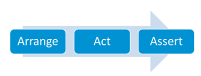

# solid

1) [Что такое ООД? Какие задачи выполняет ООД?](#что-такое-оод-какие-задачи-выполняет-оод)
2) [Расскажите о принципах KISS, DRY, YAGNI?](#расскажите-о-принципах-kiss-dry-yagni)
3) [Что такое SOLID?](#что-такое-solid)
4) [Для чего используется JavaDoc?](#для-чего-используется-javadoc)
5) [Как писать JavaDoc? Опишите основные теги @param, @return, @throws.](#как-писать-javadoc-опишите-основные-теги-param-return-throws)
6) [Что такое Java code convention?](#что-такое-java-code-convention)
7) [Расскажите про принципы составления Java класса.](#расскажите-про-принципы-составления-java-класса)
8) [Что такое SRP?](#что-такое-srp)
9) [Расскажите о нарушениях принципа SRP.](#расскажите-о-нарушениях-принципа-srp)
10) [Каковы последствия нарушения SRP?](#каковы-последствия-нарушения-srp)
11) [Что такое OCP?](#что-такое-ocp)
12) [Расскажите о нарушениях принципа OCP.](#расскажите-о-нарушениях-принципа-ocp)
13) [Каковы последствия нарушения OCP?](#каковы-последствия-нарушения-ocp)
14) [Что такое LSP?](#что-такое-lsp)
15) [Расскажите о нарушениях принципа LSP.](#расскажите-о-нарушениях-принципа-lsp)
16) [Каковы последствия нарушения LSP?](#каковы-последствия-нарушения-lsp)
17) [Что такое ISP?](#что-такое-isp)
18) [Расскажите о нарушениях принципа ISP.](#расскажите-о-нарушениях-принципа-isp)
19) [Каковы последствия нарушения ISP?](#каковы-последствия-нарушения-isp)
20) [Что такое DIP?](#что-такое-dip)
21) [Расскажите о нарушениях принципа DIP.](#расскажите-о-нарушениях-принципа-dip)
22) [Каковы последствия нарушения DIP?](#каковы-последствия-нарушения-dip)
23) [Расскажите, что такое автоматизированное тестирование.](#расскажите-что-такое-автоматизированное-тестирование)
24) [Как в Java осуществляется автоматизированное тестирование?](#как-в-java-осуществляется-автоматизированное-тестирование)
25) [Что такое JUnit? Как использовать ее для тестирования?](#что-такое-junit-как-использовать-ее-для-тестирования)
26) [Что такое функциональное тестирование и чем отличается оно от модульного?](#что-такое-функциональное-тестирование-и-чем-отличается-оно-от-модульного)
27) [Расскажите про методологию TDD.](#расскажите-про-методологию-tdd)
28) [Расскажите про методологию BDD.](#расскажите-про-методологию-bdd)
29) [Что такое тестирование черным, белым, серым ящиком?](#что-такое-тестирование-черным-белым-серым-ящиком)
30) [Опишите типы тестов: модульное, интеграционное, функциональное, приемочное?](#опишите-типы-тестов-модульное-интеграционное-функциональное-приемочное)


# Что такое оод какие задачи выполняет оод
```Объектно-ориентированный дизайн (OOD)``` - это метод разработки программного обеспечения. Процесс определения требуемых классов, операций над классами и ассоциаций между классами в соответствии с требованиями. Цель OOD - управлять взаимозависимостью различных частей в программе и обеспечить повышение эффективности разработки программ.

Для достижения этой цели OOD требует, чтобы программа была разделена на блоки, размер каждого блока должен быть небольшим, чтобы можно было управлять, а затем каждый блок скрыт за интерфейсом, что позволяет им общаться друг с другом только через интерфейс. Например, если приложение сервер-клиент (клиент-сервер) разработано с использованием классов методов OOD, не должно быть прямой зависимости между сервером и клиентом, но интерфейс сервера и интерфейс клиента должны быть взаимозависимыми.

### Шаг OOD
* Уточните и реорганизуйте класс;
* Уточните связь между классом реализации и проясните его видимость;
* Добавьте атрибуты, укажите тип и видимость атрибутов;
* Назначьте обязанности и определите методы для выполнения каждой из них;
* Для систем, управляемых сообщениями, поясните способ доставки сообщений;
* Частичное проектирование с использованием шаблонов проектирования;
* Нарисуйте подробную диаграмму классов и диаграмму последовательности.

[OOA/OOD/OOP](https://russianblogs.com/article/26891104633/)

[к оглавлению](#solid)

# Расскажите о принципах kiss dry yagni
Принципы проектирования приложения. Все эти принципы не имеют технической специфики. Их можно применить для любой области жизни.

```KISS``` - keep it simple and short. Код должен быть простым и коротким.

```DRY``` - don't repeat yourselft. Дословно "не повторяй себя". Противоположность этому принципу - copypaste. То есть, старайтесь использовать уже существующие методы, чтобы решить новую задачу. Не копируйте код.

```YAGNI``` - You aren't gonna need it. Вам это не понадобится. Принцип пересекается со втором. Подумайте, стоит ли создавать новый метод. Можно ли решить задачу уже существующими методами.

[к оглавлению](#solid)

# Что такое solid

Это аббревиатура пяти основных принципов дизайна классов в объектно-ориентированном проектировании
+ Single responsibility,
+ Open-closed,
+ Liskov substitution,
+ Interface segregation,
+ Dependency inversion

SOLID принципы советуют, как проектировать модули, т.е. кирпичикам, из которых строится приложение. Цель принципов — проектировать модули, которые:
+ способствуют изменениям
+ легко понимаемы
+ повторно используемы

[к оглавлению](#solid)

# Для чего используется javadoc
Javadoc — генератор документации в HTML-формате из комментариев исходного кода на Java
Javadoc также предоставляет API для создания доклетов и тэглетов, которые позволяют программисту анализировать структуру Java-приложения.
В каждом случае комментарий должен находиться перед документируемым элементом.
@author, @version, @since
Многие IDE также используют Javadocs для генерации контекстных описаний API
```java
/**
 * Returns {@code true} if this list contains the specified element.
 * More formally, returns {@code true} if and only if this list contains
 * at least one element {@code e} such that
 * {@code Objects.equals(o, e)}.
 *
 * @param o element whose presence in this list is to be tested
 * @return {@code true} if this list contains the specified element
 */
public boolean contains(Object o) {
    return indexOf(o) >= 0;
}
```
и если мы посмотрим описание этого метода в документации по ссылке:
[ArrayList Doc](https://docs.oracle.com/en/java/javase/14/docs/api/java.base/java/util/ArrayList.html#contains(java.lang.Object))
то мы увидим, что текст в документации совпадает с тем текстом, который заключен в конструкцию /** какой-то текст */. Задача этого и следующего задания - научиться сначала писать комментарии, а потом на их основе генерировать качественную документацию к нашему коду.

Разработан специальный синтаксис для оформления документации в виде комментариев и инструмент для создания из комментариев документации. Таким инструментом является JavaDoc, который обрабатывает файл с исходным кодом, выделяет помеченную документацию из комментариев и связывает с именами соответствующих классов, методов и полей. Таким образом, приложив минимальные усилия для создания комментариев к коду, можно получить качественную документацию к программе.

JavaDoc - это генератор документации в HTML-формате из комментариев исходного кода Java. Для создания элементов, которые позволят программисту анализировать структуру приложения, JavaDoc предоставляет API. При этом комментарий должен находиться перед документируемым элементом.


[к оглавлению](#solid)

# Как писать javadoc опишите основные теги param return throws

При этом важная особенность JavaDoc комментариев, что в отличие от комментариев с которыми мы сталкивались ранее, в данном случае комментарии помещаются в такую конструкцию:

/** комментирование документации */

т.е. в начале у нас идет две **, а не одна как ранее (одна * - это просто многострочный комментарий в коде).

С помощью утилиты JavaDoc, которая входит в состав JDK, комментарий документации можно извлекать и помещать в HTML файл. Утилита JavaDoc позволяет вставлять HTML тэги и использовать специальные ярлыки (дескрипторы) документирования. HTML тэги заголовков не используют, чтобы не нарушать стиль файла, сформированного утилитой.

Есть 2 типа дескрипторов:

1. Автономные - они начинаются со знака @ и должны помещаться с начала строки комментария;

2. Встроенные - начинаются с фигурной скобки и могут применяться внутри описания.

Комментарии документации применяют для документирования классов, интерфейсов, полей (переменных), конструкторов и методов. В каждом случае комментарий должен находиться перед документируемым элементом.

 Описание основных дескрипторов, разделив их на три категории:

1. Применяются только для классов или интерфейсов:

@author - указывается имя автора;

@version - указывается версия нашего класса. Не более одного дескриптора на класс.

2. Применяются только для методов:

@param - приводится описание входного параметра описываемого метода;

@return - описывается возвращаемое значение документируемого метода;

@exception имя_класса_исключения - приводится описание исключения, которое может бросить описываемый метод.

3. Применяются для классов, интерфейсов, полей и методов:

@since - указывается с какой версии доступен документируемый элемент;

@see - тут можно указать ссылку на другое место в документации;

@deprecated - описываются устаревшие блоки кода;

{@link reference} - можно указать ссылку на другой класс, метод и прочее.

```java
/**
 * Класс описывает работу простейшей очереди по приоритету, которая работает
 * по принципу FIFO (first in - first out)
 * @author STAS KOROBEYNIKOV
 * @version 1.0
 */
public class PriorityQueue {
    /**
     * Хранение задания осуществляется в коллекции типа LinkedList
     */
    private LinkedList<Task> tasks = new LinkedList<>();

    /**
     * Метод принимает на вход заявку и добавляет ее в очередь.
     * Если встречаются 2 задания с одинаковым приоритетом, то в очереди
     * они распределяются по принципу FIFO.
     * @param task задача которая добавляется в очередь
     */
    public void put(Task task) {
        int i = 0;
        for (Task current : tasks) {
            if (task.getPriority() < current.getPriority()) {
                break;
            }
            i++;
        }
        tasks.add(i, task);
    }

    /**
     * Метод позволяет получить первую задачу в очереди
     * @return возвращает задачу из головы очереди или null если очередь пуста
     */
    public Task take() {
        return this.tasks.poll();
    }
}
```

### Генерация документации
```xml
<plugin>
    <groupId>org.apache.maven.plugins</groupId>
    <artifactId>maven-javadoc-plugin</artifactId>
    <version>3.2.0</version>
</plugin>
```

target -> site -> apidocs

[к оглавлению](#solid)

# Что такое java code convention
Документ Oracle по правилам оформления кода.
Соглашения по оформлению кода важны для программистов по ряду причин:

+ 80% от стоимости программного обеспечения приходится на его обслуживание.
+ Вряд ли какое-либо программное обеспечение все время поддерживается первоначальным разработчиком.
+ Соглашения по оформлению кода делают исходный код программ более удобочитаемым, позволяя инженерам более быстро и тщательно понимать новый код.
+ Если вы предоствляете исходный код как продукт, вы должны убедиться, что он хорошо оформлен и упакован как любой другой продукт который вы создаете

[Рекомендации к стилю кода](https://habr.com/ru/post/112042/)

[к оглавлению](#solid)

# Расскажите про принципы составления java класса

+ **Принцип единственной ответственности (SRP).** Данный принцип гласит: никогда не должно быть больше одной причины изменить класс.
+ **Принцип открытости/закрытости (OCP)** программные сущности (классы, модули, функции и т.п.) должны быть открыты для расширения, но закрыты для изменения.
+ **Принцип подстановки Барбары Лисков (LSP)** Это вариация принципа открытости/закрытости, о котором говорилось ранее. Его можно описать так: объекты в программе можно заменить их наследниками без изменения свойств программы.
+ **Принцип разделения интерфейса (ISP)** клиенты не должны быть вынуждены реализовывать методы, которые они не будут использовать.
+ **Принцип инверсии зависимостей (DIP)** зависимости внутри системы строятся на основе абстракций

[Рекомендации к стилю кода](https://habr.com/ru/post/112042/)

[к оглавлению](#solid)

# Что такое srp

Данный принцип гласит: программная сущность (класс, пакет, модуль) должна иметь только одну ответственность.
Каждая абстракция должна преследовать только одну цель, а ее методы это уже способы достижения поставленной цели.

Часто ее трактовали следующим образом: Модуль должен иметь только одну обязанность.
И это главное заблуждение при знакомстве с принципами. Все несколько хитрее.

На каждом проекте люди играют разные роли (actor): Аналитик, Проектировщик интерфейсов, Администратор баз данных.
Естественно, один человек может играть сразу несколько ролей.
В этом принципе речь идет о том, что изменения в модуле может запрашивать одна и только одна роль.
Например, есть модуль, реализующий некую бизнес-логику, запросить изменения в этом модуле может только Аналитик, но никак не DBA или UX.

[к оглавлению](#solid)

# Расскажите о нарушениях принципа srp
1. Обращать внимание на функционал, предоставляемый классом. У класса должна быть только одна цель.
2. Обращать внимание на создаваемые объекты. Если класс умеет их создавать и инициализировать, то это скорее всего нарушает принцип SRP.
3.  Обращать внимание на используемые операции, которые используются без зависимости. Это могут неявные преобразования. Здесь антипаттерном служат статические библиотеки, не предоставляющие стандарт языка. Например, вы выводите дату в определенном формате, преобразование в формат есть преобразование, которое может поменяться. В качестве примера можно также привести проверку условий, диктуемых из вне. Например, поиск по файловой системе должен быть по предикату.

[к оглавлению](#solid)

# Каковы последствия нарушения srp
Вместо изменения в одном месте, придется вносить одни и те же изменения в разных местах. Если где-то пропустить, это приведет к ошибке.

[к оглавлению](#solid)

# Что такое ocp 
OCP – Open Closed Principle. Данный принцип гласит, что программные сущности должны быть открыты к расширению, но закрыты к изменению.

Допустим мне нужно будет добавить операцию вычитания в программу. Для первого класса мне нужно будет добавить еще метод, т.е. его изменить. Для второго достаточно будет передать новую лямбду, т.е. расширить программу, не изменяя ее.

Почему так важен факт изменения?

1) Изменение программы может привести к ее некорректной работе. Если программа маленькая, то продебажить ее не трудно, но если в ней много кода, то это будет сделать затруднительно, поэтому становится актуальным ее расширение, а не изменение.

2) Программы со временем меняются. Меняются требования. Выходят новые версии. Все это делается за счет возможности гибкого расширения программы.

Чтобы расширить поведение, нужно воспользоваться динамическим полиморфизмом.

[к оглавлению](#solid)

# Расскажите о нарушениях принципа ocp

[github](https://github.com/nikisha-script/job4j_design/commit/a600894b093f80344a5366a4a42e2bfb85d6ad16)

[к оглавлению](#solid)

# Каковы последствия нарушения ocp

Вместо изменения в одном месте, придется вносить одни и те же изменения в разных местах. Если где-то пропустить, это приведет к ошибке.

[к оглавлению](#solid)

# Что такое lsp
Liskov substitution — принцип подстановки Барбары Лисков (американский учёный в области информатики)

Данный принцип гласит, что если в коде используется
сущность X, то при постановке его наследников или других реализаций Y код будет работать. Фактически этот принцип
гарантирует, что не нарушится принцип OCP относительно взаимосвязи между классами в иерархии.

Принцип Лисков контролирует отношения между классами при наследовании

```Контракты LSP```

Контракт - это некое правило, соблюдение которого гарантирует, что принцип не будет нарушен.
Применительно LSP выделяют следующие контракты:
1. Предусловия (Preconditions) не могут быть усилены в подклассе
 Предусловие - это условие, которое проверяет корректность аргументов конструктора или метода.
2. Постусловия (Postconditions) не могут быть ослаблены в подклассе.
 Постусловие - это условие, налагаемое на возвращаемое значение метода.
3. Инварианты (Invariants) — все условия базового класса также должны быть сохранены и в подклассе. Инвариант - это условие, которое постоянно на протяжении существования объекта.

В качестве примера можно привести Generics. Допустим, есть базовый класс Shape и его потомки Circle и Rectangle.
И есть некая функция Foo(List<Shape> list). Мы считаем, что List<Circle> можно привести к List<Shape>.
Однако, это не так. Допустим, это приведение возможно, но тогда в list можно добавить любую фигуру, например rectangle.
А изначально list должен содержать только объекты класса Circle.

[к оглавлению](#solid)

# Расскажите о нарушениях принципа lsp

1. Использование методов getClass(), instance of
Приведет к нарушению принципа OCP, мы не можем расширить код, нам нужно его дописать чтобы он работал с новой фигурой, а
   нарушение принципа OCP было по причине нарушения принципа LSP.
2. Написание кода с наличием слова type
   Исключением здесь является использование рефлекции, которая само
   собой предполагает извлечение и модификацию метаинформации о классах.
Обычно совместно с этим идет использование enum

Вывод:

1. Если при подстановке нарушается поведение объекта, то это есть нарушение принципа Лисков.
2. Если в коде присутствует адаптация под реализации, то скорее всего код нарушает принцип Лисков. Это наблюдение исходит из первого, потому что под определенное поведение нам нужна определенная проверка.

Его можно описать так: объекты в программе можно заменить их наследниками без изменения свойств программы.
Если оказывается, что в коде проверяется тип класса, значит принцип подстановки нарушается.
Это означает, что класс, разработанный путем расширения на основании базового класса, должен переопределять его методы так,
чтобы не нарушалась функциональность с точки зрения клиента.
То есть, если разработчик расширяет ваш класс и использует его в приложении, он не должен изменять ожидаемое поведение переопределенных методов.

Предположим у нас есть класс, который отвечает за валидацию заказа и проверяет, все ли из товаров заказа находятся на складе.
У данного класса есть метод isValid который возвращает true или false:

```java
public class OrderStockValidator {

    public boolean isValid(Order order) {
        for (Item item : order.getItems()) {
            if (! item.isInStock()) {
                return false;
            }
        }

        return true;
    }
}
```

Также предположим, что некоторые заказы нужно валидировать иначе: проверять,
все ли товары заказа находятся на складе и все ли товары упакованы.
Для этого мы расширили класс OrderStockValidator классом OrderStockAndPackValidator:

```java
public class OrderStockAndPackValidator extends OrderStockValidator {

    @Override
    public boolean isValid(Order order) {
        for (Item item : order.getItems()) {
            if ( !item.isInStock() || !item.isPacked() ){
                throw new IllegalStateException(
                     String.format("Order %d is not valid!", order.getId())
                );
            }
        }

        return true;
    }
}
```

Однако в данном классе мы нарушили принцип LSP, так как вместо того, чтобы вернуть false, если заказ не прошел валидацию,
наш метод бросает исключение IllegalStateException. Клиенты данного кода не рассчитывают на такое: они ожидают возвращения true или false.
Это может привести к ошибкам в работе программы.

[к оглавлению](#solid)

# Каковы последствия нарушения lsp
Неожиданное поведение классов. Ошибки в программе при замене на подклассы.

[к оглавлению](#solid)

# Что такое isp
ISP (Interface Segregation Principle) - принцип разделения интерфейсов.
Make fine grained interfaces that are client specific.

Под интерфейсом здесь понимается именно Java, C# интерфейс. Разделение интерфейса облегчает использование и тестирование модулей.
Создавайте узкоспециализированные интерфейсы, предназначенные для конкретного клиента.
Клиенты не должны зависеть от интерфейсов, которые они не используют.

[к оглавлению](#solid)

# Расскажите о нарушениях принципа isp
Характеризуется следующим утверждением: клиенты не должны быть вынуждены реализовывать методы, которые они не будут использовать.
Этот принцип направлен на устранение недостатков, связанных с реализацией больших интерфейсов.

[к оглавлению](#solid)

# Каковы последствия нарушения isp
Рассмотрим пример. Разработчик Алекс создал интерфейс "отчет" и добавил два метода: generateExcel() и generatedPdf().
Теперь клиент А хочет использовать этот интерфейс, но он намерен использовать отчеты только в PDF-формате, а не в Excel.
Устроит ли его такая функциональность?

Нет. Он должен будет реализовать два метода, один из которых по большому счету не нужен и существует только благодаря Алексу — дизайнеру программного обеспечения.
Клиент воспользуется либо другим интерфейсом, либо оставит поле для Excel пустым.

Так в чем же решение? Оно состоит в разделении существующего интерфейса на два более мелких.
Один — отчет в формате PDF, второй — отчет в формате Excel. Это даст пользователю возможность использовать только необходимый для него функционал.

[к оглавлению](#solid)

# Что такое dip
DIP (Dependency Inversion Principle) - принцип инверсии зависимостей
Модули верхнего уровня не должны зависеть от модулей нижнего уровня. И те и другие должны зависеть от абстракций.

Абстракции не должны зависеть от деталей. Детали должны зависеть от абстракций.
Проще говоря, используемые сущности в вашем коде должны быть абстракциями, т.е. не должно быть прямой зависимости от реализации.

Это касается:

- полей классов
- возвращаемых значений методов
- аргументов методов и конструкторов
- создаваемых объектов (вспомните пример из урока про SRP)


Модули верхних уровней не должны зависеть от модулей нижних уровней. Оба типа модулей должны зависеть от абстракций.
Абстракции не должны зависеть от деталей. Детали должны зависеть от абстракций.

Что такое модули верхних уровней? Как определить этот уровень? Как оказалось, все очень просто.
Чем ближе модуль к вводу/выводу, тем ниже уровень модуля. Т.е. модули, работающие с BD, интерфейсом пользователя, низкого уровня.
А модули, реализующие бизнес-логику — высокого уровня.

Что такое зависимость модулей? Это ссылка на модуль в исходном коде, т.е. import, require и т.п.
С помощью динамического полиморфизма в runtime можно обратить эту зависимость.

Есть модуль Logic, реализующий логику, который должен отсылать уведомления.
В этом же пакете объявляется интерфейс ISender, который используется Logic.
Уровнем ниже, в другом пакете объявляется ConcreteSender, реализующий ISender.
Получается, что в момент компиляции Logic не зависит от ConcreteSender.
В runtime, например, через конструктор в Logic устанавливается экземпляр ConcreteSender.

Отдельно стоит отметить частый вопрос “Зачем плодить абстракции, если мы не собираемся заменять базу данных?”.
Логика тут следующая. На старте проекта, мы знаем, что будем использовать реляционную базу данных, и это точно будет Postgresql,
а для поиска — ElasticSearch. Мы даже не планируем их менять в будущем. Но мы хотим отложить принятие решений о том,
какая будет схема таблиц, какие будут индексы, и т.п. до момента, пока это не станет проблемой.
И на этот момент мы будем обладать достаточной информацией, чтобы принять правильное решение.
Также мы можем раньше отладить логику нашего приложения, реализовать интерфейс, собрать обратную связь от заказчика,
и минимизировать последующие изменения, ведь многое реализовано только в виде заглушек.

[к оглавлению](#solid)

# Расскажите о нарушениях принципа dip
Программное обеспечение нужно разрабатывать так, чтобы различные модули были автономными и соединялись друг с другом с помощью абстракции.

Попробуем продемонстрировать это на примере. Говоря о принципе единственной ответственности, мы рассматривали некоторый OrderProcessor.
Взглянем еще раз на код данного класса:

```java
public class OrderProcessor {
    public void process(Order order){

        MySQLOrderRepository repository = new MySQLOrderRepository();
        ConfirmationEmailSender mailSender = new ConfirmationEmailSender();

        if (order.isValid() && repository.save(order)) {
            mailSender.sendConfirmationEmail(order);
        }
    }

}
``` 

В данном примере наш OrderProcessor зависит от двух конкретных классов MySQLOrderRepository и ConfirmationEmailSender

Правильный вариант:

```java
public class OrderProcessor {

    private MailSender mailSender;
    private OrderRepository repository;

    public OrderProcessor(MailSender mailSender, OrderRepository repository) {
        this.mailSender = mailSender;
        this.repository = repository;
    }

    public void process(Order order){
        if (order.isValid() && repository.save(order)) {
            mailSender.sendConfirmationEmail(order);
        }
    }
}
```

[к оглавлению](#solid)

# Каковы последствия нарушения dip
Вместо замены реализации, придется изменять сам класс.

[к оглавлению](#solid)

# Расскажите что такое автоматизированное тестирование
Автоматизированное тестирование – это процесс написания тестов в виде повторно запускаемого блока кода. Тест – это проверка заведомо нужного поведения программы. В качестве противопоставления автоматизированному тестированию существует ручное тестирование. Оно предполагает, что тест выполняется не компьютером, а человеком, он сам делает проверки и решает, что верно, а что нет. Например, когда Вы запускаете main, смотрите как ваша программа работает и что-то проверяете, то этот процесс можно назвать ручным тестированием.

[к оглавлению](#solid)

# Как в java осуществляется автоматизированное тестирование
Все тесты базируются на принципе AAA – Arrange Act Assert. Arrange – указание входных и ожидаемых данных программы. Act – выполнение программы путем передачи входных и получение выходных данных. Assert – сравнение выходных и ожидаемых данных.



Рассмотрим принцип на примере:

```java
@Test
public void add2To1ThenSumIs3{
int a = 2;
int b = 1;
int expected = 3;
int sum = calculator.sum(a, b);
assertEquals(expected, sum);
}
```
Код есть блок Arrange:

```java
int a = 2;
int b = 1;
int expected = 3;
```
Код есть блок Act:
```java
int sum = calculator.sum(a, b);
```
Код есть блок Assert:
```java
assertEquals(expected, sum);
```

[к оглавлению](#solid)

# Что такое junit как использовать ее для тестирования
JUnit – это Java фреймворк для тестирования, т. е. тестирования отдельных участков кода, например, методов или классов. Для автоматизированного тестирования
Тест это отдельный класс.
Наряду с Junit используется также Harmcrest. Это библиотека матчеров – классов, которые позволяют проводить сравнение определенным образом. Подробнее [здесь](http://hamcrest.org/JavaHamcrest/tutorial).

Например, если мы хотим проверить, что строка содержит в себе определенную последовательность, мы можем записать тест вот так:

```java
@Test
public void withHarmcrest() {
assertThat("job4j", containsString("4"));
}
```

Это гораздо удобнее чем:

```java
@Test
public void withoutHarmcrest() {
assertTrue("job4j".contains("4"));
}
```

Здесь же стоит упомянуть Mockito. Эту библиотеку мы используем на уровне мидл. Она позволяет заменять реальные объекты в тестах на объекты-заглушки, которые имитируют поведение. Подробнее [здесь](https://site.mockito.org/).

Все, выше упомянутые библиотеки, подключаются через Maven. Подключают их именно для тестов (в запускаемый архив jar они не попадают), для этого указывают <scope>test</scope>. Например:

```maven
<dependency>
    <groupId>junit</groupId>
    <artifactId>junit</artifactId>
    <version>4.13</version>
    <scope>test</scope>
</dependency>
```

[к оглавлению](#solid)

# Что такое функциональное тестирование и чем отличается оно от модульного
Обычно используют два вида автоматических тестов:
+ **Модульное тестирование** (тестирование отдельных частей продукта, обычно отдельных функций/методов)
+ **Функциональное тестирование** — тестирование некого функционала продукта, при этом продукт воспринимается как единый «чёрный ящик».

Типы тестирования:
- тестирование белым ящиком. Это тестирование с учетом исходного кода, т.е. мы знаем как устроена программа и знаем какой тест может протестировать ту или иную ветку кода. Пример, модульное тестирование;

- тестирование черным ящиком. Это тестирование без учета исходного кода. Не известно как программа работает внутри, но известны данные, которые она принимает и возвращает. Пример, приемочное тестирование;

- тестирование серым ящиком. Это тестирование находится на стыке белого и черного. Например, известен принцип внутренней работы программы и известны данные. Тестирование проводится с учетом и того и другого. Пример, регрессионное тестирование.

Функциональные тесты полностью определяют (по крайней мере должны) работоспособность продукта.
И прежде всего нужны заказчику/руководителю разработки.
Юнит тестирование прежде всего нужно самим разработчикам,
для быстрого нахождения ошибок или проверки последствий рефакторинга.

[к оглавлению](#solid)

# Расскажите про методологию tdd

Разработка через тестирование (англ. test-driven development, TDD) — техника разработки программного обеспечения,
которая основывается на повторении очень коротких циклов разработки: сначала пишется тест,
покрывающий желаемое изменение, затем пишется код, который позволит пройти тест,
и под конец проводится рефакторинг нового кода к соответствующим стандартам.

[к оглавлению](#solid)

# Расскажите про методологию bdd
BDD - разработка, основанная на описании поведения, является рсширением TDD, перед тем как писать какой-либо тест, необходимо написать желаемый результат.

Методология заключается в том,чтобы мы могли совместить разработки в чисто техническом интересе и интересе продакшена (бизнеса). Могут тестировать продукт не только программисты

BDD (сокр. от англ. Behavior-driven development, дословно «разработка через поведение») — это методология разработки программного обеспечения,
являющаяся ответвлением от методологии разработки через тестирование (TDD).

Основной идеей данной методологии является совмещение в процессе разработки чисто технических интересов и интересов бизнеса,
позволяя тем самым управляющему персоналу и программистам говорить на одном языке.
Для общения между этими группами персонала используется предметно-ориентированный язык, основу которого представляют конструкции из естественного языка,
понятные неспециалисту, обычно выражающие поведение программного продукта и ожидаемые результаты.

BDD фокусируется на следующих вопросах:

+ С чего начинается процесс.
+ Что нужно тестировать, а что нет.
+ Сколько проверок должно быть совершено за один раз.
+ Что можно назвать проверкой.
+ Как понять, почему тест не прошёл.

Исходя из этих вопросов, BDD требует, чтобы имена тестов были целыми предложениями, которые начинаются с глагола в сослагательном наклонении и следовали бизнес целям. Описание приемочных тестов должно вестись на гибком языке пользовательской истории, например,

```java
Как [роль того, чьи бизнес интересы удовлетворяются] я хочу, чтобы [описание функциональности так, как она должна работать], для того чтобы [описание выгоды].
```

Критерии приёмки должны быть описаны через сценарий, который реализует пользователь, чтобы достигнуть результата.

[к оглавлению](#solid)

# Что такое тестирование черным белым серым ящиком

тестирование черного ящика – это:
+ тестирование, как функциональное, так и нефункциональное, не предполагающее знания внутреннего устройства компонента или системы.
+ тест-дизайн, основанный на технике черного ящика – процедура написания или выбора тест-кейсов на основе анализа
  функциональной или нефункциональной спецификации компонента или системы  без знания ее внутреннего устройства.

Почему именно «черный ящик»? Тестируемая программа для тестировщика – как черный непрозрачный ящик, содержания которого он не видит.
Целью этой техники является поиск ошибок в таких категориях:

+ неправильно реализованные или недостающие функции;
+ ошибки интерфейса;
+ ошибки в структурах данных или организации доступа к внешним базам данных;
+ ошибки поведения или недостаточная производительности системы;

Таким образом, мы не имеем представления о структуре и внутреннем устройстве системы.
Нужно концентрироваться на том, что программа делает, а не на том, как она это делает.

[здесь](https://testmatick.com/ru/testirovanie-metodom-serogo-yashhika-osnovnye-ponyatiya-i-osobennosti/)

[к оглавлению](#solid)

# Опишите типы тестов модульное интеграционное функциональное приемочное

```Unit testing - Модульное тестирование```
Модульное тестирование (Unit testing) = тестирование одного модуля кода (обычно это одна функция или один класс в случае ООП-кода) в изолированном окружении . Об этом говорит сайт https://intellect.icu . Это значит, что:

если код использует какие-то сторонние классы, то вместо них подсовываются классы-заглушки: моки и стабы. Stub’ы предназначены для получения нужного состояния тестируемого объекта, а Mock’и применяются для проверки ожидаемого поведения тестируемого объекта.
код не должен работать с сетью (и внешними серверами), файлами, базой данных (иначе мы тестируем не саму функцию или класс, а еще и диск, базу, ит.д.)
Обычно юнит-тест передает функции различные входные данные и проверяет, что она вернет ожидаемый результат. Например, если у нас есть функция проверки правильности номера телефона, мы даем ей заранее подготовленные номера и проверяем, что она определит их правильно. Если у нас есть функция решения квадратного уравнения, мы проверяем, что она возвращает правильные корни (для этого мы заранее делаем список уравнений с ответами).
Выполняется разработчиками, зачастую методом автоматического тестирования.

```Integration testing - Интеграционное тестирование```
Интеграционное тестирование (Integration testing) = проверка связи между модулями (компонентами) кода, а также взаимодействия с различными частями системы (операционной системой, оборудованием либо связи между различными системами). Если проводить аналогии, например с тестированием авиадвигателя, то юнит-тесты - это тестирование отдельных деталей, клапанов, заслонок, а интеграционное тестирование - это запуск собранного двигателя на стенде.
Выполняется разработчиками, зачастую методом автоматического тестирования.


```Acceptance testing - Приемочное тестирование```
Приемочное тестирование (Acceptance testing) или Приемо-сдаточные испытания (ПСИ) - формальный процесс тестирования, который проверяет соответствие системы Бизнес/Пользовательским требованиям и проводится с целью: определения удовлетворяет ли система приемочным критериям, вынесения решения заказчиком или другим уполномоченным лицом принимается приложение или нет. Выполняется на основании набора типичных тестовых случаев и сценариев, разработанных на основании требований к данному приложению.
Выполняется тестировщиками ручным и автоматическим методами.

```Функциональное тестирование (functional testing)```
Функциональное тестирование рассматривает заранее указанное поведение и основывается на анализе спецификаций функциональности компонента или системы в целом.
Функциональные тесты основываются на функциях, выполняемых системой, и могут проводиться на всех уровнях тестирования (компонентном, интеграционном, системном, приемочном). Как правило, эти функции описываются в требованиях, функциональных спецификациях или в виде вариантов использования системы (use cases).

Функциональное тестирование бывает:

"Позитивное" (positive testing) -- это тестирование на данных или сценариях, которые соответствуют нормальному (штатному, ожидаемому) поведению системы.
Основной целью "позитивного" тестирования является проверка того, что при помощи системы можно делать то, для чего она создавалась.
"Негативное" (negative testing) -- это тестирование на данных или сценариях, которые соответствуют нештатному поведению тестируемой системы - различные сообщения об ошибках, исключительные ситуации, "запредельные" состояния и т.п.
Основной целью "негативного" тестирования является проверка устойчивости системы к воздействиям различного рода, валидация неверного набора данных, проверка обработки исключительных ситуаций (как в реализации самих программных алгоритмов, так и в логике бизнес-правил).
Позитивное тестирование является гораздо более важным, но это не означает, что "негативными" тестами можно пренебречь.


Источник: https://intellect.icu/tipy-i-vidy-testirovaniya-urovni-testirovaniya-metody-testirovaniya-5187

[к оглавлению](#solid)

