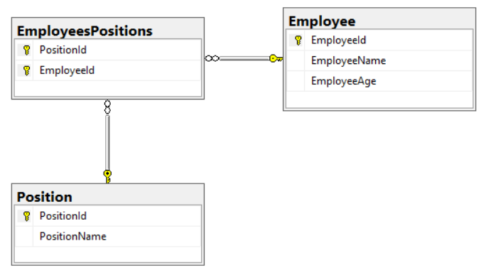
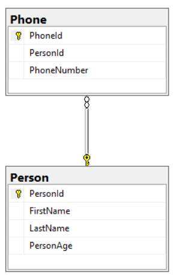
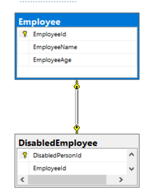
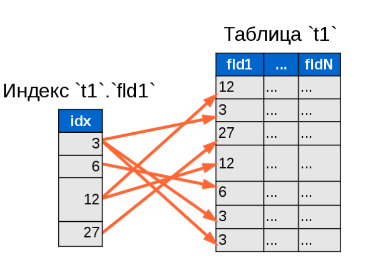
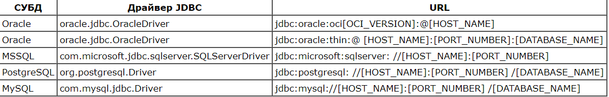
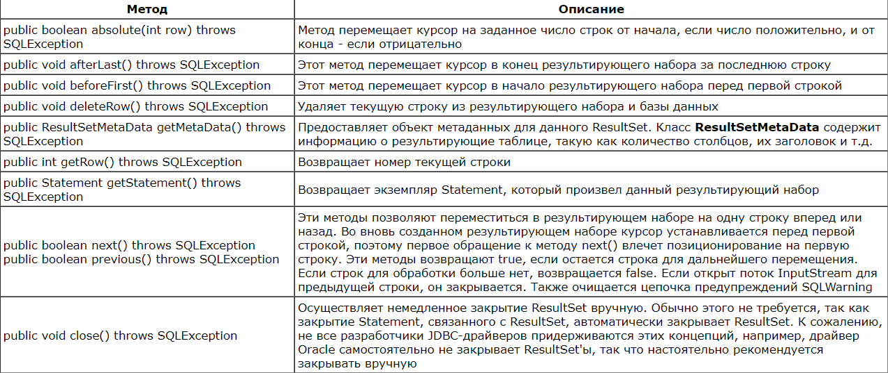

## SQL

1. [Что такое SQL?](#что-такое-SQL)
2. [Что такое DML и DDL?](#что-такое-DML-и-DDL)
3. [Что такое первичный ключ?](#Что-такое-первичный-ключ)
4. [Что такое внешний ключ?](#Что-такое-внешний-ключ)
5. [Какие виды связей между таблицами существуют и как они организуются?](#Какие-виды-связей-между-таблицами-существуют-и-как-они-организуются)
6. [Опишите как вставить, удалить, обновить данные в(из) таблицу(ы).](#Опишите-как-вставлять-удалять-обновлять-данные-в-таблице)
7. [Что такое нормализация БД?](#Что-такое-нормализация-бд)
8. [Что такое денормализация БД? Для чего она нужна?](#Что-такое-денормализация-БД-Для-чего-она-нужна)
9. [Что такое кластерный и некластерный индексы?](#Что-такое-кластерный-и-некластерный-индекс)
10. [Какие типы соединений (join) таблиц существуют? В чем их разница?](#Какие-типы-соединений-join-таблиц-существуют-В-чем-их-разница)
11. [Что такое SQL курсор?](#Что-такое-SQL-курсор)
12. [Опишите шаги по созданию и использованию курсора.](#Опишите-шаги-по-созданию-и-использованию-курсора)
13. [Что такое транзакция?](#Что-такое-транзакция)
14. [Что такое триггер? Какие типы триггеров Вы знаете?](#Что-такое-триггер-Какие-типы-триггеров-Вы-знаете)
15. [В чем разница между where и having?](#В-чем-разница-между-where-и-having)
16. [Что такое подзапрос (sub-query)?](#Что-такое-подзапрос-sub-query)
17. [Что такое union?](#Что-такое-union)
18. [Что такое group by?](#Что-такое-group-by)
19. [Что такое хранимые процедуры?](#Что-такое-хранимые-процедуры)
20. [Что такое view(Представление)?](#Что-такое-view)
21. [Что такое JDBC?](#Что-такое-JDBC)
22. [Что нужно для работы с той или иной БД?](#Что-нужно-для-работы-с-той-или-иной-БД)
23. [Как зарегистрировать драйвер?](#Как-зарегистрировать-драйвер)
24. [Как получить Connection?](#Как-получить-Connection)
25. [Что такое Statement, PreparedStatement? В чем разница между ними?](#Что-такое-Statement-PreparedStatement-В-чем-разница-между-ними)
26. [Что такое ResultSet?](#Что-такое-ResultSet)
27. [В чем разница между методами execute, executeUpdate, executeQueury?](#В-чем-разница-между-методами-execute-executeUpdate-executeQuery)
28. [Можно ли использовать возвращаемое значение execute() для проверки, что что-то обновилось?](#Можно-ли-использовать-возвращаемое-значение-execute-для-проверки-обновления)
29. [Как получить при вставке сгенерированные ключи? Как это сделать на чистом sql?](#Как-получить-при-вставке-сгенерированные-ключи-Как-это-сделать-на-чистом-sql)
30. [Для чего используется конструкция try-with-resources?](#Для-чего-используется-конструкция-try-with-resources)


## Что такое SQL

SQL, Structured query language («язык структурированных запросов») — формальный непроцедурный декларативный язык программирования, применяемый для создания, модификации и управления данными в произвольной реляционной базе данных, управляемой соответствующей системой управления базами данных (СУБД).

[к оглавлению](#SQL)

## Что такое DML и DDL

С точки зрения реализации язык SQL представляет собой набор операторов, которые делятся на определенные группы и у каждой группы есть свое назначение. В сокращенном виде эти группы называются DDL, DML, DCL и TCL.

#### DDL – Data Definition Language

```Data Definition Language (DDL)``` – это группа операторов определения данных. Другими словами, с помощью операторов, входящих в эту группы, мы определяем структуру базы данных и работаем с объектами этой базы, т.е. создаем, изменяем и удаляем их.

В эту группу входят следующие операторы:

- CREATE – используется для создания объектов базы данных;
- ALTER – используется для изменения объектов базы данных;
- DROP – используется для удаления объектов базы данных.

#### DML – Data Manipulation Language

```Data Manipulation Language (DML)``` – это группа операторов для манипуляции данными. С помощью этих операторов мы можем добавлять, изменять, удалять и выгружать данные из базы, т.е. манипулировать ими.

В эту группу входят самые распространённые операторы языка SQL:

- SELECT – осуществляет выборку данных;
- INSERT – добавляет новые данные;
- UPDATE – изменяет существующие данные;
- DELETE – удаляет данные.

#### DCL – Data Control Language

```Data Control Language (DCL)``` – группа операторов определения доступа к данным. Иными словами, это операторы для управления разрешениями, с помощью них мы можем разрешать или запрещать выполнение определенных операций над объектами базы данных.

Сюда входят:

- GRANT – предоставляет пользователю или группе разрешения на определённые операции с объектом;
- REVOKE – отзывает выданные разрешения;
- DENY– задаёт запрет, имеющий приоритет над разрешением.

#### TCL – Transaction Control Language
```Transaction Control Language (TCL)``` – группа операторов для управления транзакциями. Транзакция – это команда или блок команд (инструкций), которые успешно завершаются как единое целое, при этом в базе данных все внесенные изменения фиксируются на постоянной основе или отменяются, т.е. все изменения, внесенные любой командой, входящей в транзакцию, будут отменены.

Группа операторов TCL предназначена как раз для реализации и управления транзакциями. Сюда можно отнести:

- BEGIN TRANSACTION – служит для определения начала транзакции;
- COMMIT TRANSACTION – применяет транзакцию;
- ROLLBACK TRANSACTION – откатывает все изменения, сделанные в контексте текущей транзакции;
- SAVE TRANSACTION – устанавливает промежуточную точку сохранения внутри транзакции.

[к оглавлению](#SQL)

## Что такое первичный ключ

**Первичный ключ (primary key)** является полем в таблице, которое однозначно идентифицирует каждую строку/запись
в таблице базы данных. Первичные ключи должны содержать уникальные значения. Первичный ключ столбец не может иметь значения NULL.
Таблица может иметь только один первичный ключ, который может состоять из одного или нескольких полей.
Когда несколько полей используются в качестве первичного ключа, их называют составным ключом.
Поэтому в качестве первичного ключа, как правило, выбирают тот, который имеет наименьший размер (физического хранения)
и/или включает наименьшее количество атрибутов. Другой критерий выбора первичного ключа — сохранение его уникальности
со временем. Поэтому в качестве первичного ключа стараются выбирать такой потенциальный ключ, который
с наибольшей вероятностью никогда не утратит уникальность.

[к оглавлению](#SQL)

## Что такое внешний ключ

**Внешний ключ (foreign key)** — это столбец или комбинация столбцов, значения которых соответствуют
Первичному ключу в другой таблице. Связь между двумя таблицами задается через соответствие Первичного ключа в одной
из таблиц внешнему ключу во второй.

[к оглавлению](#SQL)

## Какие виды связей между таблицами существуют и как они организуются

Связи создаются с помощью внешних ключей (foreign key).
Внешний ключ — это атрибут или набор атрибутов, которые ссылаются на primary key или unique другой таблицы. Другими словами, это что-то вроде указателя на строку другой таблицы.

Связи делятся на:

1. Многие ко многим.
2. Один ко многим:
   * с обязательной связью;
   * с необязательной связью;
3. Один к одному.
    * с обязательной связью;
    * с необязательной связью;

#### Многие ко многим

Представим, что нам нужно написать БД, которая будет хранить работником IT-компании. При этом существует некий стандартный набор должностей. При этом:

* Работник может иметь одну и более должностей. Например, некий работник может быть и админом, и программистом.
* Должность может «владеть» одним и более работников. Например, админами является определенный набор работников. Другими словами, к админам относятся некие работники.

Работников представляет таблица «Employee» (id, имя, возраст), должности представляет таблица «Position» (id и название должности). Как видно, обе эти таблицы связаны между собой по правилу многие ко многим: каждому работнику соответствует одна и больше должностей (многие должности), каждой должности соответствует один и больше работников (многие работники).

Мы уже имеем две таблицы, описывающие работника и профессию. Теперь нам нужно установить между ними связь многие ко многим. Для реализации такой связи нам нужен некий посредник между таблицами «Employee» и «Position». В нашем случае это будет некая таблица «EmployeesPositions» (работники и должности). Эта таблица-посредник связывает между собой работника и должность следующим образом:

| EmployeeId | PositionId |
|------------|------------|
| 1          | 1          |
| 1          | 2          |
| 2          | 3          |
| 3          | 3          |

Слева указаны работники (их id), справа — должности (их id). Работники и должности на этой таблице указываются с помощью id’шников.

На эту таблицу можно посмотреть с двух сторон:

1. Таким образом, мы говорим, что работник с id 1 находится на должность с id 1. При этом обратите внимание на то, что в этой таблице работник с id 1 имеет две должности: 1 и 2. Т.е., каждому работнику слева соответствует некая должность справа.
2. Мы также можем сказать, что должности с id 3 принадлежат пользователи с id 2 и 3. Т.е., каждой роли справа принадлежит некий работник слева.



Для реализации связи многие ко многим нам нужен некий посредник между двумя рассматриваемыми таблицами. Он должен хранить два внешних ключа, первый из которых ссылается на первую таблицу, а второй — на вторую.

#### Один ко многим

Эта самая распространенная связь между базами данных. Мы рассматриваем ее после связи многие ко многим для сравнения.

Предположим, нам нужно реализовать некую БД, которая ведет учет данных о пользователях. У пользователя есть: имя, фамилия, возраст, номера телефонов. При этом у каждого пользователя может быть от одного и больше номеров телефонов (многие номера телефонов).

В этом случае мы наблюдаем следующее: пользователь может иметь многие номера телефонов, но нельзя сказать, что номеру телефона принадлежит определенный пользователь.

Другими словами, телефон принадлежит только одному пользователю. А пользователю могут принадлежать 1 и более телефонов (многие).

Как мы видим, это отношение один ко многим.

Пользователей будет представлять некая таблица «Person» (id, имя, фамилия, возраст), номера телефонов будет представлять таблица «Phone». Она будет выглядеть так:


| PhoneId | PersonId | PhoneNumber |
|---------|----------| ------------|
| 1       | 5        | 11 091-10   |
| 2       | 5        | 19 124-66   |
| 3       | 17       | 21 972-02   |

Данная таблица представляет три номера телефона. При этом номера телефона с id 1 и 2 принадлежат пользователю с id 5. А вот номер с id 3 принадлежит пользователю с id 17.
Заметка. Если бы у таблицы «Phones» было бы больше атрибутов, то мы смело бы их добавляли в эту таблицу.

Таблица-посредник нужна только в том случае, если мы имеем связь многие-ко-многим. По той простой причине, что мы можем рассматривать ее с двух сторон. Как, например, таблицу EmployeesPositions ранее:

* Каждому работнику принадлежат несколько должностей (многие).
* Каждой должности принадлежит несколько работников (многие).

Но в нашем случае мы не можем сказать, что каждому телефону принадлежат несколько пользователей — номеру телефона может принадлежать только один пользователь.
  Теперь прочтите еще раз заметку в конце пункта 5.1. — она станет для вас более понятной.



Наша таблица Phone хранит всего один внешний ключ. Он ссылается на некого пользователя (на строку из таблицы Person). Таким образом, мы как бы говорим: «этот пользователь является владельцем данного телефона». Другими словами, телефон знает id своего владельца.

#### Один к одному

Представим, что на работе вам дали задание написать БД для учета всех работников для HR. Начальник уверял, что компании нужно знать только об имени, возрасте и телефоне работника. Вы разработали такую БД и поместили в нее всю 1000 работников компании. И тут начальник говорит, что им зачем-то нужно знать о том, является ли работник инвалидом или нет. Наиболее простое, что приходит в голову — это добавить новый столбец типа bool в вашу таблицу. Но это слишком долго вписывать 1000 значений и ведь true вы будете вписывать намного реже, чем false (2% будут true, например).

Более простым решением будет создать новую таблицу, назовем ее «DisabledEmployee». Она будет выглядеть так:

| DisabledPersonId | EmployeeId  |
|------------|-------------|
| 1          | 159         |
| 1          | 722         |
| 2          | 937         |

Но это еще не связь один к одному. Дело в том, что в такую таблицу работник может быть вписан более одного раза, соответственно, мы получили отношение один ко многим: работник может быть несколько раз инвалидом. Нужно сделать так, чтобы работник мог быть вписан в таблицу только один раз, соответственно, мог быть инвалидом только один раз. Для этого нам нужно указать, что столбец EmployeeId может хранить только уникальные значения. Нам нужно просто наложить на столбец EmloyeeId ограничение unique. Это ограничение сообщает, что атрибут может принимать только уникальные значения.

Выполнив это мы получили связь один к одному.

Заметка. Обратите внимание на то, что мы могли также наложить на атрибут EmloyeeId ограничение primary key. Оно отличается от ограничения unique лишь тем, что не может принимать значения null.

Можно сказать, что отношение один к одному — это разделение одной и той же таблицы на две.



Таблица DisabledEmployee имеет атрибут EmployeeId, что является внешним ключом. Он ссылается на атрибут EmployeeId таблицы Employee. Кроме того, этот атрибут имеет ограничение unique, что говорит о том, что в него могут быть записаны только уникальные значения. Соответственно, работник может быть записан в эту таблицу не более одного раза.

### Обязательные и необязательные связи

Связи можно поделить на обязательные и необязательные.

#### Один ко многим

* Один ко многим с обязательной связью:
  К одному полку относятся многие бойцы. Один боец относится только к одному полку. Обратите внимание, что любой солдат обязательно принадлежит к одному полку, а полк не может существовать без солдат.
* Один ко многим с необязательной связью:
На планете Земля живут все люди. Каждый человек живет только на Земле. При этом планета может существовать и без человечества. Соответственно, нахождение нас на Земле не является обязательным

Одну и ту же связь можно рассматривать как обязательную и как необязательную. Рассмотрим вот такой пример:
У одной биологической матери может быть много детей. У ребенка есть только одна биологическая мать.
* У женщины необязательно есть свои дети. Соответственно, связь необязательна.
* У ребенка обязательно есть только одна биологическая мать – в таком случае, связь обязательна.

#### Один к одному

* Один к одному с обязательной связью:
У одного гражданина определенной страны обязательно есть только один паспорт этой страны. У одного паспорта есть только один владелец.
* Один к одному с необязательной связью:
У одной страны может быть только одна конституция. Одна конституция принадлежит только одной стране. Но конституция не является обязательной. У страны она может быть, а может и не быть, как, например, у Израиля и Великобритании.

Одну и ту же связь можно рассматривать как обязательную и как необязательную:
У одного человека может быть только один загранпаспорт. У одного загранпаспорта есть только один владелец.
* Наличие загранпаспорта необязательно – его может и не быть у гражданина. Это необязательная связь.
* У загранпаспорта обязательно есть только один владелец. В этом случае, это уже обязательная связь.

#### Многие ко многим

Любая связь многие ко многим является необязательной. Например:
Человек может инвестировать в акции разных компаний (многих). Инвесторами какой-то компании являются определенные люди (многие).
* Человек может вообще не инвестировать свои деньги в акции.
* Акции компании мог никто не купить.


[к оглавлению](#SQL)

## Опишите как вставлять удалять обновлять данные в таблице

#### Insert
Команда INSERT INTO <table_name> в SQL отвечает за добавление данных в таблицу:

```sql
INSERT INTO <table_name> (<col_name1>, <col_name2>, <col_name3>, …)
  VALUES (<value1>, <value2>, <value3>, …);
```

#### Update
SQL-команда для обновления данных таблицы:
```sql
UPDATE <table_name>
SET <col_name1> = <value1>, <col_name2> = <value2>, ...
    WHERE <condition>;
```

#### Delete
SQL-команда DELETE FROM <table_name> используется для удаления данных из таблицы.

Удаление всех фильмов, кроме мюзиклов:

```sql
DELETE FROM films WHERE kind <> 'Musical';
```

Очистка таблицы films:

```sql
DELETE FROM films;
```
Удаление завершённых задач с получением всех данных удалённых строк:

```sql
DELETE FROM tasks WHERE status = 'DONE' RETURNING *;
```
Удаление из tasks строки, на которой в текущий момент располагается курсор c_tasks:

```sql
DELETE FROM tasks WHERE CURRENT OF c_tasks;
```

[к оглавлению](#SQL)

## Что такое нормализация бд
В реляционных базах данных есть такое понятия, как «Нормализация».

`Нормализация` – это процесс удаления избыточных данных.
Также нормализацию можно рассматривать и с позиции проектирования базы данных, в таком случае мы можем сформулировать определение нормализации следующим образом.

`Нормализация` – это метод проектирования базы данных, который позволяет привести базу данных к минимальной избыточности.

Избыточность устраняется, как правило, за счёт декомпозиции отношений (таблиц), т.е. разбиения одной таблицы на несколько.

У Вас может возникнуть вопрос – а зачем вообще нормализовать базу данных и бороться с этой избыточностью?

Дело в том, что избыточность данных создает предпосылки для появления различных аномалий, снижает производительность, и делает управление данными не гибким и не очень удобным. Отсюда можно сделать вывод, что нормализация нужна для:

* Устранения аномалий (при обновлении данных)
* Повышения производительности
* Повышения удобства управления данными

`Избыточность данных` – это когда одни и те же данные хранятся в базе в нескольких местах, именно это и приводит к аномалиям.

Так как в этом случае необходимо добавлять, изменять или удалять одни и те же данные в нескольких местах. Например, если не выполнить операцию в каком-нибудь одном месте, то возникает ситуация, когда одни данные не соответствуют вроде как точно таким же данным в другом месте.

Именно поэтому мы должны устранять избыточность данных в базе, т.е. проводить так называемую нормализацию базы данных

#### Нормальные формы базы данных

В целом процесс нормализации базы данных выглядит следующим образом: мы, следуя определённым правилам и соблюдая определенные требования, проектируем таблицы в базе данных.

При этом все эти правила и требования можно сгруппировать в несколько наборов, и если спроектировать базу данных с соблюдением всех правил и требований, которые включаются в тот или иной набор, то база данных будет находиться в определённом состоянии, т.е. форме, и такая форма называется нормальная форма базы данных.

Иными словами, следуя определённым правилам и соблюдая определенные требования мы приводим базу данных к определенной нормальной форме.

`Нормальная форма базы данных` – это набор правил и критериев, которым должна отвечать база данных.

Каждая следующая нормальная форма содержит более строгие правила и критерии, тем самым приводя базу данных к определённой нормальной форме мы устраняем определённый набор аномалий.

Отсюда можно сделать вывод, что чем выше нормальная форма, тем меньше аномалий в базе будет.

`Процесс нормализации` – это последовательный процесс приведения базы данных к эталонному виду, т.е. переход от одной нормальной формы к следующей.

Иными словами, процесс перехода от одной нормальной формы к следующей – это усовершенствование базы данных. Так как если база данных находится в какой-то определённой нормальной форме – это означает, что в базе данных отсутствует определенный вид аномалий.

Существует 5 основных нормальных форм базы данных:

* Первая нормальная форма (1NF)
* Вторая нормальная форма (2NF)
* Третья нормальная форма (3NF)
* Четвертая нормальная форма (4NF)
* Пятая нормальная форма (5NF)

Однако выделяют еще дополнительные нормальные формы:

* Ненормализованная форма или нулевая нормальная форма (UNF)
* Нормальная форма Бойса-Кодда (BCNF)
* Доменно-ключевая нормальная форма (DKNF)
* Шестая нормальная форма (6NF)

Если объединить оба этих списка и упорядочить нормальные формы от менее нормализованной до самой нормализованной, т.е. начиная с формы, при которой база данных по своей сути не является нормализованной, и заканчивая самой строгой нормальной формой, то мы получим следующий перечень:

* Ненормализованная форма или нулевая нормальная форма (UNF)
* Первая нормальная форма (1NF)
* Вторая нормальная форма (2NF)
* Третья нормальная форма (3NF)
* Нормальная форма Бойса-Кодда (BCNF)
* Четвертая нормальная форма (4NF)
* Пятая нормальная форма (5NF)
* Доменно-ключевая нормальная форма (DKNF)
* Шестая нормальная форма (6NF)

База данных считается нормализованной, если она находится как минимум в третьей нормальной форме (3NF).

В реальном мире нормализация до третьей нормальной формы (3NF) является обычной, стандартной практикой, так как 3NF устраняет достаточное количество аномалий, при этом производительность базы данных, а также удобство ее использования не снижается, что нельзя сказать о всех последующих формах.

Ситуации, при которых требуется нормализовать базу данных до четвертой нормальной формы (4NF), в реальном мире встречаются достаточно редко.

Если говорить о всех последующих нормальных формах (5NF, DKNF, 6NF), то в реальной жизни трудно даже представить ситуации, при которых потребуется нормализовать базу данных до этих форм.

Иными словами, 5NF, DKNF, 6NF – это в большей степени теоретические нормальные формы, немного отстраненные от реального мира.

Стоит отметить, что приведение базы данных к какой-то конкретной нормальной форме, обязательно требует, чтобы эта база данных уже находилась в предыдущей нормальной форме. Другими словами, если Вы хотите нормализовать базу данных до третьей нормальной формы, то база уже должна находиться во второй нормальной форме, т.е. нельзя нормализовать базу данных до третьей формы, если она еще не нормализована до второй.

[к оглавлению](#SQL)

## Что такое денормализация БД Для чего она нужна

Денормализация (англ. denormalization) — намеренное приведение структуры базы данных в состояние, не соответствующее критериям нормализации, обычно проводимое с целью ускорения операций чтения из базы за счет добавления избыточных данных.

Добавление "избыточных" данных с целью:

1. Для сохранения истории.
2. Повышение производительности запросов за счет экономии на объединениях.
3. Предварительные вычисления часто запрашиваемых значений.

[к оглавлению](#SQL)

## Что такое кластерный и некластерный индекс

Некластерный индекс, созданный для такой таблицы, содержит только указатели на записи таблицы. Кластерный индекс может быть только одним для каждой таблицы, но каждая таблица может иметь несколько различных некластерных индексов, каждый из которых определяет свой собственный порядок следования записей.

По способу хранения данных отличают кластерные и обычные индексы.
+ **Обычно индекс** — это отсортированный набор данных колонки, по которой он построен. Индекс будет хранить ссылки на данные каждой строки для каждого значения ID.
+ **Кластерный индекс** (или кластерный ключ) сохраняет не только значения колонки в отсортированном виде, а и данные всей строки.
  Это позволяет минимизировать количество операций чтения с диска при работе с таким индексом. В таблице может быть только один кластерный индекс.

#### Некластерные индексы

Чтобы не запутаться, до поры до времени будем рассматривать простой индекс по одному полю. Упрощённо некластерный индекс можно представить как отдельную таблицу, каждая строка в которой ссылается на одну или несколько строк в таблице с данными. Строки в индексной таблице упорядочены и сгруппированы по значениям ключевых полей. Представим элементарный запрос:

```sql
SELECT * FROM `t1` WHERE `fld1` = 12;
```

Совсем без индексации будет прочитана и проверена каждая строка, и неудовлетворяющие условию строки просто не попадут в результат. Но прочитаны они будут.

При использовании «обычного», некластерного индекса, задача поиска сильно ускоряется. Во-первых, индексная таблица весит много меньше таблицы с данными, а значит элементарно может быть прочитана быстрее. Во-вторых, СУБД чаще всего стараются кешировать индексы в оперативную память, которая сама по себе много шустрее жёсткого диска*. В-третьих, в индексах отсутствуют дублирующиеся строки. А значит, как только мы нашли первое значение, поиск можно прекращать — оно же и последнее. В-четвёртых, данные в индексе отсортированы. А в-третьих и в-четвёртых вместе позволяют использовать алгоритм бинарного поиска (он же метод деления пополам), эффективность которого многократно превосходит простой перебор.

* Если ресурсы позволяют, таблицу данных тоже можно (и нужно) кешировать в оперативную память. Однако индексам и месту для них в оперативной памяти, по понятным причинам, принято уделять больше внимания.

Индексация — великая сила. Но если представить все указатели индексной таблицы на строки в таблице данных ОДНОВРЕМЕННО, получится достаточно сложная «паутина»:



И эта паутина, со множеством пересекающихся стрелок, подводит нас к проблеме (просто таки наглядно её демонстрирует), которую создаёт некластерный индекс.

#### Кластерные индексы

Кластерные индексы отличаются от некластерных точно так же, как оглавление книги отличается от алфавитного указателя. Алфавитный указатель (некластерный индекс) для точного слова (значения) даёт точные номера страниц (строки в БД). Оглавление же указывает диапазон страниц, соответствующих определённой главе, в которой уже найдётся искомое слово. Причём каждая глава, если она достаточно велика, может содержать собственное оглавление.

Кластерный индекс — это древовидная структура данных, при которой значения индекса хранятся вместе с данными, им соответствующими. И индексы, и данные при такой организации упорядочены. При добавлении новой строки в таблицу, она дописывается не в конец файла*, не в конец плоского списка, а в нужную ветку древовидной структуры, соответствующую ей по сортировке.

* В разных движках и при разных настройках это может быть вовсе и не конец, и вовсе и не файла. Слово файл здесь означает «некую единицу измерения данных, соответствующую одной таблице», а «конец файла» употребляется как символ последовательной, линейной записи.

Один из самых мощных и производительных движков для MySQL — InnoDB. Тому много причин, и одна из них — кластерные индексы. Проще всего понять как устроены кластерные индексы, если представить их в динамике: как они разрастаются по мере добавления данных, и как начинает ветвиться таблица.

[habr](https://habr.com/ru/post/141767/)

[к оглавлению](#SQL)

## Какие типы соединений join таблиц существуют В чем их разница

+ **INNER JOIN** Выбираются только совпадающие данные из объединяемых таблиц.
+ **OUTER JOIN** Такое объединение вернет совпадающие данные из объединяемых таблиц ПЛЮС дополнит выборку оставшимися данными
  из внешней таблицы, которые по условию не подходят, заполнив недостающие данные значением NULL.
+ Существует два типа внешнего объединения OUTER JOIN - **LEFT OUTER JOIN** и **RIGHT OUTER JOIN**.
+ **FULL JOIN** возвращает `объединение` объединений LEFT и RIGHT таблиц, комбинируя результат двух запросов.
+ **CROSS JOIN** возвращает перекрестное (декартово) объединение двух таблиц. Результатом будет выборка всех записей первой
  таблицы объединенная с каждой строкой второй таблицы. Важным моментом является то, что для кросса не нужно указывать
  условие объединения.
+ **SELF JOIN** соединение таблицы с этой же таблицей.

При использовании объединения новички часто забывают что результирующая выборка может содержать дублирующиеся данные!

Статья про join: http://www.skillz.ru/dev/php/article-Obyasnenie_SQL_obedinenii_JOIN_INNER_OUTER.html

[к оглавлению](#SQL)

## Что такое SQL курсор

Команды манипулирования данными SELECT, UPDATE, DELETE работают сразу с группами строк.
Эти группы, вплоть до отдельных строк, можно выбрать с помощью опции WHERE.
А если надо перебрать строки некоторой таблицы последовательно, одну за другой? На этот случай в языке SQL существуют курсоры.
**Курсор (current set of record)** – временный набор строк, которые можно перебирать последовательно, с первой до последней.
Это эффективный способ получать большие наборы строк из функций по частям.
Если выборка осуществляется через курсорные переменные, которые всегда имеют специальный тип данных refcursor.

[Курсоры SQL Server](https://docs.microsoft.com/ru-ru/sql/relational-databases/cursors?view=sql-server-ver16)

[habr](https://habr.com/ru/post/46333/)

[к оглавлению](#SQL)

## Опишите шаги по созданию и использованию курсора

При работе с курсорами используются следующие команды.
+ **Объявление курсора**:
  DECLARE имя_курсора CURSOR FOR SELECT текст_запроса
  Любой курсор создается на основе некоторого оператора SELECT.
+ **Открытие курсора**:
  OPEN имя_курсора
  Для того чтобы с помощью курсора можно было читать строки, его надо обязательно открыть.
+ **Чтение следующей строки из курсора**:
  FETCH имя_курсора INTO список_переменных
  Переменные в списке должны быть в том же количестве и того е типа, что и столбцы курсора.
  Глобальная переменная @@FETCH_STATUS принимает ненулевое значение, если строк в курсоре больше нет. Если же набор строк еще не исчерпан, то @@FETCH_STATUS равна нулю, и оператор FETCH перепишет значения полей из текущей строки в переменные.
+ **Закрытие курсора**:
  CLOSE имя_курсора
+ Для **удаления курсора из памяти** используется команда
  DEALLOCATE имя_курсора

Для иллюстрации использования курсора создадим процедуру, которая будет выбирать данные из одной таблицы,
перебирать их в курсоре анализируя, есть ли такие данные во второй таблице и вставлять в третью таблицу,
если данные записи удовлетворяют определённым критериям.
```sql
CREATE PROCEDURE [dbo].[MyProcedure] AS

DECLARE @ID INT
DECLARE         @QUA INT
DECLARE @VAL VARCHAR (500)
DECLARE @NAM VARCHAR (500)
/*Объявляем курсор*/
DECLARE @CURSOR CURSOR
/*Заполняем курсор*/
SET @CURSOR  = CURSOR SCROLL
FOR
SELECT  INDEX, QUANTITY, VALUE,  NAME  
  FROM  My_First_Table WHERE  QUANTITY > 1
/*Открываем курсор*/
OPEN @CURSOR
/*Выбираем первую строку*/
FETCH NEXT FROM @CURSOR INTO @ID, @QUA, @VAL, @NAM
/*Выполняем в цикле перебор строк*/
WHILE @@FETCH_STATUS = 0
BEGIN

        IF NOT EXISTS(SELECT VAL FROM My_Second_Table WHERE ID=@ID)
        BEGIN
/*Вставляем параметры в третью таблицу если условие соблюдается*/
                INSERT INTO My_Third_Table (VALUE, NAME) VALUE(@VAL, @NAM)
        END
/*Выбираем следующую строку*/
FETCH NEXT FROM @CURSOR INTO @ID, @QUA, @VAL, @NAM
END
CLOSE @CURSOR
```

[к оглавлению](#SQL)

## Что такое транзакция

Группа последовательных операций с базой данных, которая представляет собой логическую единицу работы с данными.
Транзакция может быть выполнена либо целиком и успешно, соблюдая целостность данных и независимо от параллельно
идущих других транзакций, либо не выполнена вообще, и тогда она не должна произвести никакого эффекта.

`Транзакция` – это целостная операция, объединяющая под собой несколько запросов в один. Вообще,
любой набор действий, который выполняется единой процедурой, является транзакцией.

Отличным примером транзакций из реальной жизни являются банковские операции. Одно действие
открытия счёта на самом деле состоит из ряда операций.

С точки зрения баз данных, транзакция – это группа последовательных действий с БД,
представляющая собой логическую единицу работы с данными. В итоге транзакция заканчивается
либо полным успешным выполнением, либо отменой изменений (и тогда она не должна вызывать
последствий). По итогам работы СУБД создает журнал транзакций.

#### Принципы ACID
`Atomicity` – Атомарность.
Этот принцип отвечает за то, что ни одна транзакция не может быть выполнена частично. Как было
сказано выше, выполняются либо все шаги, либо ни один из них. Если транзакция не завершена
полностью, все действия отменяются, не влияя на систему.

`Isolation` – Изолированность.
В процессе выполнения параллельные транзакции не должны влиять друг на друга. Это довольно
дорогое требование, а потому в MySQL есть не полная блокировка, а различные уровни
изолированности.

`Consistency` – Согласованность/Консистентность.
Транзакция, которая завершилась неким результатом, т. е. зафиксировавшая результаты своей
работы, сохраняет согласованность базы данных. Таким образом каждая успешная транзакция
сохраняет базу в корректном состоянии.
Консистентность может иметь и более широкое понимание. К примеру, в той же банковской схеме
существует требование к равенству суммы списания и суммы зачисления на определенном
промежутке времени. Но это не техническое требование, а бизнес-правило. И такие правила
гарантируются уже не технической реализацией, а логикой работы транзакций.
Отметим, что в ходе работы транзакции консистентность не требуется. Т. е. то же списание и
зачисление будут проходить разными операциями, и между ними будет некий временной промежуток.
Но при изоляции транзакций друг от друга другим транзакционным процессам такая
несогласованность не будет доступна. При этом атомарность гарантирует, что транзакция будет
завершена либо отменена.

`Durability` – Долговечность/Надежность.
В случае отказа СУБД по какой-либо причине, изменения, сделанные успешной транзакцией, должны
оставаться целостными после восстановления работоспособности системы.

#### Уровни изоляции транзакций

Для повышения скорости работы в транзакциях реализуется разграничение доступа к данным с
разделением по уровням доступа.

0 – Read Uncommitted, Dirty Read – чтение незаконченных изменений своей и других транзакций. При
этом, разумеется, не гарантируется, что изменения данных не будут в любой момент отозваны,
поэтому подобный тип чтения является источником ошибок.

1 – Read Committed – чтение только изменений, которые были зафиксированы по результатам
завершения всех транзакций.

2 – Repeatable Read, Snapshot – чтение всех изменений, но только внутри своей транзакции.

Заметьте, что при таком уровне доступа любые изменения, внесённые другими транзакциями после
начала своей, недоступны.

3 – Serializable – сериализуемые транзакции. Являются результатом параллельного выполнения
сериализуемой транзакции с другими транзакциями. Он должен быть идентичен результату их
последовательного выполнения. Проблемы синхронизации не возникают.

Чем выше уровень изоляции, тем больше требуется ресурсов, чтобы его обеспечить. Соответственно,
повышение изолированности может приводить к снижению скорости выполнения параллельных
транзакций, что является «платой» за повышение надёжности.

[к оглавлению](#SQL)

## Что такое триггер Какие типы триггеров Вы знаете

Триггеры — это части кода, запускаемые автоматически и основанные на каком-либо действии или событии в таблице
базы данных.

Триггеры могут применять в таблице во время выполнения операторов INSERT, UPDATE или DELETE, а затем работать
или перед, или после этих действий.

Некоторые СУБД также позволяют работать триггерам на уровне оператора или на уровне каждой строки данных во
время ее изменения.

Главный плюс триггеров: они минуют долгую фазу анализа и компиляции запроса.

```sql
mysql> CREATE TABLE account (acct_num INT, amount DECIMAL(10,2));
Query OK, 0 rows affected (0.03 sec)
mysql> CREATE TRIGGER ins_sum BEFORE INSERT ON account
-> FOR EACH ROW SET @sum = @sum + NEW.amount;
Query OK, 0 rows affected (0.06 sec)
```

Пример использования триггеров: https://habr.com/ru/post/146717/


[к оглавлению](#SQL)

## В чем разница между where и having

Главное отличие HAVING от WHERE в том, что в HAVING можно наложить условия на результаты группировки, потому что порядок исполнения запроса устроен таким образом, что на этапе, когда выполняется WHERE, ещё нет групп, а HAVING выполняется уже после формирования групп

[к оглавлению](#SQL)

## Что такое подзапрос sub query

Запрос который выполнится перед основным и результаты которого будут теми данными из которых будет дальнейшая обработка
основным запросом.

Вложенным запросом в SQL называется запрос, содержащийся в предложении WHERE или HAVING другого оператора SQL. Данный запрос обычно используется для получения данных из двух и более таблиц, а также для возвращения данных, которые будут использоваться в основном запросе, как условие для ограничения получаемых данных.

[к оглавлению](#SQL)

## Что такое union

В языке SQL операция UNION применяется для объединения двух наборов строк, возвращаемых SQL-запросами.
Оба запроса должны возвращать одинаковое число столбцов, и столбцы с одинаковым порядковым номером должны иметь
совместимые типы данных. Результат получает структуру (названия и типы столбцов) первого (левого) запроса, то есть
операция не является симметричной.
При объединении нескольких запросов подряд результат последовательно вычисляется слева направо.

[к оглавлению](#SQL)

## Что такое group by

Предложение GROUP BY используется для определения групп выходных строк, к которым могут применяться агрегатные функции (COUNT, MIN, MAX, AVG и SUM).
все столбцы списка SELECT, не вошедшие в агрегатные функции, должны быть указаны в предложении GROUP BY.
В результате чего все выходные строки запроса разбиваются на группы, характеризуемые одинаковыми комбинациями значений
в этих столбцах. После чего к каждой группе будут применены агрегатные функции. Следует иметь в виду, что для GROUP BY
все значения NULL трактуются как равные, то есть при группировке по полю, содержащему NULL-значения,
все такие строки попадут в одну группу.

[к оглавлению](#SQL)

## Что такое хранимые процедуры

Объект базы данных, представляющий собой набор SQL-инструкций, который компилируется один раз и хранится на сервере.
Хранимые процедуры очень похожи на обыкновенные процедуры языков высокого уровня, у них могут быть входные и выходные
параметры и локальные переменные, в них могут производиться числовые вычисления и операции над символьными данными,
результаты которых могут присваиваться переменным и параметрам. В хранимых процедурах могут выполняться стандартные
операции с базами данных (как DDL, так и DML). Кроме того, в хранимых процедурах возможны циклы и ветвления,
то есть в них могут использоваться инструкции управления процессом исполнения.
Хранимые процедуры похожи на определяемые пользователем функции (UDF). Основное различие заключается в том,
что пользовательские функции можно использовать как и любое другое выражение в SQL запросе, в то время как
хранимые процедуры должны быть вызваны с помощью функции CALL:
```sql
CALL процедура(…)
```
или
```sql
EXECUTE процедура(…)
```
Хранимые процедуры могут возвращать множества результатов, то есть результаты запроса SELECT.
Такие множества результатов могут обрабатываться, используя курсоры, другими сохранёнными процедурами,
возвращая указатель результирующего множества, либо же приложениями. Хранимые процедуры могут также содержать
объявленные переменные для обработки данных и курсоров, которые позволяют организовать цикл по нескольким
строкам в таблице. Стандарт SQL предоставляет для работы выражения IF, LOOP, REPEAT, CASE и многие другие.
Хранимые процедуры могут принимать переменные, возвращать результаты или изменять переменные и возвращать их,
в зависимости от того, где переменная объявлена.

https://habr.com/ru/post/79340/
http://javatutor.net/articles/stored-procedures-for-java-programmers

[к оглавлению](#SQL)

## Что такое view

Представление (VIEW) — объект базы данных, являющийся результатом выполнения запроса к базе данных,
определенного с помощью оператора SELECT, в момент обращения к представлению.
Представления иногда называют «виртуальными таблицами».
Такое название связано с тем, что представление доступно для пользователя как таблица,
но само оно не содержит данных, а извлекает их из таблиц в момент обращения к нему.

https://habr.com/ru/post/47031/

[к оглавлению](#SQL)

## Что такое JDBC
Java DataBase Connectivity — соединение с базами данных на Java

JDBC — платформенно независимый промышленный стандарт взаимодействия Java-приложений с различными СУБД, реализованный в виде пакета java.sql, входящего в состав Java SE. JDBC основан на концепции так называемых драйверов, позволяющих получать соединение с базой данных по специально описанному URL.

[к оглавлению](#SQL)

## Что нужно для работы с той или иной БД

Различные БД выпускают jdbc-драйвера для своих баз данных, которые достаточно добавить в свой проект, а само API использует стандартизованный и унифицированный набор методов для работы с БД в независимости от того, с какой именно БД вы работаете. Это позволяет программисту не менять свой код под разные драйвера в случае миграции. Меняется только драйвер.

```java
public static Connection getMySQLConnection() {
 
        Connection conn = null;
        try {
            conn = DriverManager.getConnection("jdbc:postgresql://127.0.0.1:5432/test_jdbc", "postgres", "12345");
 
            if (conn != null) {
                System.out.println("Connected to the database!");
            } else {
                System.out.println("Failed to make connection!");
            }
 
        } catch (SQLException e) {
            System.err.format("SQL State: %s\n%s", e.getSQLState(), e.getMessage());
        }
        return conn;
    }
```

[к оглавлению](#SQL)

## Как зарегистрировать драйвер

JDBC необходимо зарегистрировать этот драйвер с помощью класса DriverManager.

Это можно сделать в программе на Java или с помощью системного свойства Java.

* Регистрация с помощью системного свойства

  В каждой виртуальной машине применяется собственный метод настройки системных свойств. Например, в JDK нужно вызвать команду Java с опцией -D. Для того чтобы задать драйвер в системных свойствах, введите:
```java
      "-Djdbc.drivers=com.ibm.as400.access.AS400JDBCDriver"
```
* Регистрация с помощью программы на Java

  Для того чтобы загрузить драйвер IBM Toolbox for Java, добавьте в программу Java перед первым вызовом JDBC следующий оператор:
```java
      Class.forName("com.ibm.as400.access.AS400JDBCDriver");
```

[к оглавлению](#SQL)

## Как получить Connection

Для соединения с БД необходимо использовать класс Connection пакета java.sql. После установления соединения можно выполнять различные SQL-запросы и получать результаты их обработки сервером. Приложение может открыть одно или несколько соединений с одной или несколькими различными СУБД.

Стандартный способ установления соединения - это вызов метода getConnection класса DriverManager. Методу getConnection необходимо передать строку URL (Uniform Resource Locator). Стандарт подключения к серверу базы данных позволяет использовать следующие методы getConnection с параметрами:
```java
getConnection(url);
getConnection(url, properties);
getConnection(url, username, password);
```

При использовании первого варианта, все параметры подключения указываются в url.

В следующей таблице представлен JDBC driver и синтаксис строки URL для подключения к СУБД.



[Подключение Connection](https://java-online.ru/jdbc-connection.xhtml)

[к оглавлению](#SQL)

## Что такое Statement PreparedStatement В чем разница между ними

#### Statement
JDBC API Statement используется для выполнения SQL запросов к базе данных.
Объект Statement можно получить с помощью метода Connection.getStatement().
Вызывая методы execute(), executeQuery(), executeUpdate() и др., можно выполнять различные статичные SQL запросы.

В случае динамически созданных SQL запросов внутри java программы, когда введенные пользователем данные могут быть
не проверенными, можно использовать SQL injection.

По умолчанию только один объект ResultSet для каждого Statement может быть открыт в одно и то же время.
Таким образом, если необходимо работать с несколькими объектами ResultSet одновременно, мы должны использовать различные
объекты Statement. Все execute() методы в интерфейсе Statement закроют текущий открытый объект ResultSet при выполнении.

#### PreparedStatement
Объект PreparedStatement используется для выполнения прекомпилированных SQL-запросов с или без входных (IN) параметров.
Мы можем использовать сеттеры для установки значений в запрос. Т.к. PreparedStatement является предкомпилированным,
то он может быть эффективно использован множество раз. PreparedStatement считается лучшим выбором нежели Statement, т.к.
он автоматически обрабатывает специальные символы, а так же предотвращает, так называемые, SQL injection attack
(когда в запрос можно подставить свой код).

Statement предназначен для выполнения простых SQL-запросов без параметров; содержит базовые методы для выполнения запросов и извлечения результатов. PreparedStatement используется для выполнения SQL-запросов с или без входных параметров; добавляет методы управления входными параметрами.

Главной отличительной чертой этого интерфейса является то, что PreparedStatement используется для выполнения параметризованных SQL-запросов.

+ PreparedStatement позволяет предотвратить атаки типа SQL injection, т.к. он автоматически экранирует специальные символы.
+ PreparedStatement позволяет использовать динамические запросы с внедрением параметров.
+ PreparedStatement быстрее Statement. Это особенно заметно при частом использовании PreparedStatement
  или при использовании для вызова группы запросов.
+ PreparedStatement позволяет писать объектно ориентированный код с использованием сеттеров\геттеров.
  В то время при использовании Statement необходимо использовать конкатенацию строк для создания запроса.
  Для больших запросов конкатенация выглядит, как минимум, большой, а так же несет в себе большой риск ошибки в запросе.

[к оглавлению](#SQL)

## Что такое ResultSet

Класс ResultSet представляет результирующий набор данных и обеспечивает приложению построчный доступ к результатам запросов. При обработке запроса ResultSet поддерживает указатель на текущую обрабатываемую строку.

Доступ к данным ResultSet обеспечивает посредством набора get-методов, которые организуют доступ к колонкам текущей строки. Метод ResultSet.next используется для перемещения к следующей строке ResultSet, делая ее текущей.

#### Методы ResultSet



#### example 
```java
public class Main
{
    private static Connection con = null;
    private static String username = "name";
    private static String password = "pass";
    private static String URL = "jdbc:jtds:sqlserver://localhost:1433";

    public static void main(String[] args) throws SQLException
    {
        // Загрузка драйвера
        DriverManager.registerDriver(new net.sourceforge.jtds.jdbc.Driver());
        // Подключение к БД
        con = DriverManager.getConnection(URL, username, password);

        if(con != null) 
            System.out.println("Connection Successful !\n");
        else
            System.exit(0);
        // Создание Statement для отправки запроса базе данных
        Statement st = con.createStatement();
		// Результирующий запрос
        ResultSet rs = st.executeQuery("select * from users");
        // Количество колонок в результирующем запросе
        int columns = rs.getMetaData().getColumnCount();
        // Перебор строк с данными
        while(rs.next()){
            for (int i = 1; i <= columns; i++){
                System.out.print(rs.getString(i) + "\t");
            }
            System.out.println();
        }
        System.out.println();
        if(rs != null)
            rs.close();
        if(st != null)
            st.close();
        if(con != null)
            con.close();
    }
}
```

Результирующий набор данных ResultSet можно не закрывать. Это делается автоматически родительским объектом Statement, когда он закрывается, начинает выполняться повторно или используется для извлечения следующего результата в последовательности нескольких результатов. Но лучше все же закрывать и не надеяться, что это сделает разработчик драйвера JDBC.

ResultSet содержит так называемый курсор, который позиционируется на текущей строке данных. При вызове метода next, курсор перемещается на следующую строку.

При открытии набора данных ResultSet курсор расположен перед первой строкой, и первый вызов next передвигает его на первую строку.

ResultSet хранит курсор до самого закрытия или пока не закроется родительский объект Statement.

Курсор для результирующей таблицы имеет имя. Если БД поддерживает позиционированные обновления или позиционированные удаления, то командам обновления или удаления можно передать в качестве параметра имя курсора, которое можно получить с помощью вызова метода getCursorName()

```java
Statement stmt = connection.createStatement();
ResultSet rset = stmt.executeQuery ("select * from users");

String cursorName = rs.getCursorName();
```

При создании Statement можно задать различные типы получаемого ResultSet.

Три типа объектов ResultSet:

+ **ResultSet.TYPE_FORWARD_ONLY:** тип по умолчанию. Поддерживает движение курсора только в прямом направлении.
+ **ResultSet.TYPE_SCROLL_INSENSITIVE:** Двунаправленный курсор. Объект не чувствителен к изменениям, которые произошли с таблицей после получения результата.
+ **ResultSet.TYPE_SCROLL_SENSITIVE:** Двунаправленный курсор. Объект чувствителен к изменениям, которые произошли с базой данных после создания объекта ResultSet.

Два типа потокобезопасных объектов ResultSet:

+ **ResultSet.CONCUR_READ_ONLY:** Поддерживает только чтение (read only). Применяется по умолчанию.
+ **ResultSet.CONCUR_UPDATABLE:** Поддерживает метод ResultSet update для обновления строк в таблице данных.

[ResultSet](https://java-online.ru/jdbc-resultset.xhtml)

[к оглавлению](#SQL)

## В чем разница между методами execute executeUpdate executeQuery

Существует несколько способов выполнять SQL-запросы в зависимости от типа этого запроса.
Для этого у интерфейса Statement существует три различных метода: executeQuery(), executeUpdate(), а так же execute().
Рассмотрим их отдельно.

Самый базовый метод executeQuery() необходим для запросов, результатом которых является один единственный набор значений,
таких как у запросов SELECT. Возвращает ResultSet, который не может быть null даже если у результата запроса
не было найдено значений.

Метод execute() используется, когда операторы SQL возвращают более одного набора данных, более одного счетчика обновлений
или и то, и другое. Метод возвращает true, если результатом является ResultSet, как у запроса SELECT. Вернет false,
если ResultSet отсутствует, например при запросах вида Insert, Update. С помощью методов getResultSet() мы можем получить
ResultSet, а getUpdateCount() — количество обновленных записей.

Метод executeUpdate() используется для выполнения операторов INSERT, UPDATE или DELETE, а также для операторов
DDL (Data Definition Language — язык определения данных), например, CREATE TABLE и DROP TABLE.
Результатом оператора INSERT, UPDATE, или DELETE является модификация одной или более колонок в нуле или более строках таблицы.
Метод executeUpdate() возвращает целое число, показывающее, сколько строк было модифицировано.
Для выражений типа CREATE TABLE и DROP TABLE, которые не оперируют над строками, возвращаемое методом executeUpdate()
значение всегда равно нулю.

Все методы выполнения SQL-запросов закрывают предыдущий набор результатов (result set) у данного объекта Statement.
Это означает, что перед тем как выполнять следующий запрос над тем же объектом Statement,
надо завершить обработку результатов предыдущего (ResultSet).

[к оглавлению](#SQL)

## Можно ли использовать возвращаемое значение execute для проверки обновления
Да
Метод execute используется, когда операторы SQL возвращают более одного набора данных, более одного счетчика обновлений или и то, и другое.
В случае вызова метода execute оператор остается не завершенным до тех пор, пока все наборы данных не будут считаны.


[к оглавлению](#SQL)

## Как получить при вставке сгенерированные ключи Как это сделать на чистом sql

serial,autoincrement

```java
public  static  void  main(String[] args) throws  Exception
	{
		Class.forName("com.gbase.jdbc.Driver" );
		String url = "jdbc:gbase://localhost/mytest" ;
		Connection con = DriverManager.getConnection(url, "root" , "111111" );

		System.out.println(getPK1(con));
		System.out.println(getPK2(con));
		System.out.println(getPK3(con));
	}
	/**
	 * Используйте getGeneratedKeys, предоставляемые JDBC 3.0. рекомендуемый
	 * 
	 * @param con
	 * @return
	 * @throws Exception
	 */
	public  static  long  getPK1(Connection con) throws  Exception
	{
		Statement stmt = con.createStatement();
		stmt.executeUpdate ("INSERT INTO t_type (name) values ​​(' ')",
		Statement.RETURN_GENERATED_KEYS);

		int  autoIncKeyFromApi = -1 ;
		ResultSet rs = stmt.getGeneratedKeys();
		if  (rs.next())
		{
		  autoIncKeyFromApi = rs.getInt(1);
		}
		return  autoIncKeyFromApi;
	}
	/**
	 * Используйте базу данных собственного специального SQL.
	 * 
	 * @param con
	 * @return
	 * @throws Exception
	 */
	public static long getPK2(Connection con) throws  Exception
	{
		Statement stmt = con.createStatement();
		stmt.executeUpdate ("INSERT INTO t_type (name) values ​​(' ')",
		Statement.RETURN_GENERATED_KEYS);

		int autoIncKeyFromFunc = -1 ;
		ResultSet rs = stmt.executeQuery( "SELECT LAST_INSERT_ID()");
		if  (rs.next()) 
		{
			autoIncKeyFromFunc = rs.getInt(1);
		}
		return  autoIncKeyFromFunc;
	}

	/**
	 * Используйте обновляемые наборы результатов.
	 * @param con
	 * @return
	 * @throws Exception
	 */
	public static long getPK3(Connection con) throws Exception
	{
		Statement stmt = con.createStatement(java.sql.ResultSet.TYPE_FORWARD_ONLY,
		java.sql.ResultSet.CONCUR_UPDATABLE);

		ResultSet rs = stmt.executeQuery("SELECT * FROM t_Type");
		rs.moveToInsertRow();
		rs.updateString("name", "AUTO INCREMENT here?");
		rs.insertRow();
		rs.last();
		int autoIncKeyFromRS = rs.getInt("id" );
		return autoIncKeyFromRS;
	}
```

[к оглавлению](#SQL)

## Для чего используется конструкция try with resources

Данная конструкция(try-with-resources) появилась в java 7,
она позволяет использовать блок try-catch не заботясь о закрытии ресурсов, используемых в данном сегменте кода.
Ресурсы объявляются в скобках сразу после try, а компилятор уже сам неявно создаёт секцию finally в которой
и происходит закрытие без участия разработчика. Конструкция является так называемым «синтаксическим сахаром»
и создана для облегчения жизни программиста. Под ресурсами подразумеваются сущности, реализующие интерфейс java.lang.Autocloseable.
Общий вид конструкции выглядит следующим образом

```java
try(тут объявляются ресурсы){
    ...
    ...
}catch(Exception ex){
    ...
}finally{
    ...
}
```

Стоит заметить, что блоки catch и явный finally выполняются уже после того, как закрываются ресурсы в неявном finnaly.

[к оглавлению](#SQL)
