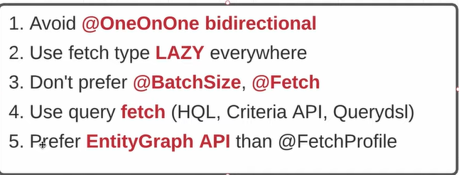
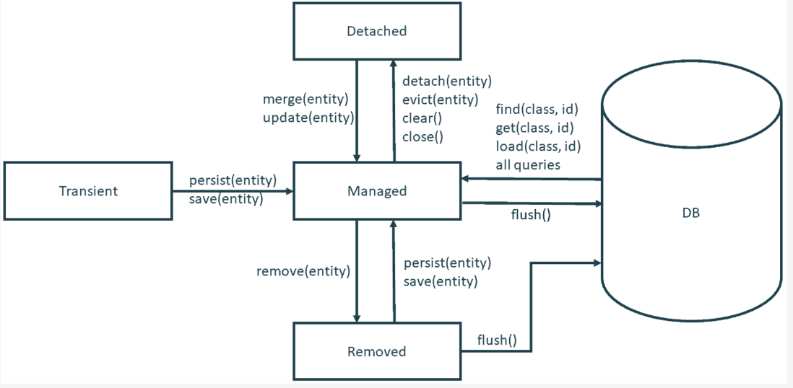

# HIBERNATE

1) [Что такое ORM?](#что-такое-orm)
2) [Опиши, как конфигурируется Hibernate. Рассказать про hibernate.cfg.xml и про mapping.](#опиши-как-конфигурируется-hibernate-рассказать-про-hibernatecfgxml-и-про-mapping)
3) [Жизненный цикл Entity.](#жизненный-цикл-entity)
4) [Зачем нужен класс SessionFactory? Является ли он потокобезопасным?](#зачем-нужен-класс-sessionfactory-является-ли-он-потокобезопасным)
5) [Зачем нужен класс Session? Является ли он потокобезопасным?](#зачем-нужен-класс-session-является-ли-он-потокобезопасным)
6) [В чем отличие методов Session.get Session.load?](#в-чем-отличие-методов-sessionget-sessionload)
7) [Расскажите про методы flush close.](#расскажите-про-методы-flush-close)
8) [В чем отличие методы save от saveOrUpdate и merge?](#в-чем-отличие-методы-save-от-saveorupdate-и-merge)
9) [Расскажите процесс создания, редактирования, чтения и удаления данных через Hibernate.](#расскажите-процесс-создания-редактирования-чтения-и-удаления-данных-через-hibernate)
10) [Как осуществляется иерархия наследования в Hibernate? Рассказать про три стратегии наследования.](#как-осуществляется-иерархия-наследования-в-hibernate-рассказать-про-три-стратегии-наследования)
11) [Можно ли создать собственный тип данных?](#можно-ли-создать-собственный-тип-данных)
12) [Какие коллекции поддерживаются на уровне mapping?](#какие-коллекции-поддерживаются-на-уровне-mapping)
13) [Зачем нужен класс Transactional?](#зачем-нужен-класс-transactional)
14) [Расскажите про уровни изоляции? Какие уровни поддерживаются в hibernate? Как их устанавливать?](#расскажите-про-уровни-изоляции-какие-уровни-поддерживаются-в-hibernate-как-их-устанавливать)
15) [Что такое OplimisticLock? Расскажите стратегии создания через version, timestamp.](#что-такое-oplimisticlock-расскажите-стратегии-создания-через-version-timestamp)
16) [Расскажите про стратегии извлечения данных urgy, lazy?](#расскажите-про-стратегии-извлечения-данных-urgy-lazy)
17) [Что такое объект Proxy? С чем связана ошибка LazyInitializationException? Как ее избежать?](#что-такое-объект-proxy-с-чем-связана-ошибка-lazyinitializationexception-как-ее-избежать)
18) [HQL. Расскажи основные элементы синтаксиса HQL? Простой запрос, запрос join? Создания объекта через конструктор.](#hql-расскажи-основные-элементы-синтаксиса-hql-простой-запрос-запрос-join-создания-объекта-через-конструктор)
19) [Расскажите про уровни кешей в Hibernate?](#расскажите-про-уровни-кешей-в-hibernate)
20) [Что такое StatelessSessionFactory? Зачем он нужен, где он используется?](#что-такое-statelesssessionfactory-зачем-он-нужен-где-он-используется)
21) [Зачем нужен решим read-only?](#зачем-нужен-решим-read-only)
22) [Расскажите, какие шаблоны проектирования используется в Hibernate (factory, proxy, strategy)](#расскажите-какие-шаблоны-проектирования-используется-в-hibernate-factory-proxy-strategy)

## Что такое orm
ORM (англ. Object-Relational Mapping, рус. объектно-реляционное отображение, или преобразование) — технология программирования,
которая связывает базы данных с концепциями объектно-ориентированных языков программирования, создавая «виртуальную объектную базу данных»

т.е. ORM — прослойка между базой данных и кодом который пишет программист, которая позволяет созданые в программе объекты складывать/получать в/из бд.

## В чем отличие JPA от Hibernate?
JPA - это спецификация JavaEE, а Hibernate - это ORM фреймворк/библиотека, которая совместима с JPA. Как и в классическом ООП, класс, который реализует интерфейс, может иметь дополнительные методы/свойства, так и Hiberante имеет больше фичей чем JPA.

JPA определяет:
- способ определения метаданных отображений - как хранимые классы и их свойства соотносятся со схемой бд. JPA широко использует Java-аннотации в классах предметной модели, но вы можете определить отображения при помощи XML;
- API для основных CRUD-операций, производимых над экземплярами хранимых классов, наиболее известен класс EntityManager, используемый для сохранения и загрузки данных;
- язык и API для создания запросов, использующих классы и их свойства. Этот язык называется Java Persistence Query Language(JPQL) и очень похож на SQL. Стандартизированный API позволяет программно создавать запросы с критериями без работы со строковыми значениями;
- порядок взаимодействия механизма хранения с транзакционными сущностями для сравнения состояний объектов, извлечения ассоциаций и выполнения прочих оптимизаций. Кроме того, в последней спецификации JPA рассмотрены основные стратегии кэширования. 

## Что такое Entity и какие есть требование к Entity в JPA?
Entity (Сущность) — POJO-класс, связанный с БД с помощью аннотации (@Entity) или через XML. К такому классу предъявляются следующие требования: Должен иметь пустой конструктор (public или protected) Не может быть вложенным, интерфейсом или enum.

1) Entity класс должен быть отмечен аннотацией Entity или описан в XML файле конфигурации JPA,
2) Entity класс должен содержать public или protected конструктор без аргументов (он также может иметь конструкторы с аргументами),
3) Entity класс не может быть enum или интерфейсом,
4) Entity класс не может быть финальным классом (final class),
5) Entity класс не может содержать финальные поля или методы, если они участвуют в маппинге (persistent final methods or persistent final instance variables),
6) Если объект Entity класса будет передаваться по значению как отдельный объект (detached object), например через удаленный интерфейс (through a remote interface), он так же должен реализовывать Serializable интерфейс,
7) Поля Entity класс должны быть напрямую доступны только методам самого Entity класса и не должны быть напрямую доступны другим классам, использующим этот Entity. Такие классы должны обращаться только к методам (getter/setter методам или другим методам бизнес-логики в Entity классе),
8) Enity класс должен содержать первичный ключ, то есть атрибут или группу атрибутов которые уникально определяют запись этого Enity класса в базе данных


## Какие есть состояния Entity в Hibernate?

org.hibernate.Session  и javax.persistence.EntityManager  представляют контекст для работы с постоянно хранимыми данными. Этот контекст называется persistence context. Сохраняемые данные имеют свою состояние как относительно persistence context, так и относительно базы данных. Сущность Hibernate может находиться в одном из четырёх состояний:

```transient\new``` — экземпляр сущности был создан, но не связан с persistence context. Он не сохранён в базе данных и обычно не имеет идентификатора.

```managed``` или ```persistent``` — сущность связана с persistence context и имеет связанный с ней идентификатор. Она может как существовать в базе данных, так и пока отсутствовать в ней.

```detached``` — с сущностью связан идентификатор, но она больше не связана с persistence context (обычно из-за того, что persistence context был закрыт, либо экземпляр был удалён из него)

```removed``` — сущность имеет идентификатор и связана с persistence context, но она запланирована к удалению из базы данных.

## Какие есть стратегии наследования Entity в Hibernate?
SQL не понимает наследование типов и не поддерживает его.

Поэтому на этапе построения сущностей и схемы БД одной из главных задач разработчика будет выбор оптимальной стратегии представления иерархии наследования.

Всего таких стратегий 4:

1) Использовать одну таблицу для каждого класса и полиморфное поведение по умолчанию.
```java
@MappedSuperclass
public class BillingDetails {

    private String owner;

    public BillingDetails() {
    }
    // get,set...
}
@Entity
@Table(name = "CREDIT_CARD")
public class CreditCard extends BillingDetails {

  @Id
  @GeneratedValue(strategy = GenerationType.SEQUENCE)
  private int id;

  @Column(name = "card_number")
  private int cardNumber;

  public CreditCard() {
  }
    // get,set...
}
@Entity
@Table(name = "BANK_ACCOUNT")
public class BankAccount extends BillingDetails {

  @Id
  @GeneratedValue(strategy = GenerationType.SEQUENCE)
  private int id;

  private int account;

  public BankAccount() {
  }
    // get,set...
}
```
Свойства суперкласса по умолчанию будут проигнорированы. Чтобы сохранить их в таблицу конкретного подкласса, необходимо использовать аннотацию @MappedSuperClass.

Этот подход возможно использовать только для верхушки иерархии классов, где:

а) Полиморфизм не нужен (выборку для конкретного подкласса Hibernate будет выполнять в один запрос -> производительность будет высокой)

б) Изменения в суперклассе не предвидятся.

Для приложения, где запросы будут ссылаться на родительский класс BillingDetails эта стратегия не подойдет.

2) Одна таблица для каждого конкретного класса, с полным исключением полиморфизма и отношений наследования из схемы SQL (для полиморфного поведения во время выполнения будут использоваться UNION-запросы)
```java
@Inheritance(strategy = InheritanceType.TABLE_PER_CLASS)
```
В рамках данной стратегии наличие идентификатора в суперклассе является обязательным требованием (в первом примере мы обошлись без него).

```java
@Entity
@Inheritance(strategy = InheritanceType.TABLE_PER_CLASS)
public abstract class BillingDetails {

    @Id
    @GeneratedValue(strategy = GenerationType.SEQUENCE)
    private int id;

    private String owner;

    public BillingDetails() {
    }
}

@Entity
@Table(name = "CREDIT_CARD")
public class CreditCard extends BillingDetails {

  @Column(name = "card_number")
  private int cardNumber;

  public CreditCard() {
  }
}

@Entity
@Table(name = "BANK_ACCOUNT")
public class BankAccount extends BillingDetails {

  @Column(name = "bank_name")
  private String bankName;
  public BankAccount() {
  }

}
```
Наша схема SQL по-прежнему ничего не знает о наследовании; между таблицами нет никаких отношений.
```sql
Hibernate: 
    select
        billingdet0_.id as id1_1_,
        billingdet0_.owner as owner2_1_,
        billingdet0_.card_number as card_num1_2_,
        billingdet0_.exp_month as exp_mont2_2_,
        billingdet0_.exp_year as exp_year3_2_,
        billingdet0_.account as account1_0_,
        billingdet0_.bank_name as bank_nam2_0_,
        billingdet0_.swift as swift3_0_,
        billingdet0_.clazz_ as clazz_ 
    from
        ( select
            id,
            owner,
            card_number,
            exp_month,
            exp_year,
            null::int4 as account,
            null::varchar as bank_name,
            null::varchar as swift,
            1 as clazz_ 
        from
            CREDIT_CARD 
        union
        all select
            id,
            owner,
            null::int4 as card_number,
            null::varchar as exp_month,
            null::varchar as exp_year,
            account,
            bank_name,
            swift,
            2 as clazz_ 
        from
            BANK_ACCOUNT 
    ) billingdet0_
```

Объединение таблиц требует одинаковой структуры столбцов, поэтому вместо несуществующих столбцов были вставлены NULL (например, «null::varchar as bank_name» в credit_card – в таблице кредиток нет названия банка).


3) Единая таблица для всей иерархии классов. Возможна только за счет денормализации схемы SQL. Определять суперкласс и подклассы будет возможно посредством различия строк.
```java
@Inheritance(strategy = InheritanceType.SINGLE_TABLE)
```
Иерархию классов можно целиком отобрать в одну таблицу. Она будет содержать столбцы для всех полей каждого класса иерархии. Для каждой записи конкретный подкласс будет определяться значением дополнительного столбца с селектором.

```java
@Entity
@Table(name = "BILLING_DETAILS")
@Inheritance(strategy = InheritanceType.SINGLE_TABLE)
@DiscriminatorColumn(name = "BD_TYPE")
public abstract class BillingDetails {

    @Id
    @GeneratedValue(strategy = GenerationType.SEQUENCE)
    private int id;

    private String owner;

    public BillingDetails() {
    }
}
@Entity
@DiscriminatorValue("BA")
public class BankAccount extends BillingDetails {

  @Column(name = "bank_name")
  private String bankName;
  
  public BankAccount() {
  }
}

@Entity
@DiscriminatorValue("CC")
public class CreditCard extends BillingDetails {

  @Column(name = "card_number")
  private int cardNumber;

  public CreditCard() {
  }
}
```
Каждый класс иерархии может указать свое значение селектора с помощью аннотации @DiscriminatorValue.
Не стоит пренебрегать явным указанием имени селектора: по умолчанию Hibernate будет использовать полное имя класса или имя сущности (зависит от того, используются ли файлы XML-Hibernate или xml-файлы JPA/аннотации).

```sql
Hibernate: 
    select
        billingdet0_.id as id2_0_,
        billingdet0_.owner as owner3_0_,
        billingdet0_.card_number as card_num4_0_,
        billingdet0_.exp_month as exp_mont5_0_,
        billingdet0_.exp_year as exp_year6_0_,
        billingdet0_.account as account7_0_,
        billingdet0_.bank_name as bank_nam8_0_,
        billingdet0_.swift as swift9_0_,
        billingdet0_.BD_TYPE as BD_TYPE1_0_ 
    from
        BILLING_DETAILS billingdet0_
```
Главным плюсом данной стратегии является производительность. Запросы (как полиморфные, так и неполиморфные) выполняются очень быстро и могут быть легко написаны вручную. Не приходится использовать соединения и объединения. Эволюция схемы также производится очень просто.


4) Одна таблица для каждого подкласса, где отношение “is a” представлено в виде «has a», т.е. – связь по внешнему ключу с использованием JOIN.
```java
@Inheritance(strategy = InheritanceType.JOINED)
```
```java
@Entity
@Table(name = "BILLING_DETAILS")
@Inheritance(strategy = InheritanceType.JOINED)
public abstract class BillingDetails {

  @Id
  @GeneratedValue(strategy = GenerationType.SEQUENCE)
  private int id;

  private String owner;

  public BillingDetails() {
  }
}

@Entity
@Table(name = "CREDIT_CARD")
public class CreditCard extends BillingDetails {

  @Column(name = "card_number")
  private int cardNumber;
  
  public CreditCard() {
  }
}
@Entity
@Table(name = "BANK_ACCOUNT")
public class BankAccount extends BillingDetails {
    
  @Column(name = "bank_name")
  private String bankName;
  
  public BankAccount() {
  }
}

Hibernate:
        select
        billingdet0_.id as id1_1_,
        billingdet0_.owner as owner2_1_,
        billingdet0_1_.card_number as card_num1_2_,
        billingdet0_1_.exp_month as exp_mont2_2_,
        billingdet0_1_.exp_year as exp_year3_2_,
        billingdet0_2_.account as account1_0_,
        billingdet0_2_.bank_name as bank_nam2_0_,
        billingdet0_2_.swift as swift3_0_,
        case
        when billingdet0_1_.id is not null then 1
        when billingdet0_2_.id is not null then 2
        when billingdet0_.id is not null then 0
        end as clazz_
        from
        BILLING_DETAILS billingdet0_
        left outer join
        CREDIT_CARD billingdet0_1_
        on billingdet0_.id=billingdet0_1_.id
        left outer join
        BANK_ACCOUNT billingdet0_2_
        on billingdet0_.id=billingdet0_2_.id
```

[https://habr.com/ru/post/337488/](https://habr.com/ru/post/337488/)
## Что такое сессия в Hibernate?
В Hibernate работа с БД осуществляется через объект типа org.hibernate.Session.
Интерфейс org.hibernate.Session является мостом между приложением и Hibernate. С помощью сессий выполняются все CRUD-операции с объектами-сущностями. Объект типа Session получают из экземпляра типа org.hibernate.SessionFactory, который должен присутствовать в приложении в виде singleton.

[https://habr.com/ru/post/337488/](https://habr.com/ru/post/337488/)

## Уровни кэширования в Hibernate.
Довольно часто в java приложениях с целью снижения нагрузки на БД используют кеш.

Прежде всего Hibernate cache — это 3 уровня кеширования:
- Кеш первого уровня (First-level cache);
- Кеш второго уровня (Second-level cache);
- Кеш запросов (Query cache);

```Кеш первого уровня``` всегда привязан к объекту сессии. Hibernate всегда по умолчанию использует этот кеш и его нельзя отключить.

```Кеш второго уровня```

Если кеш первого уровня привязан к объекту сессии, то кеш второго уровня привязан к объекту-фабрике сессий (Session Factory object). Что как бы подразумевает, что видимость этого кеша гораздо шире кеша первого уровня. По умолчанию кеш второго уровня отключен. Для включения необходимо добавить следующие строки в Вашем конфигурационном файле JPA (persistence.xml):
```xml
<property name="hibernate.cache.provider_class" value="net.sf.ehcache.hibernate.SingletonEhCacheProvider"/>
//или в более старых версиях
//<property name="hibernate.cache.provider_class" value="org.hibernate.cache.EhCacheProvider"/>
<property name="hibernate.cache.use_second_level_cache" value="true"/>
```
```java
@Entity
@Cache(usage = CacheConcurrencyStrategy.READ_WRITE)
public class Foo {}
```

Обратите внимание на первую строку. На самом деле, хибернейт сам не реализует кеширование как таковое. А лишь предоставляет структуру для его реализации, поэтому подключить можно любую реализацию, которая соответствует спецификации нашего ORM фреймворка. Из популярных реализаций можно выделить следующие:
- EHCache
- OSCache
- SwarmCache
- JBoss TreeCache
  
Чтение из кеша второго уровня происходит только в том случае, если нужный объект не был найден в кеше первого уровня.

```Кеш запросов```
```java
Query query = session.createQuery("from SharedDoc doc where doc.name = :name");

SharedDoc persistedDoc = (SharedDoc) query.setParameter("name", "first").uniqueResult();
System.out.println(persistedDoc.getName());
user1.setDoc(persistedDoc);

persistedDoc = (SharedDoc) query.setParameter("name", "first").uniqueResult();
System.out.println(persistedDoc.getName());
user2.setDoc(persistedDoc);
```
Результаты такого рода запросов не сохраняются ни кешом первого, ни второго уровня. Это как раз то место, где можно использовать кеш запросов. Он тоже по умолчанию отключен.
Для включения нужно добавить следующую строку в конфигурационный файл:
```xml
<property name="hibernate.cache.use_query_cache" value="true"/>
```

а также переписать пример выше добавив после создания объекта Query (то же справедливо и для Criteria):
```java
Query query = session.createQuery("from SharedDoc doc where doc.name = :name");
query.setCacheable(true);
```

Кеш запросов похож на кеш второго уровня. Но в отличии от него — ключом к данным кеша выступает не идентификатор объекта, а совокупность параметров запроса. А сами данные — это идентификаторы объектов соответствующих критериям запроса. Таким образом, этот кеш рационально использовать с кешем второго уровня.

[https://habr.com/ru/post/135176/](https://habr.com/ru/post/135176/)

## Пессимистичные и оптимистичные локи в Hibernate
Блокировка — это механизм, позволяющий параллельно работать с одними и теми же данными в базе данных. Когда несколько транзакций одновременно пытаются получить доступ к одним и тем же данным, вступают в действие блокировки, которые гарантируют, что только одна из этих транзакций изменит данные. JPA поддерживает два типа механизмов блокировки: оптимистическую модель и пессимистическую модель.

- Оптимистичная

Оптимистичные блокировки предполагают, что множество транзакций могут завершиться без влияния друг на друга, и таким образом могут выполнятся без блокировок тех ресурсов, на которые они влияют. Перед коммитом, каждая транзакция проверяет, что ни одна другая транзакция не модифицировала ее данные. Если проверка выявила конфликтующие модификации, транзакция, находящаяся в состоянии коммита, откатывается.

Вы можете хранить версионированные данные, когда ваше приложение использует долгоживущие транзакции или диалоги, покрывающие несколько БД-транзакций. Таким образом, если одна и та же сущность будет модифицироваться двумя диалогами, последний диалог, коммитивший изменения, будет оповещен о конфликте, и не перезапишет результаты другого диалога. Этот подход гарантирует некоторую степень изоляции, но при этом хорошо масштабируется, и довольно неплохо себя показывает в ситуациях Read-Often Write-Sometimes
Hibernate предоставляет два различных механизма для хранения версионной информации – выделенный номер версии, или временную метку (timestamp).

Механизм номера версии для оптимистичных блокировок предоставляется аннотацией Version.
```java
@Entity
public class Flight implements Serializable {
...
@Version
@Column(name="OPTLOCK")
public Integer getVersion() { ... }
}
```

Временные метки (timestamps) — менее надежный способ оптимистичных блокировок чем номера версий, который также может быть использован приложениями для других целей. Временные метки используются автоматически, если вы используете аннотацию Version на свойстве типа Date или Calendar.
```java
@Entity
public class Flight implements Serializable {
...
@Version
public Date getLastUpdate() { ... }

```

- Пессимистичная

Пессимистичная стратегия подразумевает, что параллельные транзакции будут конфликтовать каждая друг с другом, и требует блокировки ресурсов после их чтения, а также ее снятия только после того, как приложение завершило использование данных.
Hibernate предоставляет механизмы для реализации обеих стратегий блокировок в вашем приложении.

Класс LockMode определяет различные уровни блокировок, которые может захватывать Hibernate.

- LockMode.WRITE
Захватывается автоматически, когда Hibernate обновляет или вставляет строку.
- LockMode.UPGRADE
Захватывается после явного запроса пользователя с использованием SELECT… FOR UPDATE на БД, поддерживающих данный синтаксис.
- LockMode.UPGRADE_NOWAIT
Захватывается после явного запроса пользователя с использованием SELECT… FOR UPDATE NOWAIT в Oracle
- LockMode.READ
Захватывается автоматически когда Hibernate читает данные под уровнями изоляции Repeatable Read или Serializable. Может быть повторно захвачен явным запросом пользователя.
- LockMode.NONE
Отсутствие блокировки. Все объекты переключаются на этот режим блокировки в конце транзакции. Объекты, ассоциированные с сессией
через вызов update() или saveOrUpdate также начинают в этом режиме.

Явный запрос пользователя, обозначенный выше, происходит как следствие любых из следующих действий:
- Вызов Session.load(), с указанием LockMode
- Вызов Session.lock()
- Вызов Query.setLockMode()

## Проблема N+1 и как ее решать
Проблема N + 1 возникает, когда фреймворк доступа к данным выполняет N дополнительных SQL-запросов для получения тех же данных, которые можно получить при выполнении одного SQL-запроса.

Проблема заключается в выполнении множества дополнительных запросов, которые в сумме выполняются уже существенное время, влияющее на быстродействие.

 Данную проблему можно получить как на чистом SQL, так и с использованием технологий.

Использование явного или неявного FetchType.EAGER для JPA-ассоциаций — плохая идея, потому что будет загружаться гораздо больше данных, чем вам нужно. Более того, стратегия FetchType.EAGER также подвержена проблемам N + 1.

К сожалению, ассоциации @ManyToOne и @OneToOne по умолчанию используют FetchType.EAGER

Поэтому по умолчанию лучше использовать FetchType.LAZY.
использовать JOIN FETCH, чтобы избежать проблемы с N + 1

Даже если вы явно перейдете на использование FetchType.LAZY для всех ассоциаций, то вы все равно можете столкнуться с проблемой N + 1. Так как при запросу к данным, сгенерируются запросы 

Решение:



FETCH: Это тип графа по умолчанию. Когда он выбран, атрибуты, указанные узлами атрибутов графа сущностей, обрабатываются как FetchType.EAGER, а атрибуты, которые не указаны, обрабатываются как FetchType.LAZY.
LOAD: Когда выбран этот тип, атрибуты, указанные узлами атрибутов графа сущности, обрабатываются как FetchType.EAGER, а атрибуты, которые не указаны, обрабатываются в соответствии с их заданным или стандартным FetchType.

```java
@Repository
public interface ProductRepository extends JpaRepository<Product, Long> {
    @EntityGraph(attributePaths = {"stores"}, type = EntityGraph.EntityGraphType.LOAD)
    List<Product> findAll();
}
Hibernate:
        select
        product0_.id as id1_7_0_,
        store2_.id as id1_9_1_,
        product0_.category_id as category3_7_0_,
        product0_.product_name as product_2_7_0_,
        store2_.description as descript2_9_1_,
        store2_.position as position3_9_1_,
        stores1_.product_id as product_1_8_0__,
        stores1_.stores_id as stores_i2_8_0__
        from
        product product0_
        inner join
        product_stores stores1_
        on product0_.id=stores1_.product_id
        inner join
        store store2_
        on stores1_.stores_id=store2_.id
```

NamedEntityGraph:

```java
@Data
@Entity
@NamedEntityGraph(name = Product.WITH_STORES_GRAPH,
        attributeNodes = @NamedAttributeNode("stores"))
public class Product {
    public static final String WITH_STORES_GRAPH = "graph.Product.stores";
  
    @Id
    @GeneratedValue
    private Long id;

    private String productName;

    @ManyToMany(fetch = FetchType.LAZY)
    private Set<Store> stores;

    @ManyToOne(fetch = FetchType.LAZY)
    private Category category;
}
```

Repository:

```java
@Repository
public interface ProductRepository extends JpaRepository<Product, Long> {
    @EntityGraph(value = Product.WITH_STORES_GRAPH, type = EntityGraph.EntityGraphType.LOAD)
    List<Product> findAll();
}
```

```java
@Data
@Entity
@NamedEntityGraph(name = Product.WITH_STORES_AND_CITY_GRAPH,
        attributeNodes = {
                @NamedAttributeNode(
                        value = "stores",
                        subgraph = "city-subgraph"
                )
        },
        subgraphs = {
                @NamedSubgraph(
                        name = "city-subgraph",
                        attributeNodes =
                                {
                                        @NamedAttributeNode("city")
                                }
                )
        }
)
public class Product {
    public static final String WITH_STORES_AND_CITY_GRAPH = "graph.Product.stores.city";
    @Id
    @GeneratedValue
    private Long id;

    private String productName;

    @ManyToMany(fetch = FetchType.LAZY)
    private Set<Store> stores;

    @ManyToOne(fetch = FetchType.LAZY)
    private Category category;
}
```

## Виды связей между таблицами в Hibernate и JPA?
Односторонние и двусторонние отношения в Hibernate
- OneToOne - один к одному
- OneToMany - один ко многим
- ManyToOne - многие к одному
- ManyToMany - многие ко многим

[к оглавлению](#hibernate)

## Опиши как конфигурируется hibernate рассказать про hibernatecfgxml и про mapping

Существует четыре способа конфигурации работы с Hibernate:
+ используя аннотации;
+ hibernate.cfg.xml;
+ hibernate.properties;
+ persistence.xml.

Самый частый способ конфигурации: через аннотации и файл persistence.xml,
что касается файлов hibernate.properties и hibernate.cfg.xml, то hibernate.cfg.xml главнее (если в приложение есть оба файла,
то принимаются настройки из файла hibernate.cfg.xml). Конфигурация аннотациями,
хоть и удобна, но не всегда возможна, к примеру, если для разных баз данных или для разных ситуаций
вы хотите иметь разные конфигурацию сущностей, то следует использовать xml файлы конфигураций.

Файл конфигурации Hibernate содержит в себе данные о базе данных и необходим для инициализации SessionFactory.
В .xml файле необходимо указать вендора базы данных или JNDI ресурсы, а так же информацию об используемом диалекте,
что поможет hibernate выбрать режим работы с конкретной базой данных.

Файл отображения (mapping file) используется для связи entity бинов и колонок в таблице базы данных.
В случаях, когда не используются аннотации JPA, файл отображения .xml может быть полезен (например при использовании сторонних библиотек).

[к оглавлению](#hibernate)
## Жизненный цикл entity

+ *Transient:* состояние, при котором объект никогда не был связан с какой-либо сессией и не является персистентностью. Этот объект находится во временном состоянии. Объект в этом состоянии может стать персистентным при вызове метода save(), persist() или saveOrUpdate(). Объект персистентности может перейти в transient состоянии после вызова метода delete().Экземпляр сущности был создан, но не ассоциирован в контекстом постоянства. Он не имеет отображения в базе данных, и как правило, не имеет id;
+ *Persistent:* когда объект связан с уникальной сессией он находится в состоянии persistent (персистентности). Любой экземпляр, возвращаемый методами get() или load() находится в состоянии persistent. Объект имеет id и ассоциирован с контекстом постоянства. Может иметь или не иметь отображения в БД;
+ *Detached:* если объект был персистентным, но сейчас не связан с какой-либо сессией, то он находится в отвязанном (detached) состоянии. Такой объект можно сделать персистентным используя методы update(), saveOrUpdate(), lock() или replicate(). Состояния transient или detached так же могут перейти в состояние persistent как новый объект персистентности после вызова метода merge().
+ *Removed:* Объект имеет id и ассоциирован с контекстом постоянства, но запланирован на удаление из базы данных при выполнении flush() или commit();




[к оглавлению](#hibernate)
## Зачем нужен класс sessionfactory является ли он потокобезопасным
Именно из объекта SessionFactory мы получаем объекты типа Session. На все приложение существует только одна SessionFactory и она инициализируеться вместе со стартом приложения. SessionFactory кэширует мета-дату и SQL запросы которые часто используются приложением во время работы. Так же оно кэширует информацию которая была получена в одной из транзакций и может быть использована и в других транзакциях.
Обьект SessionFactory можно получить следующим обращением:
```java
SessionFactory sessionFactory = configuration.buildSessionFactory();
```

Т.к. объект SessionFactory immutable (неизменяемый), то да, он потокобезопасный.
Множество потоков может обращаться к одному объекту одновременно.

[к оглавлению](#hibernate)
## Зачем нужен класс session является ли он потокобезопасным
Session — это основной интерфейс, который отвечает за связь с базой данных.
Так же, он помогает создавать объекты запросов для получение персистентных объектов.
(персистентный объект — объект который уже находится в базе данных;
объект запроса — объект который получается когда мы получаем результат запроса в базу данных,
именно с ним работает приложение). Обьект Session можно получить из SessionFactory:
```java
Session session = sessionFactory.openSession();
```

Роль интерфейса Session:
+ является оберткой для jdbc подключения к базе данных; (https://ru.wikipedia.org/wiki/Java_Database_Connectiv..)
+ является фабрикой для транзакций (согласно официальной документации transaction — аllows the application to define units of work, что , по сути, означает что транзакция определяет границы операций связанных с базой данных).
+ является хранителем обязательного кэша первого уровня.

Жизненный цикл объекта session связан с началом и окончанием транзакции.
Этот объект предоставляет методы для CRUD (create, read, update, delete) операций для объекта персистентности.
С помощью этого экземпляра можно выполнять HQL, SQL запросы и задавать критерии выборки.

Объект Hibernate Session не является потокобезопасным.
Каждый поток должен иметь свой собственный объект Session и закрывать его по окончанию.

[к оглавлению](#hibernate)
## В чем отличие методов sessionget sessionload
Hibernate session обладает различными методами для загрузки данных из базы данных.
Наиболее часто используемые методы для этого — get() и load().

+ get() загружает данные сразу при вызове, в то время как load() использует прокси объект и загружает данные только тогда,
  когда это требуется на самом деле. В этом плане load() имеет преимущество в плане ленивой загрузки данных.
+ load() бросает исключение, когда данные не найдены. Поэтому его нужно использовать только при уверенности в существовании данных.
+ Нужно использовать метод get(), если необходимо удостовериться в наличии данных в БД.
+ В случае обращение к несуществующему объекту, метод get(); вернет null. В случае нахождения объект, метод get(); вернет сам объект и запрос в базу данных будет произведен немедленно.


[к оглавлению](#hibernate)
## Расскажите про методы flush close
+ flush() синхронизирует вашу базу данных с текущим состоянием объекта/объектов, хранящихся в памяти, но не совершает транзакцию.
+ если вы получите какое-либо исключение после вызова flush(), то транзакция будет отменена.
+ Вы можете синхронизировать свою базу данных с небольшими фрагментами данных, используя flush(), вместо того, чтобы делать большие данные одновременно с помощью commit() и столкнуться с риском получить Исключение из памяти.
+ commit() сделает данные, хранящиеся в базе данных постоянными. Вы не можете отменить свою транзакцию после успешного завершения commit()

[к оглавлению](#hibernate)
## В чем отличие методы save от saveorupdate и merge
+ Hibernate save() используется для сохранения сущности в базу данных.
  Проблема с использованием метода save() заключается в том, что он может быть вызван без транзакции.
  А следовательно если у нас имеется отображение нескольких объектов, то только первичный объект будет сохранен и мы получим несогласованные данные.
  Также save() немедленно возвращает сгенерированный идентификатор.

+ Hibernate persist() аналогичен save() с транзакцией. persist() не возвращает сгенерированный идентификатор сразу.

+ Hibernate saveOrUpdate() использует запрос для вставки или обновления, основываясь на предоставленных данных.
  Если данные уже присутствуют в базе данных, то будет выполнен запрос обновления.
  Метод saveOrUpdate() можно применять без транзакции, но это может привести к аналогичным проблемам, как и в случае с методом save().

+ Hibernate merge() может быть использован для обновления существующих значений,
  однако этот метод создает копию из переданного объекта сущности и возвращает его.
  Возвращаемый объект является частью контекста персистентности и отслеживает любые изменения, а переданный объект не отслеживается.

[к оглавлению](#hibernate)
## Расскажите процесс создания редактирования чтения и удаления данных через hibernate

[к оглавлению](#hibernate)
## Как осуществляется иерархия наследования в hibernate рассказать про три стратегии наследования
SQL не понимает наследование типов и не поддерживает его.

Всего таких стратегий 4:

+ Использовать одну таблицу для каждого класса и полиморфное поведение по умолчанию.
+ Одна таблица для каждого конкретного класса, с полным исключением полиморфизма и отношений
  наследования из схемы SQL (для полиморфного поведения во время выполнения будут использоваться UNION-запросы)
+ Единая таблица для всей иерархии классов. Возможна только за счет денормализации схемы SQL.
  Определять суперкласс и подклассы будет возможно посредством различия строк.
+ Одна таблица для каждого подкласса, где отношение “is a” представлено в виде «has a»,
  т.е. – связь по внешнему ключу с использованием JOIN.

[к оглавлению](#hibernate)
## Можно ли создать собственный тип данных
Все дело в том, что система типов в hibernate более гибкая и универсальная: там мы можем работать с пользовательскими типами данных, которые ну уровне БД отображаются не одним sql-полем, а несколькими. Кроме того, есть возможность создать такой свой тип данных, что можно использовать его при написании hql-запросов.

[к оглавлению](#hibernate)
## Какие коллекции поддерживаются на уровне mapping
+ Set
+ List
+ Array
+ Map

[к оглавлению](#hibernate)
## Зачем нужен класс transactional
*Transaction (org.hibernate.Transaction)* — однопоточный короткоживущий объект, используемый для атомарных операций.
Это абстракция приложения от основных JDBC или JTA транзакций. org.hibernate.Session может занимать несколько org.hibernate.Transaction в определенных случаях.

Вместо вызовов session.openTransaction() и session.commit() используется аннотация @Transactional

```java
@Transactional(propagation = Propagation.REQUIRED, rollbackFor = {ObjectNotFoundException.class,                               ConstraintViolationException.class})
    public Long saveTask(Long userId) {
        Session session = sessionFactory.getCurrentSession();
        Tasks task = new Tasks();
        task.setName("Задача 1");
        task.setDefinition("Задача 1");
        task.setTaskDate(new Date());
        task.setUser((User) session.load(User.class, userId));
        session.saveOrUpdate(task);
        return task.getTaskId();
    }
```

Аннотация @Transactional указывает, что метод должен выполняться в транзакции. Менеджер транзакций открывает новую транзакцию и создаёт для неё экземпляр Session, который доступен через sessionFactory.getCurrentSession(). Все методы, которые вызываются в методе с данной аннотацией, также имеют доступ к этой транзакции, потому что экземпляр Session является переменной потока (ThreadLocal). Вызов sessionFactory.openSession() откроет совсем другую сессию, которая не связана с транзакцией.


Параметр rollbackFor указывает исключения, при выбросе которых должен быть произведён откат транзакции. Есть обратный параметр — noRollbackFor, указывающий, что все исключения, кроме перечисленных, приводят к откату транзакции.

Параметр propagation самый интересный. Он указывает принцип распространения транзакции. Может принимать любое значение из перечисления org.springframework.transaction.annotation.Propagation. Приведём пример:
```java
    @Autowired
    private SessionFactory sessionFactory;

    @Autowired
    private UserDao userDao;

    @Transactional(propagation = Propagation.REQUIRED, rollbackFor = {ConstraintViolationException.class})
    public Long saveTask(Long userId) {
        Session session = sessionFactory.getCurrentSession();
        User user = userDao.getUserByLogin("user1");
        Tasks task = new Tasks();
        task.setName("Задача 1");
        ...
        task.setUser(user);
        session.saveOrUpdate(task);
        return task.getTaskId();
    }
```

Метод UserDao.getUserByLogin() также может быть помечен аннотацией @Transactional. И здесь параметр propagation определит поведение метода UserDao.getUserByLogin() относительно транзакции метода saveTask():

- Propagation.REQUIRED — выполняться в существующей транзакции, если она есть, иначе создавать новую.
- Propagation.MANDATORY — выполняться в существующей транзакции, если она есть, иначе генерировать исключение.
- Propagation.SUPPORTS — выполняться в существующей транзакции, если она есть, иначе выполняться вне транзакции.
- Propagation.NOT_SUPPORTED — всегда выполняться вне транзакции. Если есть существующая, то она будет остановлена.
- Propagation.REQUIRES_NEW — всегда выполняться в новой независимой транзакции. Если есть существующая, то она будет остановлена до окончания выполнения новой транзакции.
- Propagation.NESTED — если есть текущая транзакция, выполняться в новой, так называемой, вложенной транзакции. Если вложенная транзакция будет отменена, то это не повлияет на внешнюю транзакцию; если будет отменена внешняя транзакция, то будет отменена и вложенная. Если текущей транзакции нет, то просто создаётся новая.
- Propagation.NEVER — всегда выполнять вне транзакции, при наличии существующей генерировать исключение.

[https://habr.com/ru/post/271115/](https://habr.com/ru/post/271115/)

[к оглавлению](#hibernate)
## Расскажите про уровни изоляции какие уровни поддерживаются в hibernate как их устанавливать
- @Transactional(isolation = Isolation.READ_UNCOMMITTED) - по умолчанию
- @Transactional(isolation = Isolation.READ_COMMITTED)
- @Transactional(isolation = Isolation.REPEATABLE_READ)
- @Transactional(isolation = Isolation.SERIALIZABLE)

[к оглавлению](#hibernate)
## Что такое oplimisticlock расскажите стратегии создания через version timestamp

[к оглавлению](#hibernate)
## Расскажите про стратегии извлечения данных urgy lazy
FetchType.EAGER — загружать коллекцию дочерних объектов сразу же, при загрузке родительских объектов.

FetchType.LAZY — загружать коллекцию дочерних объектов при первом обращении к ней (вызове get) — так называемая отложенная загрузка.

[к оглавлению](#hibernate)
## Что такое объект proxy с чем связана ошибка lazyinitializationexception как ее избежать
Вместо метода session.get() можно использовать session.load(). Метод session.load() возвращает так называемый proxy-object. Proxy-object — это объект-посредник, через который мы можем взаимодействовать с реальным объектом в БД. Он расширяет функционал объекта-сущности. Взаимодействие с proxy-object полностью аналогично взаимодействию с объектом-сущностью. Proxy-object отличается от объекта-сущности тем, что при создании proxy-object не выполняется ни одного запроса к БД, т. е. Hibernate просто верит нам, что объект с данным Id существует в БД. Однако первый вызванный get или set у proxy-object сразу инициирует запрос select, и если объекта с данным Id нет в базе, то мы получим ObjectNotFoundException. Основное предназначение proxy-object — реализация отложенной загрузки.

С параметром FetchType.LAZY нужно быть аккуратнее. Иногда при загрузке ассоциированных сущностей мы можем поймать исключение LazyInitializationException. В вышеуказанном коде во время вызова user.getTasks() user должен быть либо в статусе persistent, либо proxy.

```java
public List<Task> getTasks(Long userId) {
       ...
       Session session = sessionFactory.openSession();
       User user = (User) session.load(User.class, userId);
       List<Task> tasksList = user.getTasks();
       session.close();
       return tasksList;
}
```
Здесь теоретически всё верно. Но при попытке обращения к tasksList мы МОЖЕМ получить LazyInitializationException. Но в дебагере данный код отрабатывает верно. Почему? Потому, что user.getTasks() только возвращает ссылку на коллекцию, но не ждёт её загрузки. Не подождав, пока загрузятся данные, мы закрыли сессию. Выход — выполнять в транзакции, т. е.:
```java
    public List<Task> getTasks(Long userId) {
       ...
       User user = (User) session.load(User.class, userId);
       Session session = sessionFactory.openSession();
       session.beginTransaction();
       List<Task> tasksList = user.getTasks();
       session.getTransaction().commit();            
       return tasksList;
    }
```


[к оглавлению](#hibernate)
## Hql расскажи основные элементы синтаксиса hql простой запрос запрос join создания объекта через конструктор

Язык запросов HQL

HQL (Hibernate Query Language) – это объекто-ориентированный язык запросов, который очень похож на SQL. Главное различие языков HQL и SQL связано с тем, что SQL формирует запросы из наименований таблиц в базе данных и их столбцов, а HQL работает с сущностями (классами) и их полями (аттрибутами класса)

Hibernate транслирует HQL–запросы в понятные для БД SQL–запросы, которые и выполняют необходимые действия в БД.

- FROM
```java
String hql = "FROM User";
Query query = session.createQuery(hql);
List<User> users = query.list();
```
- WHERE
```java
Query query = session.createQuery("FROM User where name = 'Иван'");
List<User> users = query.list();
```
- INSERT
```java
        String hql = "insert into User (login, name) " +
        "select 'oleg', 'Олег' from User";
        int rows = session.createQuery (hql).executeUpdate();
        System.out.println("rows : " + rows);
```
- UPDATE
```java
        String hql = "update Contact "
        + "SET firstName = :name "
        +   ", lastName  = :lastName "
        +   ", date      = :dateParam "
        +  " where id = :idParam"
        Query query = session.createQuery(hql);

        query.setParameter("idParam"  , 48);
        query.setParameter("name"     , "Киса");
        query.setParameter("lastName" , "Воробьянинов");
        query.setParameter("dateParam", new Date());

        int result = query.executeUpdate();
```
- DELETE
```java
        String hql = "DELETE User WHERE login = :lg";
        Query query = session.createQuery(hql);
        query.setParameter("lg", "oleg");
        int rows = query.executeUpdate();
```
- Использование алиаса AS
```java
        String hql = "FROM User AS u";
        Query query = session.createQuery(hql);
        List results = query.list();
        
        String hql = "FROM User u";
        Query query = session.createQuery(hql);
        List results = query.list();
```
- GROUP BY
```java
        String hql = "SELECT SUM (e.salary), e.firtName "
        +      "FROM Employee e "
        +          "GROUP BY e.firstName";
        Query query = session.createQuery(hql);
        List results = query.list();
```
- Агрегатные функции HQL
  - avg (property name)	получение среднего значения
  - count (property name or *)	получение количества записей
  - max (property name)	получение максимального значения
  - min (property name)	получение минимального значения
  - sum (property name)	вычисление суммарного значения
```java
String hql = "SELECT COUNT (distinct e.firstName) "
        + "FROM Employee e";
        Query query = session.createQuery(hql);
        List results = query.list();
```
- ORDER BY
```java
        String hql = "FROM Employee e "
        +  "WHERE e.id > 10 "
        +     "ORDER BY e.firstName DESC, e.salary DESC";
        Query query = session.createQuery(hql);
        List results = query.list();
```
- JOIN. HQL поддерживает две формы объединения: явные (explicit) и неявные (implicit).
Явная форма:
```java
  from Cat as cat
  join cat.mate as mate
  left join cat.kittens as kitten

        Вы можете предоставить дополнительные условия соединения с использованием ключевого слова HQL with.
        from Cat as cat
        left join cat.kittens as kitten
        with kitten.bodyWeight > 10.0
```

Соединение «fetch» позволяет инициализировать ассоциации или коллекции значений вместе с их родительскими объектами с использованием одного запроса. Это особенно полезно в случае коллекции. Он эффективно отменяет внешнее объединение и ленивые объявления файла отображения для ассоциаций и коллекций.
```java
from Cat as cat
    inner join fetch cat.mate
    left join fetch cat.kittens
```

Неявная форма:

Неявная форма не использует ключевое слово join. Вместо этого ассоциации «разыменовываются» с использованием точечной нотации. неявные объединения могут появляться в любом из секций HQL. Неявный результат объединения во внутренних объединениях в результирующей SQL-инструкции.
```java
from Cat as cat where cat.mate.name like '%s%'
```

[к оглавлению](#hibernate)
## Расскажите про уровни кешей в hibernate


[к оглавлению](#hibernate)
## Что такое statelesssessionfactory зачем он нужен где он используется
StatelessSession предоставляет командно-ориентированный API, который гораздо ближе к JDBC. Этот функционал доступен только в Hibernate и не включен в JPA.

StatelessSession не предоставляет кэш первого уровня, сравнение состояния объектов (dirty checks) или write-behind. Он также не обеспечивает ленивую загрузку связей и не использует кэши второго и третьего уровня. Любая операция также не вызывает никаких событий жизненного цикла или перехватчиков.

Вместо всех функций, которые предоставляет обычный Session или EntityManager в JPA, мы получаем полный контроль над выполняемыми SQL-запросами.

Если вы хотите получить какие-то данные из базы данных или инициализировать связь между сущностями, вам нужно написать и выполнить соответствующий запрос. А если вы создаете новый или изменяете существующий объект сущности, вам нужно вызвать метод insert(), update() или delete() интерфейса StatelessSession, чтобы сохранить изменения.

Это требует от вас большего внимания к технической стороне слоя хранения данных (persistence layer). Но если ваши задачи не требуют сравнение состояния объектов (dirty checks), ленивой загрузки или кэшей первого уровня, использование StatelessSession значительно снижает накладные расходы на производительность, которые добавляют все эти функции.

Это делает StatelessSession отличным решением для случаев, когда импортируется или обновляется огромный набор данных. Вы также можете попробовать StatelessSession, если вам нужно получить много объектов сущностей, которые вы не будете изменять.

### Как использовать StatelessSession?
Давайте используем StatelessSession для чтения и записи объектов сущностей. Экземпляр StatelessSession можно получить так же, как и обычный экземпляр Session.

Если ваше приложение основано на Spring, вы можете просто внедрить экземпляр StatelessSession. А если вы используете обычный Hibernate, вызовите метод openStatelessSession() вашего SessionFactory и использовать его для начала транзакции.

```java
StatelessSession statelessSession = sessionFactory.openStatelessSession();
statelessSession.getTransaction().begin();
 
// ваши запросы
 
statelessSession.getTransaction().commit();
```

Вставка и обновление сущностей:
```java
final StatelessSession statelessSession = sessionFactory.openStatelessSession();

statelessSession.getTransaction().begin();

final Post post = new Post();
post.setTitle("New Past");

statelessSession.insert(post);

post.setTitle("New Post");

statelessSession.update(post);

statelessSession.getTransaction().commit();
```
Без кэша первого уровня и сравнения состояния объектов (dirty checks) Hibernate немедленно выполняет оператор SQL INSERT, когда вы вызываете метод insert(). Также Hibernate самостоятельно не обнаруживает изменений в поле title. Вам нужно вызвать метод update(), чтобы сохранить это изменение. Тогда будет немедленно выполнен оператор SQL UPDATE

### Чтение из базы данных

Я уже упоминал, что StatelessSession не обеспечивает ленивую загрузку. Поэтому при получении объекта сущности из базы данных необходимо самостоятельно инициализировать все необходимые связи. В противном случае вы получите LazyInitializationException при первом обращении к связной сущности.
Лучший способ инициализировать связи - использовать граф сущностей (EntityGraph) или включить предложение JOIN FETCH в запрос JPQL.
```java
final StatelessSession statelessSession = sessionFactory.openStatelessSession();

statelessSession.getTransaction().begin();

final Post post = statelessSession.createQuery("""
                SELECT p
                FROM Post p
                    JOIN FETCH p.comments
                WHERE p.id=:id""", Post.class)
        .setParameter("id", 1L)
        .getSingleResult();

log.info(post.getId() + " " + post.getTitle());
log.info("Comments size: " + post.getComments().size());

statelessSession.getTransaction().commit();
```

Интерфейс StatelessSession в Hibernate предоставляет командно-ориентированный API, который дает вам больше контроля над выполняемыми SQL-запросами. Он гораздо ближе к JDBC, но не поддерживает такие функции как сравнение состояния объектов (dirty checks), выталкивание контекста хранения (flushes), кэши всех уровней, каскадные операции и ленивую загрузку.

В целом, StatelessSession в Hibernate - это отличная функция, если вы хотите снизить накладные расходы на обработку сессий в Hibernate и не нуждаетесь во всех этих функциях. Типичными примерами являются пакетные задания или другие сценарии использования, которые выполняют множество простых операций записи.

[к оглавлению](#hibernate)
## Зачем нужен решим read only
- Транзакции для чтения могут показаться действительно странными, и часто люди не отмечают методы транзакций в этом случае. Но JDBC создаст транзакцию в любом случае, она просто будет работать в autocommit=true, если другая опция не была задана явно.
- Но нет гарантии, что ваш метод не будет записываться в базу данных. Если вы помечаете метод как @Transactional(readonly=true), Spring установит транзакцию JDBC в режим только для чтения, таким образом, вы будете определять, действительно ли это возможно записать в БД в рамках этой транзакции. Если ваша архитектура довольно громоздка, и некоторые члены команды могут не следовать разумному пути, этот флаг указывает на проблемное место.
- Также транзакции, доступные только для чтения, могут быть оптимизированы БД, но это, конечно, специфично для БД. Например. MySQL добавила поддержку для этого только в InnoDB, начиная с версии 5.6.4.
- Если вы не используете JDBC напрямую, а скорее ORM, это может быть проблематично. Например, сообщество Hibernate говорит, что работа за пределами транзакции может привести к непредсказуемому поведению. Это связано с тем, что Hibernate откроет транзакцию, но она не будет закрыта сама по себе, поэтому соединение будет возвращено в пул соединений, при этом транзакция не будет выполнена. Что происходит тогда? JDBC сохраняет молчание, поэтому это специфично для реализации (MySQL откатывает транзакцию, Oracle afair ее совершает). Это также можно настроить на уровне пула соединений (например, C3P0 предоставляет вам такую ​​возможность, откат по умолчанию).
- Другое дело, когда дело доходит до Hibernate, Spring устанавливает FlushMode в MANUAL в случае транзакций только для чтения, что приводит к другим оптимизации, не требующим грязных проверок.
- Вы можете переопределить или установить явно уровень изоляции транзакции. Это также влияет на транзакции чтения, так как вы читаете или не хотите читать незафиксированные изменения, подвергаетесь сообщениям phantom и т.д.

[к оглавлению](#hibernate)
## Расскажите какие шаблоны проектирования используется в hibernate factory proxy strategy
+ Domain Model Pattern – объектная модель предметной области, включающая в себя как поведение так и данные.
+ Data Mapper – слой мапперов (Mappers), который передает данные между объектами и базой данных, сохраняя их независимыми друг от друга и себя.
+ Proxy Pattern — применяется для ленивой загрузки.
+ Factory pattern — используется в SessionFactory

[к оглавлению](#hibernate)

## Что такое каскадные связи обновления и какие каскадные типы есть в Hibernate

Если у нас имеются зависимости между сущностями (entities), то нам необходимо определить как различные операции будут влиять на другую сущность.
Это реализуется с помощью каскадных связей (или обновлений). Вот пример кода с использованием аннотации @Cascade:
```java
import org.hibernate.annotations.Cascade;
 
@Entity
@Table(name = "EMPLOYEE")
public class Employee {
 
@OneToOne(mappedBy = "employee")
@Cascade(value = org.hibernate.annotations.CascadeType.ALL)
private Address address;
 
}
```
Обратите внимание, что есть некоторые различия между enum CascadeType в Hibernate и в JPA. Поэтому обращайте внимание какой пакет вы импортируете при использовании аннотации и константы типа. Наиболее часто используемые CascadeType перечисления описаны ниже.

None: без Cascading. Формально это не тип, но если мы не указали каскадной связи, то никакая операция для родителя не будет иметь эффекта для ребенка.
+ ALL: Cascades save, delete, update, evict, lock, replicate, merge, persist. В общем — всё.
+ SAVE_UPDATE: Cascades save и update. Доступно только для hibernate.
+ DELETE: передает в Hibernate native DELETE действие. Только для hibernate.
+ DETATCH, MERGE, PERSIST, REFRESH и REMOVE – для простых операций.
+ LOCK: передает в Hibernate native LOCK действие.
+ REPLICATE: передает в Hibernate native REPLICATE действие.
