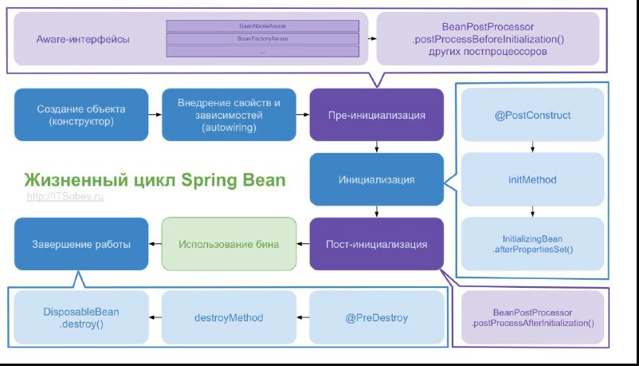

### spring

1) [Что такое Spring? Какие основные задачи выполняет этот фреймворк?](#что-такое-spring-какие-основные-задачи-выполняет-этот-фреймворк)
2) [Что такое IoC и DI? В чем отличие этих терминов?](#что-такое-ioc-и-di-в-чем-отличие-этих-терминов)
3) [Перечислите основные модули Spring фреймворка.](#перечислите-основные-модули-spring-фреймворка)
4) [Перечислите способы инъекций зависимостей.](#перечислите-способы-инъекций-зависимостей)
5) [Что такое ApplicationContext? Когда он создается?](#что-такое-applicationcontext-когда-он-создается)
6) [Расскажите, что такое Spring Bean? Опишите жизненный цикл Spring Bean?](#расскажите-что-такое-spring-bean-опишите-жизненный-цикл-spring-bean)
7) [Объясните для чего используются аннотации @Autowired @Qualifier. Когда какой нужно использовать?](#объясните-для-чего-используются-аннотации-autowired-qualifier-когда-какой-нужно-использовать)
8) [Что такое FactoryBeans?](#что-такое-factorybeans)
9) [Что такое Profiles? Когда их используют.](#что-такое-profiles-когда-их-используют)
10) [Расскажите про модуль Spring AOP.](#расскажите-про-модуль-spring-aop)
11) [Объясните шаблон проектирование Proxy? Где он используется в Spring.](#объясните-шаблон-проектирование-proxy-где-он-используется-в-spring)
12) [Объясните, как происходит интеграция с JDBC.](#объясните-как-происходит-интеграция-с-jdbc)
13) [Объясните, как происходит интеграция с Hibernate.](#объясните-как-происходит-интеграция-с-hibernate)
14) [Что такое Transaction Manager? Где он используется? Когда он нужен?](#что-такое-transaction-manager-где-он-используется-когда-он-нужен)
15) [Расскажите о модуле Spring MVC.](#расскажите-о-модуле-spring-mvc)
16) [Объясните верхнеуровневую архитектуру Spring MVC: Dispatcher, ViewResolver.](#объясните-верхнеуровневую-архитектуру-spring-mvc-dispatcher-viewresolver)
17) [Как конфигурировать Spring MVC?](#как-конфигурировать-spring-mvc)
18) [Что такое Spring scope? Какие типы Spring scope существуют?](#что-такое-spring-scope-какие-типы-spring-scope-существуют)
19) [Расскажите про аннотации @RequestMapping, @PathVariable, @RequestBody, @RequestParam, @ModelAttribute, @ResponseBody, @SessionAttribute, @CookieValue.](#расскажите-про-аннотации-requestmapping-pathvariable-requestbody-requestparam-modelattribute-responsebody-sessionattribute-cookievalue)
20) [Расскажите про модуль Spring Security?](#расскажите-про-модуль-spring-security)
21) [Как конфигурировать Spring Security?](#как-конфигурировать-spring-security)
22) [Что такое UserDetails?](#что-такое-userdetails)
23) [Расскажите верхнеуровневую архитектуру Spring Security.](#расскажите-верхнеуровневую-архитектуру-spring-security)
24) [Что такое FilterChainProxy?](#что-такое-filterchainproxy)
25) [Расскажите о схеме работы пользователь-роль.](#расскажите-о-схеме-работы-пользователь-роль)
26) [Расскажите о SpringContextHolder.](#расскажите-о-springcontextholder)
27) [Расскажите об аспектах многопоточного окружения в Spring.](#расскажите-об-аспектах-многопоточного-окружения-в-spring)
28) [Расскажите о тестирование Spring приложений?](#расскажите-о-тестировании-spring-приложений)
29) [Расскажите о тестирование Spring MVС приложений](#расскажите-о-тестировании-spring-приложений)
30) [Расскажите о мониторинге Spring приложений.](#тестирование-spring-mvc-приложения)
31) [Расскажите про REST модель.](#расскажите-про-rest-модель)
32) [Что такое коды состояния HTTP?](#что-такое-коды-состояния-http)


## Что такое spring какие основные задачи выполняет этот фреймворк
По сути Spring Framework с открытым исходным кодом представляет собой просто контейнер внедрения зависимостей, с несколькими удобными слоями (например: доступ к базе данных, прокси, аспектно-ориентированное программирование, RPC, веб-инфраструктура MVC). Это все позволяет вам быстрее и удобнее создавать Java-приложения.

Он нужен, чтобы разработчикам было легче проектировать и создавать приложения. Spring не связан с конкретной парадигмой или моделью программирования, поэтому его могут использовать как каркас для разных видов приложений.

[к оглавлению](#spring)
## Что такое ioc и di в чем отличие этих терминов
```Inversion of control (IoC)``` - инверсия управления - принцип программирования, при котором управление выполнением программы передается фреймворку, а не программисту.
Происходит потеря контроля над выполнением кода: фреймворк управляет кодом программиста, а не программист управляет фреймворком. Когда мы говорим про IoC спринга, то подразумеваем ```Dependency Injection``` - внедрение зависимостей - это одна из реализаций инверсии управления IoC, посредством которой созданием объекта и компоновкой его зависимостей занимается другой объект (фреймворк)

плюсы DI:
- Уменьшенная связь между частями приложения
- Улучшенное тестирование
- Улучшенная архитектура приложения
- Уменьшает шаблонный код
- Стандартизирует разработку приложения

```IoC container``` - это объект, который занимается созданием других объектов и внедрением в них зависимостей(DI). Представлен в виде обычного ассоциативного массива Map. Ключом является String (какой-то id объекта), значением сам объект.


[к оглавлению](#spring)
## Перечислите основные модули spring фреймворка


- ```Inversion of Control-контейнер```. Служит для конфигурирования компонентов программных приложений и управления жизненным циклом Java-объектов.
- ```Модуль аспектно-ориентированного программирования```. Позволяет работать с функциональностью, которую нельзя реализовать возможностями классического объектно-ориентированного программирования на Джава без потерь.
- ```Модуль доступа к данным```. Позволяет работать с реляционными СУБД на платформе Java, используя при этом JDBC- и ORM-средства. Также обеспечивается решение задач, повторяющихся в большом количестве Java-based environments.
- ```Модуль управления транзакциями```. Служит для координации разных API управления транзакциями, предоставляет инструменты настраиваемого управления транзакциями для Java-объектов.
MVC. Каркас, который основан на сервлетах и HTTP и предоставляет много возможностей по расширению и настройкам (customization).
- ```Модуль удаленного доступа```. Не что иное, как конфигурируемая передача объектов Java через сеть в стиле RPC с поддержкой RMI, CORBA, HTTP-based-протоколов, в том числе web-сервисов (SOAP).
- ```Модуль аутентификации и авторизации```. Речь идет о конфигурируемом инструментарии процессов аутентификации и авторизации, причем обеспечивается поддержка многих популярных и ставших индустриальными стандартами протоколов, практик и инструментов, что происходит посредством дочернего проекта Spring Security.
- ```Модуль удаленного управления```. Конфигурируемое представление и управление объектами Java для локальной либо удаленной конфигурации посредством JMX.
- ```Модуль работы с сообщениями```. Конфигурируемая регистрация объектов-слушателей сообщений в целях прозрачной обработки сообщений из очереди сообщений посредством JMS. Также обеспечивается улучшенная отправка сообщений в соответствии со стандартом JMS API.
- ```Тестирование``` — каркас, который поддерживает классы для написания интеграционных и модульных тестов

[к оглавлению](#spring)
## Перечислите способы инъекций зависимостей

DI внедряет и определяет зависимости объекта через:
- параметры конструктора;
- параметры статического метода инициализации (фабричный метод);
- свойства объекта (set* methods).

Constructor Dependency Injection — это тип внедрения зависимостей, при котором зависимости компонента предоставляются ему в его конструкторе (или конструкторах).

```java
public class ConstructorInjection {
    
    private Dependency dependency;
    
    public ConstructorInjection(Dependency dependency) {
        this.dependency = dependency;
    }
}
```
Setter Dependency Injection — контейнер IoC внедряет зависимости компонента в компонент через методы установки в стиле JavaBean.

```java
public class SetterInjection {
    private Dependency dependency;
    
    public void setDependency(Dependency dependency) {
        this.dependency = dependency;
    }
}
```

Фабричный метод
```java
public class FabricInjection {
    private Dependency dependency;
    
    public static FabricInjection of(Dependency dependency) {
        this.dependency = dependency;
    }
}
```

[к оглавлению](#spring)
## Что такое applicationcontext когда он создается
В Spring Framework интерфейс org.springframework.factory.BeanFactory предоставляет фабрику для бинов, которая в то же время является IoC контейнером приложения. Управление бинами основано на конфигурации(java или xml).


Интерфейс org.springframework.context.ApplicationContext — это обертка над bean factory, предоставляющая некоторые дополнительные возможности, например AOP, транзакции, безопасность, i18n, и т.п.


Тот, кто контролирует все ваши классы и может управлять ими соответствующим образом (читай: создайте их с необходимыми зависимостями), называется ApplicationContext во вселенной Spring.

```java
import org.springframework.context.ApplicationContext;
import org.springframework.context.annotation.AnnotationConfigApplicationContext;
import javax.sql.DataSource;

public class MyApplication {

    public static void main(String[] args) {
        ApplicationContext ctx = new AnnotationConfigApplicationContext(someConfigClass); // (1)

        UserDao userDao = ctx.getBean(UserDao.class); // (2)
        User user1 = userDao.findById(1);
        User user2 = userDao.findById(2);

        DataSource dataSource = ctx.getBean(DataSource.class); // (3)
        // etc ...
    }
}
```

[к оглавлению](#spring)
## Расскажите что такое spring bean опишите жизненный цикл spring bean
Полный жизненный цикл состоит из:
Представлен из BeanDefinition (это тоже соответствующие объекты, которые реализуют BeanDefinition) далее они попадают в IoC container, который сразу же направляет их в BeanFactoryPostProcessor, они нужны для того, чтобы подкрутить наши BeanDefinition, например, подкрутить наши app.properties. Далее должны отсортировать наши BeanDefinition таким образом, осуществлялась зависимость между ними, потому что один BeanDefinition нельзя проинициализировать до инициализации другого BeanDefinition, если у первого есть зависимость на второй. Далее по одному (forEach) начинается этап инициализации. Вызывается конструктор у соответствующего BeanDefinition, далее вызываются соответствующие сетеры и после сеттеров используется BPP - before(postProcessBeforeInitialization(Object bean, String beanName)) и в него уже попадает не BeanDefinition, а Bean и в нем уже будут заинжекшены соответствующие зависимости. Далее как прошли все postProcessBeforeInitialization, вызывается InittializationCallback(если мы используем, например @PostConstructor). Далее вызывается второй метод у BPP - after(postProcessAfterInitialization(Object bean, String beanName)) у тех же самых бинов с тем же самым id, но в нем уже bean может быть изменен на первой фазе bpp или callback-ов. На этой фазе часто используется прокси или подмена других бинов. И после всех фаз мы получаем готовые бины и если это синглтон то он остается в IoC Container, если другой Scope то мы сразу возвращаем тому кто попросил бин. Только для синголтонов мы можем, по завершению контекста, вызвать Destruction Callback -> @PreDestroy (close()).

Есть интерфейс метка Aware, не содержит функционала, но тот кто им помечается то сможет предоставить нам определенную информацию, а так же можем заинжектить, например, наш ApplicationContext туда куда мы его попросим.

BeanFactory - базовый интерфейс для всех ApplicationContext-ов


- Загрузка описаний бинов, создание графа зависимостей(между бинами)
- Создание и запуск BeanFactoryPostProcessors - в основном для внедрения данных из application.properties
- Создание бинов
- Spring внедряет значения и зависимости в свойства бина
- Если бин реализует метод setBeanName() из интерфейса NameBeanAware, то ID бина передается в метод
- Если бин реализует BeanFactoryAware, то Spring устанавливает ссылку на bean factory через setBeanFactory() из этого интерфейса.
- Если бин реализует интерфейс ApplicationContextAware, то Spring устанавливает ссылку на ApplicationContext через setApplicationContext().
- BeanPostProcessor это специальный интерфейс(о нем ниже), и Spring позволяет бинам имплементировать этот интерфейс. Реализуя метод postProcessBeforeInitialization(), можно изменить экземпляр бина перед его(бина) инициализацией(установка свойств и т.п.)
- Если определены методы обратного вызова, то Spring вызывает их. Например, это метод, аннотированный @PostConstruct или метод initMethod из аннотации @Bean.
- Теперь бин готов к использованию. Его можно получить с помощью метода ApplicationContext#getBean().
- После того как контекст будет закрыт(метод close() из ApplicationContext), бин уничтожается.
- Если в бине есть метод, аннотированный @PreDestroy, то перед уничтожением вызовется этот метод (для Singletone). Если бин имплементирует DisposibleBean, то Spring вызовет метод destroy(), чтобы очистить ресурсы или убить процессы в приложении. Если в аннотации @Bean определен метод destroyMethod, то вызовется и он.




[к оглавлению](#spring)
## Объясните для чего используются аннотации autowired qualifier когда какой нужно использовать
BeanPostProcessor(BPP) - интерфейс, который предназначен для обработки аннотаций. Имеет два метода before, after. BPP играют важную роль в жизненном цикле бинов, потому что они нужны для их инициализации. Before вызывает до инициализации callback-ов(@PostConstruct \ init-method), a After вызывается после инициализации callback-ов.

@Autowired инжектит другие зависимости без использования xml.

своя реализация:
```java
@Retention(RetentionPolicy.RUNTIME)
@Target(ElementType.FIELD)
public @interface InjectBean {
    
}

public class InjectBeanPostProcessor implements BeanPostProcessor, ApplicationContextAware {
    
    // ApplicationContextAware - используется, чтобы заинжектить ApplicationContext, чтобы достать из контейнера нужный бин
    
    private ApplicationContext applicationContext;
    
    @Override
    public Object postProcessBeforeInitialization(Object bean, String beanName) throws BeansException {
        Arrays.stream(bean.getClass().getDeclaredFields())
                .filter(field -> field.isAnnotationPresent(InjectBean.class))
                .forEach(field -> {
                    Object beanToInject = applicationContext.getBean(field.getType());
                    ReflectionUtils.makeAccessible(field);
                    ReflectionUtils.setField(field, bean, beanToInject);
                });
        
        return bean;
    }
    
    @Override
    public void setApplicationContext(ApplicationContext applicationContext) {
        this.applicationContext = applicationContext;
    }
    
}
```

[к оглавлению](#spring)
## Что такое factorybeans

[к оглавлению](#spring)
## Что такое profiles когда их используют

[к оглавлению](#spring)
## Расскажите про модуль spring aop

[к оглавлению](#spring)
## Объясните шаблон проектирование proxy где он используется в spring

[к оглавлению](#spring)
## Объясните как происходит интеграция с jdbc

[к оглавлению](#spring)
## Объясните как происходит интеграция с hibernate

[к оглавлению](#spring)
## Что такое transaction manager где он используется когда он нужен

[к оглавлению](#spring)
## Расскажите о модуле spring mvc

[к оглавлению](#spring)
## Объясните верхнеуровневую архитектуру spring mvc dispatcher viewresolver

[к оглавлению](#spring)
## Как конфигурировать spring mvc

[к оглавлению](#spring)
## Что такое spring scope какие типы spring scope существуют

[к оглавлению](#spring)
## Расскажите про аннотации requestmapping pathvariable requestbody requestparam modelattribute responsebody sessionattribute cookievalue

[к оглавлению](#spring)
## Расскажите про модуль spring security

[к оглавлению](#spring)
## Как конфигурировать spring security

[к оглавлению](#spring)
## Что такое userdetails

[к оглавлению](#spring)
## Расскажите верхнеуровневую архитектуру spring security

[к оглавлению](#spring)
## Что такое filterchainproxy

[к оглавлению](#spring)
## Расскажите о схеме работы пользователь роль

[к оглавлению](#spring)
## Расскажите о springcontextholder

[к оглавлению](#spring)
## Расскажите об аспектах многопоточного окружения в spring

[к оглавлению](#spring)
## Расскажите о тестировании spring приложений

[к оглавлению](#spring)
## Тестирование spring mvc приложения

[к оглавлению](#spring)
## Расскажите о мониторинге spring приложений

[к оглавлению](#spring)
## Расскажите про rest модель

[к оглавлению](#spring)
## Что такое коды состояния http

[к оглавлению](#spring)
