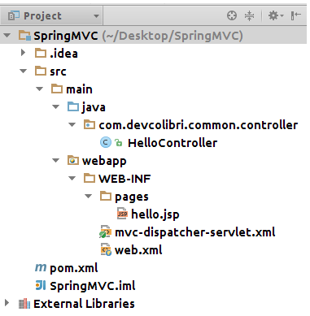

### spring

1) [Что такое Spring? Какие основные задачи выполняет этот фреймворк?](#что-такое-spring-какие-основные-задачи-выполняет-этот-фреймворк)
2) [Что такое IoC и DI? В чем отличие этих терминов?](#что-такое-ioc-и-di-в-чем-отличие-этих-терминов)
3) [Перечислите основные модули Spring фреймворка.](#перечислите-основные-модули-spring-фреймворка)
4) [Перечислите способы инъекций зависимостей.](#перечислите-способы-инъекций-зависимостей)
5) [Что такое ApplicationContext? Когда он создается?](#что-такое-applicationcontext-когда-он-создается)
6) [Расскажите, что такое Spring Bean? Опишите жизненный цикл Spring Bean?](#расскажите-что-такое-spring-bean-опишите-жизненный-цикл-spring-bean)
7) [Объясните для чего используются аннотации @Autowired @Qualifier. Когда какой нужно использовать?](#объясните-для-чего-используются-аннотации-autowired-qualifier-когда-какой-нужно-использовать)
8) [Что такое FactoryBeans?](#что-такое-factorybeans)
9) [Что такое Profiles? Когда их используют.](#что-такое-profiles-когда-их-используют)
10) [Расскажите про модуль Spring AOP.](#расскажите-про-модуль-spring-aop)
11) [Объясните шаблон проектирование Proxy? Где он используется в Spring.](#объясните-шаблон-проектирование-proxy-где-он-используется-в-spring)
12) [Объясните, как происходит интеграция с JDBC.](#объясните-как-происходит-интеграция-с-jdbc)
13) [Объясните, как происходит интеграция с Hibernate.](#объясните-как-происходит-интеграция-с-hibernate)
14) [Что такое Transaction Manager? Где он используется? Когда он нужен?](#что-такое-transaction-manager-где-он-используется-когда-он-нужен)
15) [Расскажите о модуле Spring MVC.](#расскажите-о-модуле-spring-mvc)
16) [Объясните верхнеуровневую архитектуру Spring MVC: Dispatcher, ViewResolver.](#объясните-верхнеуровневую-архитектуру-spring-mvc-dispatcher-viewresolver)
17) [Как конфигурировать Spring MVC?](#как-конфигурировать-spring-mvc)
18) [Что такое Spring scope? Какие типы Spring scope существуют?](#что-такое-spring-scope-какие-типы-spring-scope-существуют)
19) [Расскажите про аннотации @RequestMapping, @PathVariable, @RequestBody, @RequestParam, @ModelAttribute, @ResponseBody, @SessionAttribute, @CookieValue.](#расскажите-про-аннотации-requestmapping-pathvariable-requestbody-requestparam-modelattribute-responsebody-sessionattribute-cookievalue)
20) [Расскажите про модуль Spring Security?](#расскажите-про-модуль-spring-security)
21) [Как конфигурировать Spring Security?](#как-конфигурировать-spring-security)
22) [Что такое UserDetails?](#что-такое-userdetails)
23) [Расскажите верхнеуровневую архитектуру Spring Security.](#расскажите-верхнеуровневую-архитектуру-spring-security)
24) [Что такое FilterChainProxy?](#что-такое-filterchainproxy)
25) [Расскажите о схеме работы пользователь-роль.](#расскажите-о-схеме-работы-пользователь-роль)
26) [Расскажите о SpringContextHolder.](#расскажите-о-springcontextholder)
27) [Расскажите об аспектах многопоточного окружения в Spring.](#расскажите-об-аспектах-многопоточного-окружения-в-spring)
28) [Расскажите о тестирование Spring приложений?](#расскажите-о-тестировании-spring-приложений)
29) [Расскажите о тестирование Spring MVС приложений](#расскажите-о-тестировании-spring-приложений)
30) [Расскажите о мониторинге Spring приложений.](#тестирование-spring-mvc-приложения)
31) [Расскажите про REST модель.](#расскажите-про-rest-модель)
32) [Что такое коды состояния HTTP?](#что-такое-коды-состояния-http)


## Links:
- [https://habr.com/ru/post/470305/](https://habr.com/ru/post/470305/)
- [Этапы инициализации контекста Spring](https://habr.com/ru/post/222579/)
- [Spring под капотом](https://medium.com/@kirill.sereda/spring-%D0%BF%D0%BE%D0%B4-%D0%BA%D0%B0%D0%BF%D0%BE%D1%82%D0%BE%D0%BC-9d92f2bf1a04#:~:text=%D0%9E%D0%BD%20%D1%81%D0%BE%D0%B7%D0%B4%D0%B0%D0%B5%D1%82%D1%81%D1%8F%20%D1%87%D0%B5%D1%80%D0%B5%D0%B7%20BeanDefinitionRegistryPostProcessor%2C%20%D0%BA%D0%BE%D1%82%D0%BE%D1%80%D1%8B%D0%B9,%D1%87%D0%B5%D1%80%D0%B5%D0%B7%20%D0%B0%D0%BD%D0%BD%D0%BE%D1%82%D0%B0%D1%86%D0%B8%D0%B8)


## Что такое spring какие основные задачи выполняет этот фреймворк
По сути Spring Framework с открытым исходным кодом представляет собой просто контейнер внедрения зависимостей, с несколькими удобными слоями (например: доступ к базе данных, прокси, аспектно-ориентированное программирование, RPC, веб-инфраструктура MVC). Это все позволяет вам быстрее и удобнее создавать Java-приложения.

Он нужен, чтобы разработчикам было легче проектировать и создавать приложения. Spring не связан с конкретной парадигмой или моделью программирования, поэтому его могут использовать как каркас для разных видов приложений.

[к оглавлению](#spring)
## Что такое ioc и di в чем отличие этих терминов
```Inversion of control (IoC)``` - инверсия управления - принцип программирования, при котором управление выполнением программы передается фреймворку, а не программисту.
Происходит потеря контроля над выполнением кода: фреймворк управляет кодом программиста, а не программист управляет фреймворком. Когда мы говорим про IoC спринга, то подразумеваем ```Dependency Injection``` - внедрение зависимостей - это одна из реализаций инверсии управления IoC, посредством которой созданием объекта и компоновкой его зависимостей занимается другой объект (фреймворк)

плюсы DI:
- Уменьшенная связь между частями приложения
- Улучшенное тестирование
- Улучшенная архитектура приложения
- Уменьшает шаблонный код
- Стандартизирует разработку приложения

```IoC container``` - это объект, который занимается созданием других объектов и внедрением в них зависимостей(DI). Представлен в виде обычного ассоциативного массива Map. Ключом является String (какой-то id объекта), значением сам объект.


[к оглавлению](#spring)
## Перечислите основные модули spring фреймворка


- ```Inversion of Control-контейнер```. Служит для конфигурирования компонентов программных приложений и управления жизненным циклом Java-объектов.
- ```Модуль аспектно-ориентированного программирования```. Позволяет работать с функциональностью, которую нельзя реализовать возможностями классического объектно-ориентированного программирования на Джава без потерь.
- ```Модуль доступа к данным```. Позволяет работать с реляционными СУБД на платформе Java, используя при этом JDBC- и ORM-средства. Также обеспечивается решение задач, повторяющихся в большом количестве Java-based environments.
- ```Модуль управления транзакциями```. Служит для координации разных API управления транзакциями, предоставляет инструменты настраиваемого управления транзакциями для Java-объектов.
MVC. Каркас, который основан на сервлетах и HTTP и предоставляет много возможностей по расширению и настройкам (customization).
- ```Модуль удаленного доступа```. Не что иное, как конфигурируемая передача объектов Java через сеть в стиле RPC с поддержкой RMI, CORBA, HTTP-based-протоколов, в том числе web-сервисов (SOAP).
- ```Модуль аутентификации и авторизации```. Речь идет о конфигурируемом инструментарии процессов аутентификации и авторизации, причем обеспечивается поддержка многих популярных и ставших индустриальными стандартами протоколов, практик и инструментов, что происходит посредством дочернего проекта Spring Security.
- ```Модуль удаленного управления```. Конфигурируемое представление и управление объектами Java для локальной либо удаленной конфигурации посредством JMX.
- ```Модуль работы с сообщениями```. Конфигурируемая регистрация объектов-слушателей сообщений в целях прозрачной обработки сообщений из очереди сообщений посредством JMS. Также обеспечивается улучшенная отправка сообщений в соответствии со стандартом JMS API.
- ```Тестирование``` — каркас, который поддерживает классы для написания интеграционных и модульных тестов

[к оглавлению](#spring)
## Перечислите способы инъекций зависимостей

DI внедряет и определяет зависимости объекта через:
- параметры конструктора;
- параметры статического метода инициализации (фабричный метод);
- свойства объекта (set* methods).

Constructor Dependency Injection — это тип внедрения зависимостей, при котором зависимости компонента предоставляются ему в его конструкторе (или конструкторах).

```java
public class ConstructorInjection {
    
    private Dependency dependency;
    
    public ConstructorInjection(Dependency dependency) {
        this.dependency = dependency;
    }
}
```
Setter Dependency Injection — контейнер IoC внедряет зависимости компонента в компонент через методы установки в стиле JavaBean.

```java
public class SetterInjection {
    private Dependency dependency;
    
    public void setDependency(Dependency dependency) {
        this.dependency = dependency;
    }
}
```

Фабричный метод
```java
public class FabricInjection {
    private Dependency dependency;
    
    public static FabricInjection of(Dependency dependency) {
        this.dependency = dependency;
    }
}
```

[к оглавлению](#spring)
## Что такое applicationcontext когда он создается
В Spring Framework интерфейс org.springframework.factory.BeanFactory предоставляет фабрику для бинов, которая в то же время является IoC контейнером приложения. Управление бинами основано на конфигурации(java или xml).


Интерфейс org.springframework.context.ApplicationContext — это обертка над bean factory, предоставляющая некоторые дополнительные возможности, например AOP, транзакции, безопасность, i18n, и т.п.


Тот, кто контролирует все ваши классы и может управлять ими соответствующим образом (читай: создайте их с необходимыми зависимостями), называется ApplicationContext во вселенной Spring.

```java
import org.springframework.context.ApplicationContext;
import org.springframework.context.annotation.AnnotationConfigApplicationContext;
import javax.sql.DataSource;

public class MyApplication {

    public static void main(String[] args) {
        ApplicationContext ctx = new AnnotationConfigApplicationContext(someConfigClass); // (1)

        UserDao userDao = ctx.getBean(UserDao.class); // (2)
        User user1 = userDao.findById(1);
        User user2 = userDao.findById(2);

        DataSource dataSource = ctx.getBean(DataSource.class); // (3)
        // etc ...
    }
}
```

[к оглавлению](#spring)
## Расскажите что такое spring bean опишите жизненный цикл spring bean
Spring-бины − это классы, созданием экземпляров которых и установкой в них зависимостей управляет контейнер фреймворка Spring. Бины предназначены для реализации бизнес-логики приложения. Spring Bean представляет собой singleton, то есть в некотором блоке приложения существует только один экземпляр данного класса.


Полный жизненный цикл состоит из:
Представлен из BeanDefinition (это тоже соответствующие объекты, которые реализуют BeanDefinition) далее они попадают в IoC container, который сразу же направляет их в BeanFactoryPostProcessor, они нужны для того, чтобы подкрутить наши BeanDefinition, например, подкрутить наши app.properties. Далее должны отсортировать наши BeanDefinition таким образом, осуществлялась зависимость между ними, потому что один BeanDefinition нельзя проинициализировать до инициализации другого BeanDefinition, если у первого есть зависимость на второй. Далее по одному (forEach) начинается этап инициализации. Вызывается конструктор у соответствующего BeanDefinition, далее вызываются соответствующие сетеры и после сеттеров используется BPP - before(postProcessBeforeInitialization(Object bean, String beanName)) и в него уже попадает не BeanDefinition, а Bean и в нем уже будут заинжекшены соответствующие зависимости. Далее как прошли все postProcessBeforeInitialization, вызывается InittializationCallback(если мы используем, например @PostConstructor). Далее вызывается второй метод у BPP - after(postProcessAfterInitialization(Object bean, String beanName)) у тех же самых бинов с тем же самым id, но в нем уже bean может быть изменен на первой фазе bpp или callback-ов. На этой фазе часто используется прокси или подмена других бинов. И после всех фаз мы получаем готовые бины и если это синглтон то он остается в IoC Container, если другой Scope то мы сразу возвращаем тому кто попросил бин. Только для синголтонов мы можем, по завершению контекста, вызвать Destruction Callback -> @PreDestroy (close()).

Есть интерфейс метка Aware, не содержит функционала, но тот кто им помечается то сможет предоставить нам определенную информацию, а так же можем заинжектить, например, наш ApplicationContext туда куда мы его попросим.

BeanFactory - базовый интерфейс для всех ApplicationContext-ов


- Загрузка описаний бинов, создание графа зависимостей(между бинами)
- Создание и запуск BeanFactoryPostProcessors - в основном для внедрения данных из application.properties
- Создание бинов
- Spring внедряет значения и зависимости в свойства бина
- Если бин реализует метод setBeanName() из интерфейса NameBeanAware, то ID бина передается в метод
- Если бин реализует BeanFactoryAware, то Spring устанавливает ссылку на bean factory через setBeanFactory() из этого интерфейса.
- Если бин реализует интерфейс ApplicationContextAware, то Spring устанавливает ссылку на ApplicationContext через setApplicationContext().
- BeanPostProcessor это специальный интерфейс(о нем ниже), и Spring позволяет бинам имплементировать этот интерфейс. Реализуя метод postProcessBeforeInitialization(), можно изменить экземпляр бина перед его(бина) инициализацией(установка свойств и т.п.)
- Если определены методы обратного вызова, то Spring вызывает их. Например, это метод, аннотированный @PostConstruct или метод initMethod из аннотации @Bean.
- Теперь бин готов к использованию. Его можно получить с помощью метода ApplicationContext#getBean().
- После того как контекст будет закрыт(метод close() из ApplicationContext), бин уничтожается.
- Если в бине есть метод, аннотированный @PreDestroy, то перед уничтожением вызовется этот метод (для Singletone). Если бин имплементирует DisposibleBean, то Spring вызовет метод destroy(), чтобы очистить ресурсы или убить процессы в приложении. Если в аннотации @Bean определен метод destroyMethod, то вызовется и он.


[к оглавлению](#spring)
## Объясните для чего используются аннотации autowired qualifier когда какой нужно использовать
BeanPostProcessor(BPP) - интерфейс, который предназначен для обработки аннотаций. Имеет два метода before, after. BPP играют важную роль в жизненном цикле бинов, потому что они нужны для их инициализации. Before вызывает до инициализации callback-ов(@PostConstruct \ init-method), a After вызывается после инициализации callback-ов.

@Autowired инжектит другие зависимости без использования xml.

своя реализация:
```java
@Retention(RetentionPolicy.RUNTIME)
@Target(ElementType.FIELD)
public @interface InjectBean {
    
    
}

public class InjectBeanPostProcessor implements BeanPostProcessor, ApplicationContextAware {
    
    // ApplicationContextAware - используется, чтобы заинжектить ApplicationContext, чтобы достать из контейнера нужный бин
    
    private ApplicationContext applicationContext;
    
    @Override
    public Object postProcessBeforeInitialization(Object bean, String beanName) throws BeansException {
        Arrays.stream(bean.getClass().getDeclaredFields())
                .filter(field -> field.isAnnotationPresent(InjectBean.class))
                .forEach(field -> {
                    Object beanToInject = applicationContext.getBean(field.getType());
                    ReflectionUtils.makeAccessible(field);
                    ReflectionUtils.setField(field, bean, beanToInject);
                });
        
        return bean;
    }
    
    @Override
    public void setApplicationContext(ApplicationContext applicationContext) {
        this.applicationContext = applicationContext;
    }
    
}
```

[к оглавлению](#spring)
## Что такое factorybeans
FactoryBean — это generic интерфейс, которому можно делегировать процесс создания бинов типа . В те времена, когда конфигурация была исключительно в xml, разработчикам был необходим механизм с помощью которого они бы могли управлять процессом создания бинов. Именно для этого и был сделан этот интерфейс. Для того что бы лучше понять проблему, приведу пример xml конфигурации.

```xml
<?xml version="1.0" encoding="UTF-8"?>
<beans xmlns="http://www.springframework.org/schema/beans"
       xmlns:xsi="http://www.w3.org/2001/XMLSchema-instance"
       xmlns:context="http://www.springframework.org/schema/context"
       xsi:schemaLocation="http://www.springframework.org/schema/beans http://www.springframework.org/schema/beans/spring-beans.xsd http://www.springframework.org/schema/context http://www.springframework.org/schema/context/spring-context.xsd">

    <bean id="redColor" scope="prototype" class="java.awt.Color">
        <constructor-arg name="r" value="255" />
        <constructor-arg name="g" value="0" />
        <constructor-arg name="b" value="0" />
    </bean>
    
</beans>
```
На первый взгляд, тут все нормально и нет никаких проблем. А что делать если нужен другой цвет? Создать еще один бин? Не вопрос.

```xml
<?xml version="1.0" encoding="UTF-8"?>
<beans xmlns="http://www.springframework.org/schema/beans"
       xmlns:xsi="http://www.w3.org/2001/XMLSchema-instance"
       xmlns:context="http://www.springframework.org/schema/context"
       xsi:schemaLocation="http://www.springframework.org/schema/beans http://www.springframework.org/schema/beans/spring-beans.xsd http://www.springframework.org/schema/context http://www.springframework.org/schema/context/spring-context.xsd">

    <bean id="redColor" scope="prototype" class="java.awt.Color">
        <constructor-arg name="r" value="255" />
        <constructor-arg name="g" value="0" />
        <constructor-arg name="b" value="0" />
    </bean>

    <bean id="green" scope="prototype" class="java.awt.Color">
        <constructor-arg name="r" value="0" />
        <constructor-arg name="g" value="255" />
        <constructor-arg name="b" value="0" />
    </bean>
    
</beans>
```

А что делать если я хочу каждый раз случайный цвет? Вот тут то и приходит на помощь интерфейс FactoryBean.

Создадим фабрику которая будет отвечать за создание всех бинов типа — Color.

```java
import org.springframework.beans.factory.FactoryBean;
import org.springframework.stereotype.Component;

import java.awt.*;
import java.util.Random;

public class ColorFactory implements FactoryBean<Color> {
    @Override
    public Color getObject() throws Exception {
        Random random = new Random();
        Color color = new Color(random.nextInt(255), random.nextInt(255), random.nextInt(255));
        return color;
    }

    @Override 
    public Class<?> getObjectType() {
        return Color.class;
    }

    @Override
    public boolean isSingleton() {
        return false;
    }
}
```

Добавим ее в xml и удалим объявленные до этого бины типа — Color.

```xml
<?xml version="1.0" encoding="UTF-8"?>
<beans xmlns="http://www.springframework.org/schema/beans"
       xmlns:xsi="http://www.w3.org/2001/XMLSchema-instance"
       xmlns:context="http://www.springframework.org/schema/context"
       xsi:schemaLocation="http://www.springframework.org/schema/beans http://www.springframework.org/schema/beans/spring-beans.xsd http://www.springframework.org/schema/context http://www.springframework.org/schema/context/spring-context.xsd">
	
	<bean id="colorFactory" class="com.malahov.temp.ColorFactory"></bean>

</beans>
```

Теперь создание бина типа Color.class будет делегироваться ColorFactory, у которого при каждом создании нового бина будет вызываться метод getObject.

Для тех кто пользуется JavaConfig, этот интерфейс будет абсолютно бесполезен.

Созданием экземпляров бинов занимается BeanFactory при этом, если нужно, делегирует это кастомным FactoryBean. Экземпляры бинов создаются на основе ранее созданных BeanDefinition.


[к оглавлению](#spring)
## Что такое profiles когда их используют
Profile представляет из себя метку и на основании этой метки мы можем активировать или дезактивировать бины или целые конфигурации.

```java
@Bean
@Profile("prod|web") // ! | &
public UserRepo userRepo() {
            return new UserReport(); 
}
```
Если метки prod или web -> то будет создан бин UserRepo;
И так же @Profile можем добавлять к @Configuration, и класс-конфиг продгрузится при активной метке @Profile

Активация:
- .properties: 
```properties
    spring.profiles.active=prod
```
- через Context: 
```java
    var context = new AnnotationConfigApplicationContext();
    context.register(Config.class); // создать ридеры
    context.getEnvironment().setActiveProfiles("prod", "web");
    context.refresh(); // прогнать через жизненный цикл бинов
```

Профили Spring позволяют разделить части конфигурации вашего приложения и сделать их доступными только в определенных средах. Любой @Component или @Configuration можно пометить @Profile для ограничения при загрузке:

```java
@Configuration
@Profile("production")
public class ProductionConfiguration {

    // ...

}
```

В обычном способе Spring вы можете использовать свойство Spring.profiles.active Environment, чтобы указать, какие профили активны. Вы можете указать свойство любым из обычных способов, например, вы можете включить его в свой application.properties:
```properties
spring.profiles.active=dev,hsqldb
```
или указать в командной строке с помощью переключателя
```properties
--spring.profiles.active=dev,hsqldb
```


Допустим, нам нужно создавать определенный бин только для определенного профиля. Для этого можно аннотировать бин с помощью @Profile. Аннотация применима как к классу, так и к методу.

```java
@Profile("test")
@Component
public class ExampleTestBean {
}
```
Проверим, что бин действительно создается. Мы активировали профиль test, внедрили бин ExampleTestBean и проверили, что он не нулевой:
```java
@ActiveProfiles("test")
@RunWith(SpringRunner.class)
@SpringBootTest
public class ProfilesIntegrationTest {
    @Autowired
    Environment environment;
    @Autowired
    ExampleTestBean testBean;
    @Test
    public void testSpringProfiles() {
        for (final String profileName : environment.getActiveProfiles()) {
        System.out.println("Currently active profile - " + profileName);
    }
    Assert.assertEquals("test", environment.getActiveProfiles()[0]);
    assertNotNull(testBean);
    }
}
```

[к оглавлению](#spring)
## Расскажите про модуль spring aop
Модуль AOP в Spring обеспечивает нас такими сущностями, как “перехватчики” (interceptors) для перехвата приложения в определённые моменты. Например, когда выполняется определённый метод, мы можем добавить какую-то функциональность (к примеру, сделать запись в лог-файл приложения) как до, так и после выполнения метода.

Аспектно-ориентированное программирование (АОП) — это парадигма программирования являющейся дальнейшим развитием процедурного и объектно-ориентированного программирования (ООП). Идея АОП заключается в выделении так называемой сквозной функциональности. И так все по порядку, здесь я покажу как это сделать в Java — Spring @AspectJ annotation стиле (есть еще schema-based xml стиль, функциональность аналогичная).

Применяется для:
- логирование,
- обработка транзакций,
- обработка ошибок,
- авторизация и проверка прав,
- кэширование

Join point — следующее понятие АОП, это точки наблюдения, присоединения к коду, где планируется введение функциональности.


Pointcut — это срез, запрос точек присоединения, — это может быть одна и более точек. Правила запросов точек очень разнообразные, на рисунке выше, запрос по аннотации на методе и конкретный метод. Правила можно объединять по &&, ||,!


Advice — набор инструкций выполняемых на точках среза (Pointcut). Инструкции можно выполнять по событию разных типов:

- Before — перед вызовом метода
- After — после вызова метода
- After returning — после возврата значения из функции
- After throwing — в случае exception
- After finally — в случае выполнения блока finally
- Around — можно сделать пред., пост., обработку перед вызовом метода, а также вообще обойти вызов метода.

на один Pointcut можно «повесить» несколько Advice разного типа.


Aspect — модуль в котором собраны описания Pointcut и Advice.


example:
```java
@Service
public class MyService {

    public void method1(List<String> list) {
        list.add("method1");
        System.out.println("MyService method1 list.size=" + list.size());
    }

    @AspectAnnotation
    public void method2() {
        System.out.println("MyService method2");
    }

    public boolean check() {
        System.out.println("MyService check");
        return true;
    }
}

@Aspect
@Component
public class MyAspect {

    private Logger logger = LoggerFactory.getLogger(this.getClass());

    @Pointcut("execution(public * com.example.demoAspects.MyService.*(..))")
    public void callAtMyServicePublic() { }

    @Before("callAtMyServicePublic()")
    public void beforeCallAtMethod1(JoinPoint jp) {
        String args = Arrays.stream(jp.getArgs())
                .map(a -> a.toString())
                .collect(Collectors.joining(","));
        logger.info("before " + jp.toString() + ", args=[" + args + "]");
    }

    @After("callAtMyServicePublic()")
    public void afterCallAt(JoinPoint jp) {
        logger.info("after " + jp.toString());
    }
}
```

[https://habr.com/ru/post/428548/](https://habr.com/ru/post/428548/)


[к оглавлению](#spring)
## Объясните шаблон проектирование proxy где он используется в spring
Паттерн Proxy широко используется в AOP и remoting. Так же часто применятеся по подмене бинов на этапе BPP -> after method. 

Хороший пример использования Proxy — это org.springframework.aop.framework.ProxyFactoryBean.

Эта фабрика создаёт AOP-прокси на основе Spring-бина.

Паттерн Заместитель (Proxy) предоставляет объект-заместитель, который управляет доступом к другому объекту. То есть создается объект-суррогат, который может выступать в роли другого объекта и замещать его.

- при взаимодействии по сети, прокси имитирует поведение объекта для снижения накладных издержек при передачи данных через сеть;
- когда нужно управлять доступом к ресурсу, создание которого требует больших затрат. Реальный объект создается когда действительно нужен, а до этого все запросы к нему обрабатывает прокси-объект

В Java имеется два способа:
- встроенное API public class Proxy (dynamic proxy class -> a class that implements) класс должен имплементировать интерфейс
- библиотека CGLib proxy - ннаследование от классов

JDK dynamic proxy могут перекрывать только public методы. CGLib proxy – кроме public, также и protected методы и package-visible. Соответственно, если мы явно не указали для среза (pointcut) ограничение «только для public методов», то потенциально можем получить неожиданное поведение.

```java
public interface Batch {

 int totalStudents();
 void registerStudent(String name);
}

public class CourseBatch implements Batch{

    private List<String> listOfStudents;
    public CourseBatch(){
        listOfStudents = new ArrayList<>();
    }
    @Override
    public int totalStudents() {
        return listOfStudents.size() + 1;
    }

    @Override
    public void registerStudent(String name) {
        listOfStudents.add(name);
        System.out.println(" Student name : " + name);
    }
}

public class ProxyBatch implements Batch{

    private Batch batch;
    private static final int TOTAL_STUDENTS_ALLOWED_TO_BATCH = 10;

    public ProxyBatch(Batch batch) {
        this.batch = batch;
    }

    @Override
    public int totalStudents() {
        return batch.totalStudents();
    }

    @Override
    public void registerStudent(String name) {
        if(TOTAL_STUDENTS_ALLOWED_TO_BATCH >= this.totalStudents()){
            batch.registerStudent(name);
        }else{
            System.out.println("Course batch size is : " + TOTAL_STUDENTS_ALLOWED_TO_BATCH);
            System.out.println("Batch is full so further students are not allowed ");
        }
    }

}
```

[к оглавлению](#spring)
## Объясните как происходит интеграция с jdbc
Spring framework интегрирует шаблон DAO
- JDBC：org.springframework.jdbc.core.JdbcTemplate
- Hibernate3.0：org.springframework.orm.hibernate3.HibernateTemplate
- JPA：org.springframework.orm.jpa.JpaTemplate

Spring напрямую не работает с базой. Он использует JDBC библиотеки.

Spring оборачивает JDBC в свои классы, делая их удобными для работы. Здесь используется шаблон "Декоратор".

```maven
 <dependency>
            <groupId>org.springframework</groupId>
            <artifactId>spring-jdbc</artifactId>
            <version>5.3.23</version>
 </dependency>
 ```
```properties
jdbc.url=jdbc:postgresql://127.0.0.1:5432/test
jdbc.username=postgres
jdbc.password=password
jdbc.driver=org.postgresql.Driver
```
```java
import org.apache.commons.dbcp2.BasicDataSource;
import org.springframework.beans.factory.annotation.Value;
import org.springframework.context.annotation.Bean;
import org.springframework.context.annotation.Configuration;
import org.springframework.context.annotation.PropertySource;
import org.springframework.jdbc.core.JdbcTemplate;
import org.springframework.transaction.annotation.EnableTransactionManagement;
import javax.sql.DataSource;

@Configuration
@PropertySource("classpath:db.properties")
@EnableTransactionManagement
public class JdbcConfig {

    @Bean
    public DataSource ds(@Value("${jdbc.driver}") String driver,
                         @Value("${jdbc.url}") String url,
                         @Value("${jdbc.username}") String username,
                         @Value("${jdbc.password}") String password) {
        BasicDataSource ds = new BasicDataSource();
        ds.setDriverClassName(driver);
        ds.setUrl(url);
        ds.setUsername(username);
        ds.setPassword(password);
        return ds;
    }

    @Bean
    public JdbcTemplate jdbc(DataSource ds) {
        return new JdbcTemplate(ds);
    }

}
```

Spring Data JDBC стремится быть проще, и поэтому отсутствует ленивая загрузка. Помимо этого, отсутствует кеширование, отслеживание "грязных" объектов (dirty tracking) и сессии (session). Если в Spring Data JDBC вы загружаете объект, то он загружается полностью (включая связи) и сохраняется тогда, когда вы сохраняете его в репозиторий.

[к оглавлению](#spring)
## Объясните как происходит интеграция с hibernate
Общие шаги выглядят следующим образом.

- Добавить зависимости для hibernate-entitymanager, hibernate-core и spring-orm.
- Создать классы модели и передать реализации DAO операции над базой данных. Важно, что DAO классы используют SessionFactory, который внедряется в конфигурации бинов Spring.
- Настроить конфигурационный файл Spring (смотрите в офф. документации или из примера на этом сайте).
- Дополнительно появляется возможность использовать аннотацию @Transactional и перестать беспокоиться об управлении транзакцией Hibernate.


```maven
        <dependency>
            <groupId>org.hibernate</groupId>
            <artifactId>hibernate-core</artifactId>
            <version>5.6.11.Final</version>
        </dependency>

        <dependency>
            <groupId>org.springframework</groupId>
            <artifactId>spring-orm</artifactId>
            <version>5.3.23</version>
        </dependency>
```
```java
import org.apache.commons.dbcp2.BasicDataSource;
import org.hibernate.SessionFactory;
import org.springframework.beans.factory.annotation.Value;
import org.springframework.context.annotation.Bean;
import org.springframework.context.annotation.Configuration;
import org.springframework.context.annotation.PropertySource;
import org.springframework.orm.hibernate5.HibernateTransactionManager;
import org.springframework.orm.hibernate5.LocalSessionFactoryBean;
import org.springframework.transaction.PlatformTransactionManager;
import org.springframework.transaction.annotation.EnableTransactionManagement;

import javax.sql.DataSource;
import java.util.Properties;

@Configuration
@PropertySource("classpath:db.properties")
@EnableTransactionManagement
public class HbmConfig {

    @Bean
    public LocalSessionFactoryBean sessionFactory(DataSource ds) {
        LocalSessionFactoryBean sessionFactory = new LocalSessionFactoryBean();
        sessionFactory.setDataSource(ds);
        sessionFactory.setPackagesToScan("ru.job4j.accident.model");
        Properties cfg = new Properties();
        sessionFactory.setHibernateProperties(cfg);
        return sessionFactory;
    }

    @Bean
    public PlatformTransactionManager htx(SessionFactory sf) {
        HibernateTransactionManager tx = new HibernateTransactionManager();
        tx.setSessionFactory(sf);
        return tx;
    }
}
```

```java
import lombok.AllArgsConstructor;
import lombok.Data;
import lombok.EqualsAndHashCode;
import lombok.NoArgsConstructor;
import javax.persistence.*;

@Data
@AllArgsConstructor
@NoArgsConstructor
@EqualsAndHashCode(onlyExplicitlyIncluded = true)
@Entity
@Table(name = "accident")
public class Accident {
    @EqualsAndHashCode.Include
    @Id
    @GeneratedValue(strategy = GenerationType.IDENTITY)
    private int id;
    private String name;
    private String text;
    private String address;
}
```
В Spring не нужна реализация кода для получения объектов Session, запуска и фиксации транзакций и обработки исключений Hibernate. Вместо этого используем экземпляр HibernateTemplate.

Spring Framework предоставляет различные подходы для интеграции с Hibernate. Тем не менее, мы наиболее часто будем использовать подход, использующий HibernateTemplate. Есть две основные причины:

- Класс скрывает детали управления сессиями и транзакциями.
- Предоставляет подход основанный на шаблонах

HibernateTemplate класс скрывает трудности управления сессиями и транзакциями при использовании Hibernate для доступа к данным. Нужно только инициализировать HibernateTemplate путем передачи экземпляра SessionFactory. Spring Framework берет на себя беспокойство за детали связанные с сессиями и транзакциями. Это помогает устранить инфраструктурный код, который может вносить суматоху при увеличении сложности.
HibernateTemplate, так же как и JdbcTemplate, предоставляет шаблонный подход для доступа к данным. Когда вы используете HibernateTemplate, вы будете работать с callbacks. Обратные вызовы — это единственный механизм в шаблонном подходе, который уведомляет шаблон запускать нужную задачу. Преимущество наличия обратного вызова в том, что там только одна точка входа в слой доступа к данным. И эта точка входа определяется шаблоном, в этом случае HibernateTemplate.

В комментариях дополнили, что использование HibernateTemplate не явлется рекомендуемым. Вместо использования HibernateTemplate из пакета org.springframework.orm рекомендуется использовать декларативный подход (@Transactional). Таким образом фреймворк сам позаботится об операциях open, commit, close, flush.


[к оглавлению](#spring)
## Что такое transaction manager где он используется когда он нужен
jdbc transaction:
```java
import java.sql.Connection;

Connection connection = dataSource.getConnection(); // (1)

try (connection) {
    connection.setAutoCommit(false); // (2)
    // выполнить несколько SQL-запросов...
    connection.commit(); // (3)

} catch (SQLException e) {
    connection.rollback(); // (4)
}
```
В Spring есть @Transactional & TransactionTemplate - обы открывают и закрывают транзакции
```java
@Transactional(
  propagation=TransactionDefinition.NESTED,
  isolation=TransactionDefinition.ISOLATION_READ_UNCOMMITTED
)
```

```java
@Service
public class UserService {

    @Autowired
    private TransactionTemplate template;

    public Long registerUser(User user) {
        Long id = template.execute(status ->  {
            // выполнить некоторый SQL, который, например,
            // вставляет пользователя в базу данных 
            // и возвращает автогенерированный идентификатор
          return id;
        });
    }
}
```

[к оглавлению](#spring)
## Расскажите о модуле spring mvc
Spring MVC реализует шаблон проектирования MVC. То есть удобным образом связывает данные и вид.
Шаблон MVC позволяет отдельно разрабатывать логику или изменять пользовательский интерфейс.


Все запросы принимает DispatcherServlet. DispatcherServlet загружается с помощью сервера контейнера (Tomcat, Jetty)

Сервер-контейнер поставляется совместно с библиотеками Spring, что позволяет сразу запустить приложение без дополнительных настроек сервера.

DispatcherServlet поднимает контекст зависимостей Spring. По сути DispatcherServlet является входной точкой всего приложения.

HandlerMapping служит для связи конкретного запроса и контроллера. Все запросы первоначально обрабатываться в DispatcherSerlvet и перераспределяются через HandlerMapping конкретному контроллеру.

ViewResolver - это объект, который содержит имя шаблона. Шаблон используется генератором HTML (JSP, Thymeleaf). Генератор заполняет шаблон на основании модели и возвращает в ViewResolver HTML.

В качестве формата данных может выступать JSON, XML, Byte, HTML.

Spring MVC построен вокруг центрального сервлета, который распределяет запросы по контроллерам, а также предоставляет другие широкие возможности при разработке веб приложений. На самом деле DispatcherServlet — полностью интегрированный сервлет в Spring IoC контейнер и таким образом получает доступ ко всем возможностям Spring.

DispatcherServlet — это обычный сервлет (наследуется от базового класса HttpServlet), и его также необходимо описывать в web.xml вашего веб приложения. Вам необходимо указать мэппинг запросов, которые будут обрабатываться в DispatcherServlet, путем указания URL в web.xml. Ниже показана стандартная конфигурация Java EE необходимая для настройки DispatcherServlet:
```xml

<web-app>
    <servlet>
        <servlet-name>example</servlet-name>
        <servlet-class>org.springframework.web.servlet.DispatcherServlet</servlet-class>
        <load-on-startup>1</load-on-startup>
    </servlet>
 
    <servlet-mapping>
        <servlet-name>example</servlet-name>
        <url-pattern>/example/*</url-pattern>
    </servlet-mapping>
 
</web-app>
```


- Вначале DispatcherServlet (диспетчер сервлетов) получает запрос, далее он смотрит свои настройки, чтобы понять какой контроллер использовать (на рисунке Handler Mapping).
- После получения имени контроллера запрос передается в него (на рисунке Controller). В контроллере происходит обработка запроса и обратно посылается ModelAndView (модель — сами данные; view (представление) — как эти данные отображать).
- DispatcherServlet на основании полученного ModelAndView ищет какое представление ему использовать (View Resolver) и получает в ответе имя представления View
- В представление передаются данные (model) и обратно, если необходимо, посылается ответ от представления.

[к оглавлению](#spring)
## Объясните верхнеуровневую архитектуру spring mvc dispatcher viewresolver
Диспетчер сервлетов DisptacherServlet Spring’а с помощью ViewResolver определяет какое представление необходимо использовать на основании полученного имени
ViewResolver — интерфейс, реализуемый объектами, которые способны находить представления View по имени View Name.

[к оглавлению](#spring)
## Как конфигурировать spring mvc

```pom
<properties>
    <spring.version>3.2.9.RELEASE</spring.version>
</properties>

<dependencies>

    <dependency>
        <groupId>org.springframework</groupId>
        <artifactId>spring-core</artifactId>
        <version>${spring.version}</version>
    </dependency>

    <dependency>
        <groupId>org.springframework</groupId>
        <artifactId>spring-web</artifactId>
        <version>${spring.version}</version>
    </dependency>

    <dependency>
        <groupId>org.springframework</groupId>
        <artifactId>spring-webmvc</artifactId>
        <version>${spring.version}</version>
    </dependency>

</dependencies>
```
```jsp
<html>
<body>
	<h1>Message : ${message}</h1>	
</body>
</html>
```

```java
import org.springframework.stereotype.Controller;
import org.springframework.ui.ModelMap;
import org.springframework.web.bind.annotation.RequestMapping;
import org.springframework.web.bind.annotation.RequestMethod;

@Controller
@RequestMapping("/welcome")
public class HelloController {

	@RequestMapping(method = RequestMethod.GET)
	public String printWelcome(ModelMap model) {

		model.addAttribute("message", "Spring 3 MVC - Hello World");
		return "hello";

	}
	
}

```
Содержимое файла mvc-dispatcher-servlet.xml:
```xml
<beans xmlns="http://www.springframework.org/schema/beans"
	xmlns:context="http://www.springframework.org/schema/context"
	xmlns:xsi="http://www.w3.org/2001/XMLSchema-instance"
	xsi:schemaLocation="
        http://www.springframework.org/schema/beans     
        http://www.springframework.org/schema/beans/spring-beans-3.0.xsd
        http://www.springframework.org/schema/context 
        http://www.springframework.org/schema/context/spring-context-3.0.xsd">

	<context:component-scan base-package="com.devcolibri.common.controller" />

	<bean
		class="org.springframework.web.servlet.view.InternalResourceViewResolver">
		<property name="prefix">
			<value>/WEB-INF/pages/</value>
		</property>
		<property name="suffix">
			<value>.jsp</value>
		</property>
	</bean>

</beans>
```
НО можно так же использовать JavaConfig

 

```java
import org.springframework.context.annotation.Bean;
import org.springframework.context.annotation.ComponentScan;
import org.springframework.context.annotation.Configuration;
import org.springframework.web.servlet.config.annotation.EnableWebMvc;
import org.springframework.web.servlet.config.annotation.ResourceHandlerRegistry;
import org.springframework.web.servlet.config.annotation.WebMvcConfigurerAdapter;
import org.springframework.web.servlet.view.InternalResourceViewResolver;
import org.springframework.web.servlet.view.JstlView;

@Configuration
@EnableWebMvc
@ComponentScan("com.devcolibri.common")
public class WebConfig extends WebMvcConfigurerAdapter {

    @Override
    public void addResourceHandlers(ResourceHandlerRegistry registry) {
        registry.addResourceHandler("/WEB-INF/pages/**").addResourceLocations("/pages/");
    }

    @Bean
    public InternalResourceViewResolver setupViewResolver() {
        InternalResourceViewResolver resolver = new InternalResourceViewResolver();
        resolver.setPrefix("/WEB-INF/pages/");
        resolver.setSuffix(".jsp");
        resolver.setViewClass(JstlView.class);

        return resolver;
    }

}
```

Аннотации:

- @Configuration — собственно эта аннотация и говорит о том, что данный класс является Java Configuration;
- @EnableWebMvc — эта аннотация разрешает нашему проекту использовать MVC;
- @ComponentScan(«com.devcolibri.common») — аналогично тому component-scan который был в mvc-dispatcher-servlet.xml, говорит, где искать компоненты проекта.
- Bean — указывает на то что это инициализация бина, и он будет создан с помощью DI.

  Теперь нужно зарегистрировать конфигурацию в Spring Context это нам позволит сделать наш класс AppInit:

```java
package com.devcolibri.common.config;

import org.springframework.web.servlet.support.AbstractAnnotationConfigDispatcherServletInitializer;

public class AppInit extends AbstractAnnotationConfigDispatcherServletInitializer {
    // Этот метод должен содержать конфигурации которые инициализируют Beans
    // для инициализации бинов у нас использовалась аннотация @Bean
    @Override
    protected Class<?>[] getRootConfigClasses() {
        return new Class<?>[]{
                WebConfig.class
        };
    }

    // Тут добавляем конфигурацию, в которой инициализируем ViewResolver
    @Override
    protected Class<?>[] getServletConfigClasses() {

        return new Class<?>[]{
                WebConfig.class
        };
    }

    @Override
    protected String[] getServletMappings() {
        return new String[]{"/"};
    }

}
```

Добавим необходимые зависимости и плагины

В pom.xml нужно добавить еще две зависимости:
```pom
<dependency>
    <groupId>javax.servlet</groupId>
    <artifactId>javax.servlet-api</artifactId>
    <version>3.0.1</version>
</dependency>

<dependency>
    <groupId>jstl</groupId>
    <artifactId>jstl</artifactId>
    <version>1.2</version>
</dependency>
```


А теперь нужно добавить maven-war-plugin с помощтю которого мы сможем отключить необходимость web.xml файла.

```pom
<plugin>
    <groupId>org.apache.maven.plugins</groupId>
    <artifactId>maven-war-plugin</artifactId>
    <configuration>
        <failOnMissingWebXml>false</failOnMissingWebXml>
    </configuration>
</plugin>
```

[к оглавлению](#spring)
## Что такое spring scope какие типы spring scope существуют


[к оглавлению](#spring)
## Расскажите про аннотации requestmapping pathvariable requestbody requestparam modelattribute responsebody sessionattribute cookievalue
@requestmapping:
```java
@RequestMapping(value = "/ex/foos", method = RequestMethod.GET)
@ResponseBody
public String getFoosBySimplePath() {
    return "Get some Foos";
}
```
@PathVariable:
```java
@GetMapping("/api/employees/{id}")
@ResponseBody
public String getEmployeesById(@PathVariable String id) {
    return "ID: " + id;
}
```

@RequestBody:
```java
@PostMapping("/request")
public ResponseEntity postController(
  @RequestBody LoginForm loginForm) {
 
    exampleService.fakeAuthenticate(loginForm);
    return ResponseEntity.ok(HttpStatus.OK);
}
```

@RequestParam:
```java
@GetMapping("/api/foos")
@ResponseBody
public String getFoos(@RequestParam String id) {
    return "ID: " + id;
}
```

@ModelAttribute:
```java
@ModelAttribute
public void addAttributes(Model model) {
    model.addAttribute("msg", "Welcome to the Netherlands!");
}
```

@ResponseBody:
```java
@PostMapping(value = "/content", produces = MediaType.APPLICATION_JSON_VALUE)
@ResponseBody
public ResponseTransfer postResponseJsonContent(
  @RequestBody LoginForm loginForm) {
    return new ResponseTransfer("JSON Content!");
}
```

@SessionAttribute:
```java
import org.springframework.stereotype.Controller;
import org.springframework.ui.Model;
import org.springframework.util.Assert;
import org.springframework.web.bind.annotation.RequestMapping;
import org.springframework.web.bind.annotation.RequestMethod;
import org.springframework.web.bind.annotation.SessionAttributes;
import org.springframework.web.bind.support.SessionStatus;

@Controller
@RequestMapping(value = "/booking")
@SessionAttributes(types = TicketForm.class)
public class BookTicketController {

    @RequestMapping(method = RequestMethod.GET)
    public String start(Model model) {
        // после выхода из start() форма будет скопирована в http session атрибуты благодаря @SessionAttributes(types = TicketForm.class)
        model.addAttribute(new TicketForm()); 
        return "booking/booking";
    }

    @RequestMapping(value = "/movie", method = RequestMethod.POST)
    public String selectMovie(TicketForm ticketForm) {

        Assert.notNull(ticketForm);
        Assert.notNull(ticketForm.getMovieId());

        return "booking/customer";
    }

    @RequestMapping(value = "/customer", method = RequestMethod.POST)
    public String enterCustomerData(TicketForm ticketForm) {

        Assert.notNull(ticketForm);
        // movieId не передавался с customer.jsp, но он был сохранен в сессии во время selectMovie()
        Assert.notNull(ticketForm.getMovieId());
        Assert.notNull(ticketForm.getLastName());

        return "booking/payment";
    }

    @RequestMapping(value = "/payment", method = RequestMethod.POST)
    public String enterPaymentDetails(TicketForm ticketForm) {

        // movieId не передавался с customer.jsp, но он был сохранен в сессии во время selectMovie()
        Assert.notNull(ticketForm.getMovieId());
        // lastName не передавался с payment.jsp, но он был сохранен в сессии во время enterCustomerData()
        Assert.notNull(ticketForm.getLastName());
        Assert.notNull(ticketForm.getCreditCardNumber());

        return "redirect:/booking/confirmation";
    }

    @RequestMapping(value = "/confirmation", method = RequestMethod.GET)
    public String confirmation(SessionStatus status) {
        status.setComplete(); // очищаем Spring Session в целях безопасности личных данных
        return "booking/confirmation";
    }

}
```
Среди прочих данных, в методе контроллера может потребоваться значение какого-нибудь Cookie, относящегося к текущей сессии клиента. Для того, чтобы получить нужное значение, достаточно поставить аннотацию @CookieValue перед параметром - и он будет автоматически преобразован к указанному типу данных

@CookieValue:
```java
@RequestMapping(value = "/page", method = RequestMethod.POST)
@ResponseBody
public String savePage(@CookieValue("JSESSIONID") String cookie) {
  //---
}
```

[к оглавлению](#spring)
## Расскажите про модуль spring security
Spring Security это фреймворк, предоставляющий механизмы построения систем аутентификации и авторизации, а также другие возможности обеспечения безопасности.

Authentication - это процесс проверки того, кем является пользователь

Authorization - это процесс проверки того, к чему у него есть доступ


[к оглавлению](#spring)
## Как конфигурировать spring security

```pom
<dependency>
	<groupId>org.springframework.boot</groupId>
	<artifactId>spring-boot-starter-security</artifactId>
</dependency>
```

Чтобы подключить Spring Security к проекту нужно создать конфигурационный класс наследующий стардантную имплементацию WebSecurityConfigurer - WebSecurityConfigurerAdapter


Регистрация пользователей

.antMatchers("/user/signUp/**").permitAll()
.anyRequest()
.authenticated()

Аутентификация пользователей

.formLogin()
.loginPage("/auth/login").permitAll()
.defaultSuccessUrl("/")

Выход пользователей из системы

.logout()
.logoutRequestMatcher(new AntPathRequestMatcher("/auth/logout", "POST")) 

[к оглавлению](#spring)
## Что такое userdetails
UserDetails предоставляет необходимую информацию для построения объекта Authentication из DAO объектов приложения или других источника данных системы безопасности. UserDetailsService , чтобы создать UserDetails , когда передано имя пользователя в виде String (или идентификатор сертификата или что-то подобное).

[к оглавлению](#spring)
## Расскажите верхнеуровневую архитектуру spring security
Работа Spring Security в веб приложении начинается с servlet фильтра.

спустимся по огромному стеку вызовов (new Exception().getStackTrace().length == 91) и найдем первое упоминание спринга

Посмотрим что лежит в переменной filterChain

Здесь интересен фильтр springSecurityFilterChain именно он делает всю работу SS в веб части.


[к оглавлению](#spring)
## Что такое filterchainproxy
springSecurityFilterChain именно он делает всю работу SS в веб части. Сам DelegatingFilterProxyRegistrationBean не очень интересен, посмотрим кому он делегирует свою работу. Свою работу он делегирует классу FilterChainProxy. Внутри него происходит несколько интересных вещей.

Он подключает необходимые фильтры, которые указываем при переопределении метода configure

[к оглавлению](#spring)
## Расскажите о схеме работы пользователь роль

[к оглавлению](#spring)
## Расскажите о springcontextholder
SecurityContextHolder, в нем содержится информация о текущем контексте безопасности приложения, который включает в себя подробную информацию о пользователе(Principal) работающем в настоящее время с приложением. По умолчанию SecurityContextHolder используетThreadLocal для хранения такой информации, что означает, что контекст безопасности всегда доступен для методов исполняющихся в том же самом потоке. Для того что бы изменить стратегию хранения этой информации можно воспользоваться статическим методом класса SecurityContextHolder.setStrategyName(String strategy).

[https://coderlessons.com/articles/java/chto-takoe-securitycontext-i-securitycontextholder-v-spring-security](https://coderlessons.com/articles/java/chto-takoe-securitycontext-i-securitycontextholder-v-spring-security)

[к оглавлению](#spring)
## Расскажите об аспектах многопоточного окружения в spring

[к оглавлению](#spring)
## Расскажите о тестировании spring приложений
https://habr.com/ru/post/561520/

[к оглавлению](#spring)
## Тестирование spring mvc приложения
https://habr.com/ru/post/561520/

[к оглавлению](#spring)
## Расскажите о мониторинге spring приложений

[к оглавлению](#spring)
## Расскажите про rest модель
REST API — это прикладной программный интерфейс (API), который использует HTTP-запросы для получения, извлечения, размещения и удаления данных. Аббревиатура REST в контексте API расшифровывается как «передача состояния представления» (Representational State Transfer).

RestFull API архитектура - это архитектура клиент-серверного приложения базирующаяся на 6 принципах.

1. Универсальный интерфейс взаимодействия. (Uniform Interface)
2. Запросы без состояния. (Stateless)
3. Поддержка кеширования. (Cacheable)
4. Клиент-серверная ориентация.
5. Поддержка слоев (Layered System)
6. Возможность выполнять код на стороне клиента (Code on Demand)

[Restful](https://boodet.online/blog/rest-api-chto-eto-prostymi-slovami-principy-standarty-opisanie)

[к оглавлению](#spring)
## Что такое коды состояния http
Каждый HTTP запрос возвращает ответ с HTTP Status. Этот ответ сообщает клиенту. что произошло с сервером.

Их можно разделить на 5 групп:

- 1XX - информационные. например. 101 - переключение протокола с http на https
- 2XX - запрос выполнен на сервере успешно.
- 3XX - запрос был перенаправлен на другой URI.
- 4XX - ошибки, связанные с клиентом. Например, 403 - у клиента нет доступа к серверу.
- 5XX - ошибки, связанные с сервером. 500 - сервер упал.


methods: 
1. GET - используется для получение данных. Не должен изменять данные на сервере.
2. HEAD - аналогично GET. но не содержит тела ответа.
3. POST - используется для изменения данных на сервера.
4. PUT - аналог POST.
5. DELETE - удаляет данные с сервера. Не содержит тела ответа.
6. CONNECT - проверяет соединение с сервером.
7. OPTIONS - используется для получения информации о сервере.
8. TRACE - используется для тестирования соединения с дополнительной информацией.


```идемпотентность``` Идемпотентным называют такой метод API, повторный вызов которого не меняет состояние.
HTTP методы GET, PUT, DELETE формально считаются идемпотентными, тогда как POST и PATCH нет.Это не означает, что вы не можете сделать GET неидемпотентным, а POST идемпотентным

Для решения можно посылать специальный ключ со стороны клиента к серверу (Приложение стало генерировать ключ идемпотентности как UUID v4 и слать его на сервер. При повторных попытках создания заказ приложение шлет тот же ключ идемпотентности. На сервере ключ идемпотентности инсертится в базу в поле, на котором есть ограничение базы данных по уникальности. Если это ограничение не дало сделать инсерт, то код обнаруживал это и отдавал ошибку 409. По совету Феди этот момент был переделан в сторону упрощения приложения: отдавать стали не 409, а 200, будто бы заказ успешно создан, тогда на клиентах не надо учиться обрабатывать код 409.)

Так же решением будет хранить на стороне сервера версионность запроса.
[к оглавлению](#spring)


# Spring Boot
Суть Spring Boot в автоконфигурации и динамического подключения модулей на основании условий с помощью аннотации  @Conditional.

```java
@Conditional(JpaConditional.class)
@Configuration
public class JpaConfig {
    
    @PostConstruct
    void init() {
        Sytem.out.println("Jpa configuration is enabled");
    }
    
}

class JpaConditional implements Condition {
    
    @Override 
    public boolean mathces(ConditionContext context, AnnotatedTypeMetadata metadata){
        // Загружаем PostgreSql driver in memory, если класс подгружен в зависимостях (PostgreSQL), то и JpaConfig загрузится
        try {
            context.getClassLoader().loadClass("org.postgresql.Driver");
            return true;
        } catch (ClassNotFoundException e){
            return false;
        }
    }
}
```
#Для создания своего spring boot app (gradle):
- plugin org.springfraemwork.boot version 2...
- plugin io.spring.dependency-management version 1.0.11. RELEASE 
- далее подключаем стартер: в блок dependencies -> spring-boot-starter

не указываем версии, они будут подтягиваться из двух плагинов 

```java
@SpringBootApplication // обычный Configuration (все сканируется в пакете, где лежит данный класс)
public class App {
    public static void main(String[] args) {
        SpringApplication.run(App.class, args); // this is Context
        /* var context = SpringApplication.run(App.class, args);
        System.out.println(context.getBeanDefinitionCount()); */
    }
}
```

@EnableAutoConfiguration (внутри @SpringBootApplication) - подтягивает все автонастройки при удовлетворяющий @Conditional

# Создание своего startera:
- Создаем пустой проект(стартер), подключаем spring-boot-starter
- Создаем в нем .properties -> starter-чтото:author:nikisha
- Создаем проперти конфиг (это не конфигурация)
```java
@ConfigurationProperties(prefix = "starter-чтото")
public class StrarteConfigProperties {
    private String author;
}
```
- Создаем класс с автоконфигурацией (Когда приложение будет загружено, то и загрузятся все конфиги (по условию))
```java
@Configuration
@EnableConfigurationProperties(StrarteConfigProperties.class)
public class StarterAutoConfiguration {
    @Bean
    public Logic logic(StrarteConfigProperties props) {
        return new Logic(props);
    }
}
```
- Чтобы заработал стартер, создаем в данном проекте META-INF -> spring.factories (В нем указываем, какой файл конфига относится к нашему стартеру)
```properties
org.srpingframework.boot.autoconfigure.EnableAutoConfiguration=ru.example.com.config.StarterAutoConfiguration (полное имя До конфига)
```
- Создаем класс с бизнес-логикой
```java
public class Logic {

    private StrarteConfigProperties props;
    
    public Logic(StrarteConfigProperties props) {
        this.props = props;
    }
    
    public String getMessage() {
        return String.format("(c) %s %s", LocalDate.now(), props.getAuthor());
    }
}
```
- Далее mvn install (хранится в локальном репо m2)
- Далее создаем другой проект spring boot(web)
- Подключаем зависимость в maven нового проекта (Берем из первого проекта группу, артифакт и версию)
```maven
<dependency>
    <groupId></groupId>
    <artifactId></artifactId>
    <version></version>
</depedency>
```
- Все классы будут доступны


# Log in file :
```properties
    logging.file.name:file.txt
    logging.file.path:/
```
[к оглавлению](#spring)
