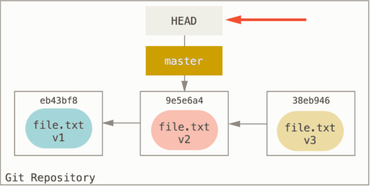
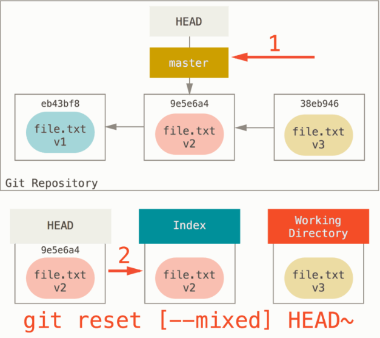
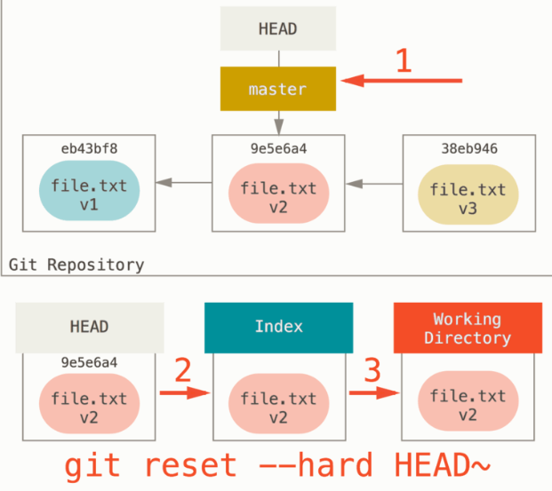
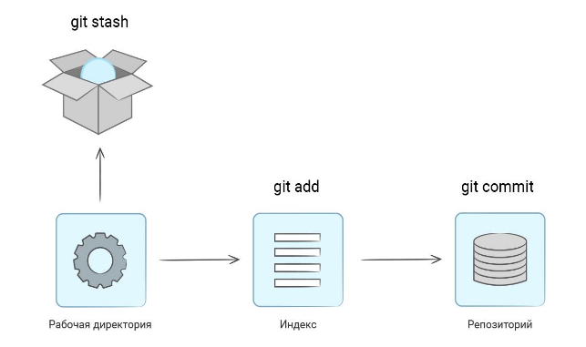

# Web

## Git
1) [Что такое индекс?](#что-такое-индекс)
2) [Как добавить изменения в индекс? (git add.)](#как-добавить-изменения-в-индекс-git-add)
3) [Как сделать фиксация изменений? (git commit -m "text")](#как-сделать-фиксация-изменений-git-commit-m-text)
4) [Как сделать синхронизация изменений с удаленным репозиторием? (git push origin master)](#как-сделать-синхронизация-изменений-с-удаленным-репозиторием-git-push-origin-master)
5) [Как синхронизироваться с удаленным репозиторием? (git pull origin master)](#как-синхронизироваться-с-удаленным-репозиторием-git-pull-origin-master)
6) [Как сделать ветку?](#как-сделать-ветку)
7) [Как переключиться между ветками?](#как-переключиться-между-ветками)
8) [Как отменить локальные изменения?](#как-отменить-локальные-изменения)
9) [Расскажи о команде git reset?](#расскажи-о-команде-git-reset)
10) [Расскажите о команде git stash](#расскажите-о-команде-git-stash)
11) [Расскажите о команде git cherry-pick](#расскажите-о-команде-git-cherry-pick)
12) [Расскажите, о команде git rerere. Расскажите, как разрешаются конфликты.](#расскажите-о-команде-git-rerere-расскажите-как-разрешаются-конфликты)

## Http protocol
1) [Расскажите, чем отличается UDP от TCP/IP.](#расскажите-чем-отличается-udp-от-tcp-ip)
2) [Расскажите о методах HTTP протокола. Подробно рассказать отличие в заголовке и теле запросов: GET, POST, PUT, DELETE.](#расскажите-о-методах-http-протокола-подробно-рассказать-отличие-в-заголовке-и-теле-запросов-get-post-put-delete)
3) [Расскажите о статусах HTTP протокола.](#расскажите-о-статусах-http-протокола)
4) [Расскажите о mime-type HTTP протокола.](#расскажите-о-mime-type-http-протокола)

## Web-container
1) [Что такое сервлет?](#что-такое-сервлет)
2) [Какова структура веб-проекта?](#какова-структура-веб-проекта)
3) [Что такое контейнер сервлетов?](#что-такое-контейнер-сервлетов)
4) [Каковы задачи, функциональность контейнера сервлетов?](#каковы-задачи-функциональность-контейнера-сервлетов)
5) [Что вы знаете о сервлет фильтрах?](#что-вы-знаете-о-сервлет-фильтрах)
6) [Зачем нужны слушатели в сервлетах?](#зачем-нужны-слушатели-в-сервлетах)
7) [Когда вы будете использовать фильтры, а когда слушатели?](#когда-вы-будете-использовать-фильтры-а-когда-слушатели)
8) [Как обработать исключения, выброшенные другим сервлетом в приложении?](#как-обработать-исключения-выброшенные-другим-сервлетом-в-приложении)
9) [Что такое дескриптор развертывания?](#что-такое-дескриптор-развертывания)
10) [Как реализовать запуск сервлета с запуском приложения?](#как-реализовать-запуск-сервлета-с-запуском-приложения)
11) [Что представляет собой объект ServletConfig?](#что-представляет-собой-объект-servletconfig)
12) [Что представляет собой объект ServletContext?](#что-представляет-собой-объект-servletcontext)
13) [В чем отличия ServletContext и ServletConfig?](#в-чем-отличия-servletcontext-и-servletconfig)
14) [Что такое Request Dispatcher?](#что-такое-request-dispatcher)

## Thymeleaf
1) [Расскажите о назначении Thymelaef?](#расскажите-о-назначении-thymelaef)
2) [Расскажите теги th text.](#расскажите-теги-th-text)
3) [Расскажите теги th if.](#расскажите-теги-th-if)
4) [Расскажите теги th href.](#расскажите-теги-th-href)
5) [Расскажите теги th each.](#расскажите-теги-th-each)
6) [Расскажите теги th object.](#расскажите-теги-th-object)
7) [Расскажите теги th action.](#расскажите-теги-th-action)

## Springboot
1) [Опишите из каких компонентов состоит Spring boot?](#опишите-из-каких-компонентов-состоит-spring-boot)
2) [Что такое контроллер и как он связан с DispatcherServlet.](#что-такое-контроллер-и-как-он-связан-с-dispatcherservlet)
3) [Что такое стереотипные аннотации? Какие они бывают?](#что-такое-стереотипные-аннотации-какие-они-бывают)
4) [Что такое DI? Как он реализован в Spring?](#что-такое-di-как-он-реализован-в-spring)
5) [Опишите аннотации @ModelAttribute, @PathVariable, @RequestParam](#опишите-аннотации-modelattribute-pathvariable-requestparam)
6) [Опишите аннотации @GetMapping, @PostMapping.](#опишите-аннотации-getmapping-postmapping)

## Многопоточность
1) [Объясните, где в веб приложении появляется многопоточность?](#объясните-где-в-веб-приложении-появляется-многопоточность)
2) [Как избежать проблем в многопоточности?](#как-избежать-проблем-в-многопоточности)
3) [Как можно создать блокировку (deadlock) в сервлете?](#как-можно-создать-блокировку-deadlock-в-сервлете)
4) [Как решать проблемы многопоточности на уровне базы данных?](#как-решать-проблемы-многопоточности-на-уровне-базы-данных)

## Architecture 
1) [Объясните слоеную архитектуру.](#объясните-слоеную-архитектуру)
2) [Объясните шаблон MVC на примере Servlet.](#объясните-шаблон-mvc-на-примере-servlet)
3) [Объясните шаблон MVC на примере Spring boot.](#объясните-шаблон-mvc-на-примере-spring-boot)

## Data base
1) [Зачем нужен пул соединений?](#зачем-нужен-пул-соединений)

## Security

1) [Что такое HttpSession?](#что-такое-httpsession)
2) [Что такое авторизация?](#что-такое-авторизация)
3) [Что такое аутентификация?](#что-такое-аутентификация)
4) [Что такое cookies?](#что-такое-cookies)


### Что такое индекс
```Индекс в Git``` «область подготовленных изменений» — это специальная промежуточная область, в которой хранятся изменения файлов на пути от рабочей директории до репозитория. При выполнении коммита в него попадают только те изменения, которые были добавлены в индекс. Понятие индекса в Git появилось неслучайно.

Самый быстрый способ увидеть что индексе, можно с помощью команды git status. Когда вы выполните команду git status, то увидите какие файлы попали в индекс, какие модифицированы но не в индексе, и какие в данный момент вообще неотслеживаемые git.

Индекс — это ваш следующий намеченный коммит. Мы также упоминали это понятие как «область подготовленных изменений» Git — то, что Git просматривает, когда вы выполняете git commit.

```gitexclude
# Добавляет абсолютно все изменения рабочей директории в индекс
git add .
# Добавляет частичные изменения файла в индекс
git add -p index.html
# Автоматически добавляет файлы в индекс и затем в коммит
git commit
```
[index](https://ru.hexlet.io/courses/intro_to_git/lessons/index/theory_unit#:~:text=%D0%98%D0%BD%D0%B4%D0%B5%D0%BA%D1%81%20%D0%B2%20Git%20%E2%80%94%20%D1%8D%D1%82%D0%BE%20%D1%81%D0%BF%D0%B5%D1%86%D0%B8%D0%B0%D0%BB%D1%8C%D0%BD%D0%B0%D1%8F,%D0%B8%D0%BD%D0%B4%D0%B5%D0%BA%D1%81%D0%B0%20%D0%B2%20Git%20%D0%BF%D0%BE%D1%8F%D0%B2%D0%B8%D0%BB%D0%BE%D1%81%D1%8C%20%D0%BD%D0%B5%D1%81%D0%BB%D1%83%D1%87%D0%B0%D0%B9%D0%BD%D0%BE.)

[к оглавлению](#web)
### Как добавить изменения в индекс git add
```gitexclude
git add .
```
[подробней](https://ru.stackoverflow.com/questions/431839/%D0%92-%D1%87%D0%B5%D0%BC-%D1%80%D0%B0%D0%B7%D0%BD%D0%B8%D1%86%D0%B0-%D0%BC%D0%B5%D0%B6%D0%B4%D1%83-git-add-add-a-add-u-%D0%B8-add)

[к оглавлению](#web)
### Как сделать фиксация изменений git commit m text
```gitexclude
git commit -m "text"
```
[doc](https://git-scm.com/book/ru/v2/%D0%9E%D1%81%D0%BD%D0%BE%D0%B2%D1%8B-Git-%D0%97%D0%B0%D0%BF%D0%B8%D1%81%D1%8C-%D0%B8%D0%B7%D0%BC%D0%B5%D0%BD%D0%B5%D0%BD%D0%B8%D0%B9-%D0%B2-%D1%80%D0%B5%D0%BF%D0%BE%D0%B7%D0%B8%D1%82%D0%BE%D1%80%D0%B8%D0%B9)

[к оглавлению](#web)
### Как сделать синхронизация изменений с удаленным репозиторием git push origin master
```gitexclude
git push origin master
```
[к оглавлению](#web)
### Как синхронизироваться с удаленным репозиторием git pull origin master
```gitexclude
git pull origin master
```
[к оглавлению](#web)
### Как сделать ветку
```Ветка``` - это альтернативная линия разработки.
```gitexclude
# Посмотреть все ветки
git branch
# Создание ветки
git branch my-branch
# Переключиться на ветку
git checkout my-branch
# Добавить изменения на удаленный репозиторий.
git push origin my-branch
# Изменить имя ветки
git branch -m old_name new_name
# Удаление ветки
git branch -D new_name
# Логгирование
git log --pretty=format:"%h -%d %s %cd" --graph
# Алиасы в git
git config --global alias.gg 'log --pretty=format:"%C(yellow)%h%Creset -%C(green)%d%Creset %s %C(bold blue)(%cn) %C(green)%cd%Creset" --graph --date=format:"%d.%m.%Y %H:%M"'
# Вызов алиаса 
git gg
```

[к оглавлению](#web)
### Как переключиться между ветками
```gitexclude
# Переключиться на ветку
git checkout my-branch
# Создать и переключиться
git checkout -b my-branch
```

[к оглавлению](#web)
### Как отменить локальные изменения
```gitexclude
# Откатывать изменения в отслеживаемом  файле (если изменения не добавлены в индекс)
 git checkout -- file.txt
# Если изменения добавили в индекс, то необходимо удалить из индекса и затем откатить изменения
 git reset --hard text.txt
 git checkout -- text.txt
# Если необходимо отменить изменения в одном файле, то следует выполнить команду
 git log --oneline
 git reset --hard a1e8fb5
# В итоге получится единый коммит — второй коммит заменит результаты первого
 git commit -m 'Initial commit'
 git add forgotten_file
# Изменения в файле и выполняем команду
 git commit --amend
 git push origin +master
# Коммит содержит объединенные изменения.
 
# Объединение нескольких коммитов.
git config core.editor notepad
явно указать путь к редактору: git config core.editor "'C:\Program Files\Notepad++\notepad++.exe' -multiInst -notabbar -nosession -noPlugin"
# Посмотреть два последних коммитами и заменить у второго на squash
git rebase -i HEAD~2
pick b7e4d2b 3. Объединение нескольких коммитов.[#33084]
squash 71663e7 3. Объединение нескольких коммитов.[#33084]
```

[doc](https://git-scm.com/book/ru/v2/%D0%9E%D1%81%D0%BD%D0%BE%D0%B2%D1%8B-Git-%D0%9E%D0%BF%D0%B5%D1%80%D0%B0%D1%86%D0%B8%D0%B8-%D0%BE%D1%82%D0%BC%D0%B5%D0%BD%D1%8B)

[к оглавлению](#web)
### Расскажи о команде git reset
Первое, что сделает reset — переместит то, на что указывает HEAD. Обратите внимание, изменяется не сам HEAD (что происходит при выполнении команды checkout); reset перемещает ветку, на которую указывает HEAD. Таким образом, если HEAD указывает на ветку master (то есть вы сейчас работаете с веткой master), выполнение команды git reset 9e5e6a4 сделает так, что master будет указывать на 9e5e6a4.



Теперь взгляните на диаграмму и постарайтесь разобраться, что случилось: фактически была отменена последняя команда git commit. Когда вы выполняете git commit, Git создает новый коммит и перемещает на него ветку, на которую указывает HEAD. Если вы выполняете reset на HEAD~ (родителя HEAD), то вы перемещаете ветку туда, где она была раньше, не изменяя при этом ни Индекс, ни Рабочий Каталог. Вы можете обновить Индекс и снова выполнить git commit, таким образом добиваясь того же, что делает команда git commit --amend

Следующим, что сделает reset, будет обновление Индекса содержимым того снимка, на который указывает HEAD.



Если вы указали опцию --mixed, выполнение reset остановится на этом шаге. Такое поведение также используется по умолчанию, поэтому если вы не указали совсем никаких опций (в нашем случае git reset HEAD~), выполнение команды также остановится на этом шаге.

Снова взгляните на диаграмму и постарайтесь разобраться, что произошло: отменен не только ваш последний commit, но также и добавление в индекс всех файлов. Вы откатились назад до момента выполнения команд git add и git commit.

```Третье```, что сделает reset — это приведение вашего Рабочего Каталога к тому же виду, что и Индекс. Если вы используете опцию --hard, то выполнение команды будет продолжено до этого шага.



Давайте разберемся, что сейчас случилось. Вы отменили ваш последний коммит, результаты выполнения команд git add и git commit, а также все изменения, которые вы сделали в рабочем каталоге.

Важно отметить, что только указание этого флага (--hard) делает команду reset опасной, это один из немногих случаев, когда Git действительно удаляет данные. Все остальные вызовы reset легко отменить, но при указании опции --hard команда принудительно перезаписывает файлы в Рабочем Каталоге. В данном конкретном случае, версия v3 нашего файла всё ещё остаётся в коммите внутри базы данных Git и мы можем вернуть её, просматривая наш reflog, но если вы не коммитили эту версию, Git перезапишет файл и её уже нельзя будет восстановить.

```Резюме```
Команда reset в заранее определённом порядке перезаписывает три дерева Git, останавливаясь тогда, когда вы ей скажете:

- Перемещает ветку, на которую указывает HEAD (останавливается на этом, если указана опция --soft)

- Делает Индекс таким же как и HEAD (останавливается на этом, если не указана опция --hard)

- Делает Рабочий Каталог таким же как и Индекс.
```gitexclude
# Откат на один коммит назад
git reset --hard @~
```
[doc](https://git-scm.com/book/ru/v2/%D0%98%D0%BD%D1%81%D1%82%D1%80%D1%83%D0%BC%D0%B5%D0%BD%D1%82%D1%8B-Git-%D0%A0%D0%B0%D1%81%D0%BA%D1%80%D1%8B%D1%82%D0%B8%D0%B5-%D1%82%D0%B0%D0%B9%D0%BD-reset)

[к оглавлению](#web)
### Расскажите о команде git stash
Команда git stash временно кэширует все изменения, внесенные вами в вашу рабочую копию, чтобы вы могли переключиться на что-то другое, а затем вернуться и восстановить их позже.

Команда git stash принимает ваши незакоммиченные изменения, как проиндексированные, так и нет, и сохраняет их для последующего использования.
После сохранения вы можете вносить любые изменения, создавать новые коммиты, переключать ветви и выполнять любые другие операции Git. Затем вы можете вернуться и активировать "тайник".

Stash остается локальным в вашем репозитории Git. Он не будет передан на сервер при выполнении push.

Два способа повторно загрузить(применить) сохранения изменения:
```gitexclude 
# Применит и удалит сохраненные изменения их сохраненного состояния.
git stash pop
# Применит одни и те же сохраненные изменения к нескольким ветвям (Достаем из стэш списка)
git stash apply
# Очищает stash
git stash drop
```

Представьте себе ситуацию. Вы работаете над какой-то важной задачей и исправили довольно много файлов. В этот момент появляется срочная задача — сделать какое-то изменение в исходном коде, не связанное с тем, над чем вы сейчас работаете. Ваши изменения еще не готовы, и они не должны попасть в репозиторий. Что делать?

В самом простом случае, если ваши изменения не пересекаются с изменениями по срочной задаче, вы можете внести исправления, добавить их в индекс, закоммитить и запушить. Но обычно это неудобно и не всегда возможно. А если изменения нужно делать в тех файлах, с которыми вы работаете прямо сейчас?

Подобная ситуация у опытных разработчиков встречается регулярно и, к счастью, она легко решается. В Git существует набор команд, позволяющий «прятать» изменения в рабочей директории и восстанавливать их при необходимости. Попробуем:

```gitexclude
touch FILE.md
git add FILE.md
git status

On branch main
Your branch is up to date with 'origin/main'.

Changes to be committed:
  (use "git restore --staged <file>..." to unstage)
    new file:   FILE.md

# Прячем файлы. После этой команды пропадут все измененные файлы
# независимо от того, добавлены они в индекс или нет
git stash

Saved working directory and index state WIP on main: e7bb5e5 update README.md

git status

On branch main
Your branch is up to date with 'origin/main'.

nothing to commit, working tree clean
```

git stash не удаляет файлы, они попадают в специальное место внутри директории .git «на сохранение». Эта команда не трогает новые файлы, так как они еще не являются частью репозитория.


После выполнения всех нужных изменений на чистой рабочей директории можно вернуть спрятанные изменения с помощью команды git stash pop:
```gitexclude
# Восстанавливаем
git stash pop

On branch main
Your branch is up to date with 'origin/main'.

Changes to be committed:
  (use "git restore --staged <file>..." to unstage)
    new file:   FILE.md

Dropped refs/stash@{0} (b896d4a0126ef4409ede63857e5d996953fe75c5)

# Проверяем
git status

On branch main
Your branch is up to date with 'origin/main'.

Changes to be committed:
  (use "git restore --staged <file>..." to unstage)
    new file:   FILE.md
```

```gitexclude
git stash

# изменяем файлы
git stash

# Вернутся последние изменения
git stash pop

# Вернутся предпоследние изменения
git stash pop
```

[к оглавлению](#web)
### Расскажите о команде git cherry pick
git cherry-pick - одна из полезных команд в Git, которая помогает копировать, вставлять фиксации из одной ветки в другую.
Обратите внимание, что cherry-pick скопирует коммиты, так что исходный коммит все еще будет присутствовать в исходной ветке.

Большинство разработчиков сочтут выбор вишни плохой практикой, которая может вызвать такие проблемы, как дублирование коммитов в нескольких ветках, нарушение истории git и другие. Но выбор вишни - один из самых мощных инструментов, и если вы понимаете, как он работает, и если использовать его с осторожностью, он может быть действительно полезным.

[к оглавлению](#web)
### Расскажите о команде git rerere расскажите как разрешаются конфликты
ReReRe - REuse REcorded REsolution «повторно использовать сохранённое решение» Как следует из названия, эта функциональность позволяет попросить Git запомнить то, как вы разрешили некоторую часть конфликта, так что в случае возникновения такого же конфликта, Git сможет его разрешить автоматически.
```gitexclude
# Включение RERERE
git config rerere.enabled true
```

[rerere](https://git-scm.com/book/ru/v2/%D0%98%D0%BD%D1%81%D1%82%D1%80%D1%83%D0%BC%D0%B5%D0%BD%D1%82%D1%8B-Git-Rerere)

[к оглавлению](#web)

### Расскажите чем отличается udp от tcp ip
Оба протокола находятся на транспортном уровне

```Протокол TCP``` (Transmission Control Protocol) – это сетевой протокол, который «заточен» под соединение. Иными словами, прежде, чем начать обмен данными, данному протоколу требуется установить соединение между двумя хостами. Данный протокол имеет высокую надежность, поскольку позволяет не терять данные при передаче, запрашивает подтверждения о получении от принимающей стороны и в случае необходимости отправляет данные повторно. При этом отправляемые пакеты данных сохраняют порядок отправки, то есть можно сказать, что передача данных упорядочена. Минусом данного протокола является относительно низкая скорость передачи данных, за счет того что выполнение надежной и упорядоченной передачи занимает больше времени, чем в альтернативном протоколе UDP.

```Протокол UDP``` (User Datagram Protocol), в свою очередь, более прост. Для передачи данных ему не обязательно устанавливать соединение между отправителем и получателем. Информация передается без предварительной проверки готовности принимающей стороны. Это делает протокол менее надежным – при передаче некоторые фрагменты данных могут теряться. Кроме того, упорядоченность данных не соблюдается – возможен непоследовательный прием данных получателем. Зато скорость передачи данных по данному транспортному протоколу будет более высокой.

Приведем несколько основных пунктов:

- Надежность: в этом случае предпочтительнее будет протокол TCP, за счет подтверждения получения данных, повторной отправки в случае необходимости, а также использованию такого инструмента как тайм-аут. Протокол UDP такого инструментария не имеет, а потому при получении отправленные данные могут приходить не полностью;
- Упорядоченность: опять будет предпочтительнее TCP, поскольку этот протокол гарантирует передачу пакетов данных именно в том порядке, в котором они были отправлены. В случае с UDP такой порядок не соблюдается;
- Скорость: здесь уже лидировать будет UDP, так как более тяжеловесному TCP-протоколу будет требоваться больше времени для установки соединения, подтверждения получения, повторной отправки данных и т.д. ;
- Метод передачи данных: в случае с TCP данные передаются потоково, границы фрагментов данных не имеют обозначения. В случае с UDP данные передаются в виде датаграмм – проверка пакетов на целостность осуществляется принимающей стороной только в случае получения сообщения. Также пакеты данных имеют определенные обозначения границ;

TCP применяется там, где требуется точная и подтверждаемая передача данных – например, отправка фотографий, или переписка между пользователями. UDP, в свою очередь, нужен для общения в голосовом формате, или при передаче потокового видео, например, с веб-камер или IP-камер.

[habr](https://habr.com/ru/company/oleg-bunin/blog/461829/)

[к оглавлению](#web)
### Расскажите о методах http протокола подробно рассказать отличие в заголовке и теле запросов get post put delete
Этот протокол описывает взаимодействие между двумя компьютерами (клиентом и сервером), построенное на базе сообщений, называемых запрос (Request) и ответ (Response). Каждое сообщение состоит из трех частей: стартовая строка, заголовки и тело. При этом обязательной является только стартовая строка.

Стартовые строки для запроса и ответа имеют различный формат — нам интересна только стартовая строка запроса, которая выглядит так:

METHOD URI HTTP/VERSION,

где METHOD — это как раз метод HTTP-запроса, URI — идентификатор ресурса, VERSION — версия протокола (на данный момент актуальна версия 1.1).

Заголовки — это набор пар имя-значение, разделенных двоеточием. В заголовках передается различная служебная информация: кодировка сообщения, название и версия браузера, адрес, с которого пришел клиент (Referrer) и так далее.

Тело сообщения — это, собственно, передаваемые данные. В ответе передаваемыми данными, как правило, является html-страница, которую запросил браузер, а в запросе, например, в теле сообщения передается содержимое файлов, загружаемых на сервер. Но как правило, тело сообщения в запросе вообще отсутствует.

Header - содержит информацию об запросе и ответе, тип отправляемой информации, размере, возможности кешировать запрос.

Body - содержит данные сообщения. В протоколе можно передавать: текст, картинки, файлы.

Запрос:
```http request
GET /index.php HTTP/1.1
Host: example.com
User-Agent: Mozilla/5.0 (X11; U; Linux i686; ru; rv:1.9b5) Gecko/2008050509 Firefox/3.0b5
Accept: text/html
Connection: close
```
Ответ:
```http request
HTTP/1.0 200 OK
Server: nginx/0.6.31
Content-Language: ru
Content-Type: text/html; charset=utf-8
Content-Length: 1234
Connection: close

... САМА HTML-СТРАНИЦА ...
```

HTTP methods.

Все запросы используют указания на методы. По сути они говорят серверу, что нужно сделать.

1. GET - используется для получение данных. Не должен изменять данные на сервере.

2. HEAD - аналогично GET. но не содержит тела ответа.

3. POST - используется для изменения данных на сервера.

4. PUT - аналог POST.

5. DELETE - удаляет данные с сервера. Не содержит тела ответа.

6. CONNECT - проверяет соединение с сервером.

7. OPTIONS - используется для получения информации о сервере.

8. TRACE - используется для тестирования соединения с дополнительной информацией.

[к оглавлению](#web)
### Расскажите о статусах http протокола
HTTP Status.

Каждый HTTP запрос возвращает ответ с HTTP Status. Этот ответ сообщает клиенту. что произошло с сервером.

Их можно разделить на 5 групп:

- 1XX - информационные. например. 101 - переключение протокола с http на https
- 2XX - запрос выполнен на сервере успешно.
- 3XX - запрос был перенаправлен на другой URI.
- 4XX - ошибки, связанные с клиентом. Например, 403 - у клиента нет доступа к серверу.
- 5XX - ошибки, связанные с сервером. 500 - сервер упал.

[к оглавлению](#web)
### Расскажите о mime type http протокола
MIME, Multipurpose Internet Mail Extension (Многоцелевые расширения Интернет-почты) — спецификация для передачи по сети файлов различного типа: изображений, музыки, текстов, видео, архивов и др. В HTML указание MIME-типа используется при передаче данных форм и вставки на страницу различных объектов.

Медиа тип (так же известный как Multipurpose Internet Mail Extensions или MIME тип) является стандартом, который описывает природу и формат документа, файла или набора байтов. Он определён и стандартизирован в спецификации RFC 6838

[youtube](https://www.youtube.com/watch?v=ABOXpjFNnyg&t=619s)

[к оглавлению](#web)

### Что такое сервлет

[к оглавлению](#web)
### Какова структура веб проекта

[к оглавлению](#web)
### Что такое контейнер сервлетов

[к оглавлению](#web)
### Каковы задачи функциональность контейнера сервлетов

[к оглавлению](#web)
### Что вы знаете о сервлет фильтрах

[к оглавлению](#web)
### Зачем нужны слушатели в сервлетах

[к оглавлению](#web)
### Когда вы будете использовать фильтры а когда слушатели

[к оглавлению](#web)
### Как обработать исключения выброшенные другим сервлетом в приложении

[к оглавлению](#web)
### Что такое дескриптор развертывания

[к оглавлению](#web)
### Как реализовать запуск сервлета с запуском приложения

[к оглавлению](#web)
### Что представляет собой объект servletconfig

[к оглавлению](#web)
### Что представляет собой объект servletcontext

[к оглавлению](#web)
### В чем отличия servletcontext и servletconfig

[к оглавлению](#web)
### Что такое request dispatcher

[к оглавлению](#web)

### Расскажите о назначении thymelaef

[к оглавлению](#web)
### Расскажите теги th text

[к оглавлению](#web)
### Расскажите теги th if

[к оглавлению](#web)
### Расскажите теги th href

[к оглавлению](#web)
### Расскажите теги th each

[к оглавлению](#web)
### Расскажите теги th object

[к оглавлению](#web)
### Расскажите теги th action

[к оглавлению](#web)

### Опишите из каких компонентов состоит spring boot

[к оглавлению](#web)
### Что такое контроллер и как он связан с dispatcherservlet

[к оглавлению](#web)
### Что такое стереотипные аннотации какие они бывают

[к оглавлению](#web)
### Что такое di как он реализован в spring

[к оглавлению](#web)
### Опишите аннотации modelattribute pathvariable requestparam

[к оглавлению](#web)
### Опишите аннотации getmapping postmapping

[к оглавлению](#web)

### Объясните где в веб приложении появляется многопоточность

[к оглавлению](#web)
### Как избежать проблем в многопоточности

[к оглавлению](#web)
### Как можно создать блокировку deadlock в сервлете

[к оглавлению](#web)
### Как решать проблемы многопоточности на уровне базы данных

[к оглавлению](#web)

### Объясните слоеную архитектуру

[к оглавлению](#web)
### Объясните шаблон mvc на примере servlet

[к оглавлению](#web)
### Объясните шаблон mvc на примере spring boot

[к оглавлению](#web)

### Зачем нужен пул соединений

[к оглавлению](#web)

### Что такое httpsession

[к оглавлению](#web)
### Что такое авторизация

[к оглавлению](#web)
### Что такое аутентификация

[к оглавлению](#web)
### Что такое cookies

[к оглавлению](#web)

